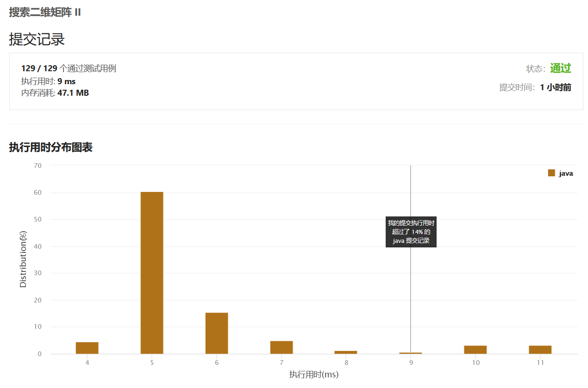
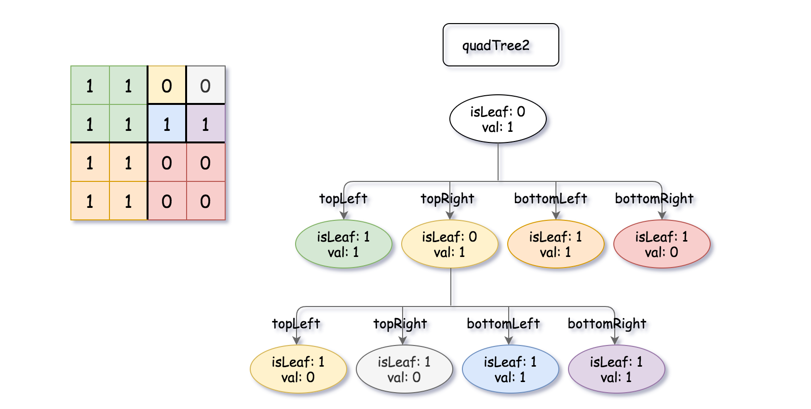

# 绪论
### <p align="right">一一顾元杰</br>学号:20200135223</br>班级:计算机Z2012</p>

# 目录:
##### <p align="right">提示:点击题目名称可直接跳转LeetCode</p>
##### <p align="right">[点击跳转到在线版](https://gitee.com/cnsukidayo/su-ke-da-data-structure/blob/master/markdown/%E6%95%B0%E6%8D%AE%E7%BB%93%E6%9E%84%E4%B8%8E%E7%AE%97%E6%B3%95.md)</p>
* ### [剑指 Offer 03. 数组中重复的数字](#Offer03)
* ### [剑指 Offer II 004. 只出现一次的数字 ](#Offer04)
* ### [707. 设计链表](#Leetcode707)
* ### [155. 最小栈](#Leetcode155)
* ### [35. 搜索插入位置](#Leetcode35)
* ### [88. 合并两个有序数组](#Leetcode88)
* ### [100. 相同的树](#Leetcode100)
* ### [111. 二叉树的最小深度](#Leetcode111)
* ### [125. 验证回文串](#Leetcode125)
* ### [168. Excel表列名称](#Leetcode168)
* ### [171. Excel 表列序号](#Leetcode171)
* ### [226. 翻转二叉树](#Leetcode226)
* ### [228. 汇总区间](#Leetcode228)
* ### [231. 2 的幂](#Leetcode231)
* ### [LCP 66. 最小展台数量](#LCP66)
* ### [LCP 67. 装饰树](#LCP67)
* ### [257. 二叉树的所有路径](#Leetcode257)
* ### [258. 各位相加](#Leetcode258)
* ### [263. 丑数](#Leetcode263)
* ### [268. 丢失的数字](#Leetcode268)
* ### [326. 3 的幂](#Leetcode326)
* ### [345. 反转字符串中的元音字母](#Leetcode345)
* ### [383. 赎金信](#Leetcode383)
* ### [389. 找不同](#Leetcode389)
* ### [190. 颠倒二进制位](#Leetcode190)
* ### [148. 排序链表](#Leetcode148)
* ### [105. 从前序与中序遍历序列构造二叉树](#Leetcode105)
* ### [106. 从中序与后序遍历序列构造二叉树](#Leetcode106)
* ### [889. 根据前序和后序遍历构造二叉树](#Leetcode889)
* ### [912. 排序数组](#Leetcode912)
* ### [240. 搜索二维矩阵 II](#Leetcode240)
* ### [427. 建立四叉树](#Leetcode427)
* ### [558. 四叉树交集](#Leetcode558)
* ### [654. 最大二叉树](#Leetcode654)
* ### [973. 最接近原点的 K 个点](#Leetcode973)
* ### [1738. 找出第 K 大的异或坐标值](#Leetcode1738)
* ### [23. 合并K个升序链表](#Leetcode23)
* ### [剑指 Offer 51. 数组中的逆序对](#Offer51)
* ### [315. 计算右侧小于当前元素的个数](#Leetcode315)
* ### [493. 翻转对](#Leetcode493)
* ### [257. 二叉树的所有路径](#Leetcode1863)
* ### [17. 电话号码的字母组合](#Leetcode17)
* ### [22. 括号生成](#Leetcode22)
* ### [39. 组合总和](#Leetcode39)
* ### [40. 组合总和 II](#Leetcode40)
* ### [46. 全排列](#Leetcode46)
* ### [47. 全排列 II](#Leetcode47)
</br>

## <a id="dataStructure">常用数据结构:</a>  
* ### [链表](#LinkList)
* ### [栈](#Stack)
</br>

## <a id="skill">常见技巧总结:</a>  
* ### [代码的健壮性](#Robust)
* ### [开辟额外空间的注意事项](#extraCache)
* ### [得到十进制数的第i位二进制表示](#HexToBitArray)
* ### [永远不要使用JDK的Stack类](#DoNotUseStack)
* ### [快速估计算法是否会超时](#QuickTimeOut)

</br>
  
## <a id="Offer03">[剑指 Offer 03. 数组中重复的数字](https://leetcode.cn/problems/shu-zu-zhong-zhong-fu-de-shu-zi-lcof/)</a>  

### **<font color="#dddd00">题目描述:</font>**
> 找出数组中重复的数字。
在一个长度为 n 的数组 nums 里的所有数字都在 0～n-1 的范围内。数组中某些数字是重复的，但不知道有几个数字重复了，也不知道每个数字重复了几次。请找出数组中任意一个重复的数字。
>>示例 1：  
输入：
[2, 3, 1, 0, 2, 5, 3]  
输出：2 或 3  
>  
> >  限制：  
2 <= n <= 100000

### **<font color="#00FF00">解题思路:</font>**
1. ### 根据题目所述,nums数组中所有元素的范围都在[0,n-1]的范围内.于是乎自然相当,可以用一个长度为n的布尔数组contains来存储当前已经出现的元素的真假.用contains数组的索引来对应元素字面值.
2. ### 首先初始化contains数组,长度为n.此时contains数组中的每个元素都为false.
3. ### 接着遍历nums数组,直接以nums数组中元素的字面值作为contains数组的元素索引,将该索引处的元素值设置为true,以此来代表某个数已经出现过.
4. ### 如果在遍历的过程中,发现在设置contains数组的某个元素值为true之前,该元素值已经是true了,那么就表明当前数已经出现过一次,返回即可.
### **<font color="#00FFFF">代码实现:</font>**
```java
1.public int findRepeatNumber(int[] nums) {
2.    if (nums == null || nums.length == 0) {
3.        throw new IllegalArgumentException("parameter should not be null or empty!");
4.    }
5.    boolean[] contains = new boolean[nums.length];
6.    for (int i = 0; i < nums.length; i++) {
7.        if (temp[nums[i]]) {
8.            return nums[i];
9.        }
10.        contains[nums[i]] = true;
11.    }
12.    return 0;
13.}

```
1. ### 首先是代码健壮性的判断.2-4行,关于代码健壮性判断详情见:[代码的健壮性](#Robust)
2. ### 第五行是用于存储已经出现过的元素的状态标识数组.数组的索引映射出现过的元素的字面值.
3. ### 6-11行遍历nums数组,并做相应的操作.

### **<font color="#FF00FF">表格演示:</font>**
1. ### 初始化contains数组,长度为n.
|    ↓     |   0   |   1   |   2   |   3   |   4   |   5   |   6   |
| :------: | :---: | :---: | :---: | :---: | :---: | :---: | :---: |
|  array   |   2   |   3   |   1   |   0   |   2   |   5   |   3   |
| contains |   F   |   F   |   F   |   F   |   F   |   F   |   F   |
2. ### 开始遍历数组
### 将array当前元素的字面值作为contains数组的下标,并将该contains元素设置为true.
|  index   | <strong><font color="#ff00ff">↓</font></strong> |   1   |                        2                        |   3   |   4   |   5   |   6   |
| :------: | :---------------------------------------------: | :---: | :---------------------------------------------: | :---: | :---: | :---: | :---: |
|  array   | <strong><font color="#00ff00">2</font></strong> |   3   |                        1                        |   0   |   2   |   5   |   6   |
| contains |                        F                        |   F   | <strong><font color="#00ff00">F</font></strong> |   F   |   F   |   F   |   F   |
3. ### 继续遍历执行
|  index   |                        0                        | <strong><font color="#ff00ff">↓</font></strong> |                        2                        |                        3                        |   4   |   5   |   6   |
| :------: | :---------------------------------------------: | :---------------------------------------------: | :---------------------------------------------: | :---------------------------------------------: | :---: | :---: | :---: |
|  array   | <strong><font color="#ffc800">2</font></strong> | <strong><font color="#00ff00">3</font></strong> |                        1                        |                        0                        |   2   |   5   |   6   |
| contains |                        F                        |                        F                        | <strong><font color="#ffc800">T</font></strong> | <strong><font color="#00ff00">F</font></strong> |   F   |   F   |   F   |

4. ### 继续遍历执行
|  index   |                        0                        |                        1                        | <strong><font color="#ff00ff">↓</font></strong> |                        3                        |   4   |   5   |   6   |
| :------: | :---------------------------------------------: | :---------------------------------------------: | :---------------------------------------------: | :---------------------------------------------: | :---: | :---: | :---: |
|  array   | <strong><font color="#ffc800">2</font></strong> | <strong><font color="#ffc800">3</font></strong> | <strong><font color="#00ff00">1</font></strong> |                        0                        |   2   |   5   |   6   |
| contains |                        F                        | <strong><font color="#00ff00">F</font></strong> | <strong><font color="#ffc800">T</font></strong> | <strong><font color="#ffc800">T</font></strong> |   T   |   F   |   F   |
5. ### 继续遍历执行
|  index   |                        0                        |                        1                        |                        2                        | <strong><font color="#ff00ff">↓</font></strong> |   4   |   5   |   6   |
| :------: | :---------------------------------------------: | :---------------------------------------------: | :---------------------------------------------: | :---------------------------------------------: | :---: | :---: | :---: |
|  array   | <strong><font color="#ffc800">2</font></strong> | <strong><font color="#ffc800">3</font></strong> | <strong><font color="#ffc800">1</font></strong> | <strong><font color="#00ff00">0</font></strong> |   2   |   5   |   6   |
| contains | <strong><font color="#00ff00">F</font></strong> | <strong><font color="#ffc800">T</font></strong> | <strong><font color="#ffc800">T</font></strong> | <strong><font color="#ffc800">T</font></strong> |   T   |   F   |   F   |
6. ### 继续遍历执行,直到访问到contains数组某个元素为true时,此时array数组的当前元素就是重复出现过的元素.所以此时2即为重复出现的元素.
|  index   |                        0                        |                        1                        |                        2                        |                        3                        | <strong><font color="#ff00ff">↓</font></strong> |   5   |   6   |
| :------: | :---------------------------------------------: | :---------------------------------------------: | :---------------------------------------------: | :---------------------------------------------: | :---------------------------------------------: | :---: | :---: |
|  array   | <strong><font color="#ffc800">2</font></strong> | <strong><font color="#ffc800">3</font></strong> | <strong><font color="#ffc800">1</font></strong> | <strong><font color="#ffc800">0</font></strong> | <strong><font color="#00ff00">2</font></strong> |   5   |   6   |
| contains | <strong><font color="#ffc800">T</font></strong> | <strong><font color="#ffc800">T</font></strong> | <strong><font color="#ff0000">T</font></strong> | <strong><font color="#ffc800">T</font></strong> |                        T                        |   F   |   F   |

**<font color="#FFC800">复杂度分析:</font>**
> ### 时间复杂度:O(n)  
> > ### 假设一种最坏的情况,数组中元素只重复出现一次,例如:[0,1,2,3,...n-1,0],因为需要遍历玩整个数组才知道重复的元素是哪一个,所以时间复杂是O(n).

> ### 空间复杂度:O(n)
> > ### 因为需要一个布尔数组contains数组来存放已经出现过的元素的状态值,并且认定出现过的数作为contains数组的下标,那么要想contains下标合法,所以contains数组的长度就是元素数值的取值范围.即n-1+1=n
> > ### 最后检验,发现给出的条件中有<font color="#FF0000">2<=n<=100000</font>,contains数组大小不超过2^31-1.
### **<p align="center"><font color="#FF0000">通过截图:</font></p>**


## <a id="Offer04">[剑指 Offer II 004. 只出现一次的数字 ](https://leetcode.cn/problems/WGki4K/)</a>  
### **<font color="#dddd00">题目描述:</font>**
> ### 给你一个整数数组 nums ，除某个元素仅出现 一次 外，其余每个元素都恰出现 三次 。请你找出并返回那个只出现了一次的元素。
> ### 示例 1：
> > ### 输入：nums = [2,2,3,2]
> > ### 输出：3
> ### 示例 2：
> > ### 输入：nums = [0,1,0,1,0,1,100]
> > ### 输出：100
> ### 提示：
> > * ### 1 <= nums.length <= 3 * 10<sup>4</sup>
> > * ### -2<sup>31</sup> <= nums[i] <= 2<sup>31</sup> - 1
> > * ### nums 中，除某个元素仅出现 一次 外，其余每个元素都恰出现 三次
## <p align="center"><font color="#0000FF">解法一之双HashSet</font></p>
### **<font color="#00FF00">解题思路:</font>**
1. ### 在本题给出的条件中,nums数组的每个元素的取值范围为-2<sup>31</sup> <= nums[i] <= 2<sup>31</sup> - 1,显然我们不可能按照Offer3那题的方法去创建一个布尔数组标识已经出现过的数的状态,因为nums数组中元素的取值范围太广泛.
2. ### 既然如此,题目中又说除了某个元素外其余的元素都恰好出现三次.显然我们可以通过另一种方式来标识已经出现过的元素.
3. ### 我们解题的核心技术扣住某个元素只出现一次这句话.创建两个HastSet一个称作contains,contains的作用是记录所有出现过元素,即只要某个元素不存在于contains中,那么就将该元素添加到contains集合中.第二个HastSet称作saveSet,saveSet的作用是记录已经出现过的元素,并将重复的元素从saveSet中移除.
4. ### 首先遍历nums数组,将每个元素去contains集合中进行比对看contains集合是否有该元素,如果没有就将该元素添加到contains和saveSet集合中.如果contains元素中有该元素,则能传递两个信息,一是该元素曾经必然出现过,二是saveSet中曾经也必然添加过该元素,于是乎这是一个重复元素将该元素从saveSet中移除.如此操作所有重复出现过的元素到最后必然都不存在于saveSet中,只有那个只出现过一次的元素会存在于saveSet中,最终将该元素返回即刻.
### **<font color="#00FFFF">代码实现:</font>**
```java
1.public class Offer4 {
2.    private Set<Integer> saveSet;
3.    private Set<Integer> contains;
4.
5.    public int singleNumber(int[] nums) {
6.        if (nums == null || nums.length % 3 != 1) {
7.            throw new IllegalArgumentException("nums数组不能为空,并且nums数组的长度取余3必须为1!");
8.        }
9.        saveSet = new HashSet<>(nums.length / 3 + 1);
10.       contains = new HashSet<>(nums.length / 3 + 1);
11.        for (int i = 0; i < nums.length; i++) {
12.            if (!contains.contains(nums[i])) {
13.                contains.add(nums[i]);
14.                saveSet.add(nums[i]);
15.            } else {
16.                saveSet.remove(nums[i]);
17.            }
18.        }
19.        return saveSet.iterator().next();
20.    }
21.}
```
1. ### 首先6-8行是代码健壮性的判断,详情见:[代码的健壮性.](#Robust)另外值得注意的一点是,这里数组的长度取模3的值一定是1,因为除某个元素只出现一次外,其余的每个元素都恰好出现三次.
2. ### 9-10行对HashSet进行初始化,并且指定集合大小,saveSet指定为nums.length / 3 + 1,具体为什么是这个值的原因不在过多阐述.提前指定集合大小的好处是避免HastSet的自动扩容造成的时间和空间上的浪费.
3. ### 接着就是遍历nums数组,并按照解题思路中的思路编码即可.
4. ### 最后一步返回结果的时候,因为此时saveSet中必然只剩下一个元素(即只出现一次的元素),所以直接用迭代器返回第一个元素即刻.
### **<font color="#FF00FF">表格演示:</font>**
1. ### 以nums = [1,2,1,3,2,1,2]举例

2. ### 初始化HastSet
|  index   |   0   |   1   |   2   |   3   |   4   |   5   |   6   |
| :------: | :---: | :---: | :---: | :---: | :---: | :---: | :---: |
|   nums   |   1   |   2   |   1   |   3   |   2   |   1   |   2   |
| contains |       |       |       |       |       |       |       |
| saveSet  |       |       |       |       |       |       |       |

3. ### 开始遍历数组,并且在contains集合中进行判断看是否存在当前元素,如果不存在就将当前元素添加到contains和saveSet集合中去.
|  index   | <strong><font color="#ff00ff">↓</font></strong> |   1   |   2   |   3   |   4   |   5   |   6   |
| :------: | :---------------------------------------------: | :---: | :---: | :---: | :---: | :---: | :---: |
|   nums   | <strong><font color="#00ff00">1</font></strong> |   2   |   1   |   3   |   2   |   1   |   2   |
| contains | <strong><font color="#00ff00">1</font></strong> |       |       |       |       |       |       |
| saveSet  | <strong><font color="#00ff00">1</font></strong> |       |       |       |       |       |       |

4. ### 继续遍历
|  index   |                        0                        | <strong><font color="#ff00ff">↓</font></strong> |   2   |   3   |   4   |   5   |   6   |
| :------: | :---------------------------------------------: | :---------------------------------------------: | :---: | :---: | :---: | :---: | :---: |
|   nums   |                        1                        | <strong><font color="#00ff00">2</font></strong> |   1   |   3   |   2   |   1   |   2   |
| contains | <strong><font color="#ffc800">1</font></strong> | <strong><font color="#00ff00">2</font></strong> |       |       |       |       |       |
| saveSet  | <strong><font color="#ffc800">1</font></strong> | <strong><font color="#00ff00">2</font></strong> |       |       |       |       |       |
5. ### 继续遍历,一旦发现contains数组中存在当前元素,那么就将当前元素从saveSet集合中移除.
|  index   |                        0                        |                        1                        | <strong><font color="#ff00ff">↓</font></strong> |   3   |   4   |   5   |   6   |
| :------: | :---------------------------------------------: | :---------------------------------------------: | :---------------------------------------------: | :---: | :---: | :---: | :---: |
|   nums   |                        1                        |                        2                        | <strong><font color="#00ff00">1</font></strong> |   3   |   2   |   1   |   2   |
| contains | <strong><font color="#00ff00">1</font></strong> | <strong><font color="#ffc800">2</font></strong> |                                                 |       |       |       |       |
| saveSet  | <strong><font color="#00ff00">1</font></strong> | <strong><font color="#ffc800">2</font></strong> |                                                 |       |       |       |       |

|  index   |                        0                        |                        1                        | <strong><font color="#ff00ff">↓</font></strong> |   3   |   4   |   5   |   6   |
| :------: | :---------------------------------------------: | :---------------------------------------------: | :---------------------------------------------: | :---: | :---: | :---: | :---: |
|   nums   |                        1                        |                        2                        | <strong><font color="#00ff00">1</font></strong> |   3   |   2   |   1   |   2   |
| contains | <strong><font color="#ffc800">1</font></strong> | <strong><font color="#ffc800">2</font></strong> |                                                 |       |       |       |       |
| saveSet  | <strong><font color="#ffc800">2</font></strong> |                                                 |                                                 |       |       |       |       |
6. ### 继续遍历
|  index   |                        0                        |                        1                        |                        2                        | <strong><font color="#ff00ff">↓</font></strong> |   4   |   5   |   6   |
| :------: | :---------------------------------------------: | :---------------------------------------------: | :---------------------------------------------: | :---------------------------------------------: | :---: | :---: | :---: |
|   nums   |                        1                        |                        2                        |                        1                        | <strong><font color="#00ff00">3</font></strong> |   2   |   1   |   2   |
| contains | <strong><font color="#ffc800">1</font></strong> | <strong><font color="#ffc800">2</font></strong> | <strong><font color="#00ff00">3</font></strong> |                                                 |       |       |       |
| saveSet  | <strong><font color="#ffc800">2</font></strong> | <strong><font color="#00ff00">3</font></strong> |                                                 |                                                 |       |       |       |
7. ### 继续遍历
|  index   |                        0                        |                        1                        |                        2                        |   3   | <strong><font color="#ff00ff">↓</font></strong> |   5   |   6   |
| :------: | :---------------------------------------------: | :---------------------------------------------: | :---------------------------------------------: | :---: | :---------------------------------------------: | :---: | :---: |
|   nums   |                        1                        |                        2                        |                        1                        |   3   | <strong><font color="#00ff00">2</font></strong> |   1   |   2   |
| contains | <strong><font color="#ffc800">1</font></strong> | <strong><font color="#00ff00">2</font></strong> | <strong><font color="#ffc800">3</font></strong> |       |                                                 |       |       |
| saveSet  | <strong><font color="#00ff00">2</font></strong> | <strong><font color="#ffc800">3</font></strong> |                                                 |       |                                                 |       |       |

|  index   |                        0                        |                        1                        |                        2                        |   3   | <strong><font color="#ff00ff">↓</font></strong> |   5   |   6   |
| :------: | :---------------------------------------------: | :---------------------------------------------: | :---------------------------------------------: | :---: | :---------------------------------------------: | :---: | :---: |
|   nums   |                        1                        |                        2                        |                        1                        |   3   | <strong><font color="#00ff00">2</font></strong> |   1   |   2   |
| contains | <strong><font color="#ffc800">1</font></strong> | <strong><font color="#ffc800">2</font></strong> | <strong><font color="#ffc800">3</font></strong> |       |                                                 |       |       |
| saveSet  | <strong><font color="#ffc800">3</font></strong> | <strong><font color="#ffc800"></font></strong>  |                                                 |       |                                                 |       |       |

8. ### 继续遍历
|  index   |                        0                        |                        1                        |                        2                        |   3   |   4   | <strong><font color="#ff00ff">↓</font></strong> |   6   |
| :------: | :---------------------------------------------: | :---------------------------------------------: | :---------------------------------------------: | :---: | :---: | :---------------------------------------------: | :---: |
|   nums   |                        1                        |                        2                        |                        1                        |   3   |   2   | <strong><font color="#00ff00">1</font></strong> |   2   |
| contains | <strong><font color="#00ff00">1</font></strong> | <strong><font color="#ffc800">2</font></strong> | <strong><font color="#ffc800">3</font></strong> |       |       |                                                 |       |
| saveSet  | <strong><font color="#ffc800">3</font></strong> | <strong><font color="#ffc800"></font></strong>  |                                                 |       |       |                                                 |       |

9. ### 继续遍历
|  index   |                        0                        |                        1                        |                        2                        |   3   |   4   |   5   | <strong><font color="#ff00ff">↓</font></strong> |
| :------: | :---------------------------------------------: | :---------------------------------------------: | :---------------------------------------------: | :---: | :---: | :---: | :---------------------------------------------: |
|   nums   |                        1                        |                        2                        |                        1                        |   3   |   2   |   1   | <strong><font color="#00ff00">2</font></strong> |
| contains | <strong><font color="#ffc800">1</font></strong> | <strong><font color="#00ff00">2</font></strong> | <strong><font color="#ffc800">3</font></strong> |       |       |       |                                                 |
| saveSet  | <strong><font color="#ffc800">3</font></strong> | <strong><font color="#ffc800"></font></strong>  |                                                 |       |       |       |                                                 |
 
10. ### 遍历结束后将saveSet中的第一个元素(也就是唯一的一个元素)返回即可.
|  index   |                        0                        |                        1                        |                        2                        |   3   |   4   |   5   |   6   |
| :------: | :---------------------------------------------: | :---------------------------------------------: | :---------------------------------------------: | :---: | :---: | :---: | :---: |
|   nums   |                        1                        |                        2                        |                        1                        |   3   |   2   |   1   |   2   |
| contains | <strong><font color="#ffc800">1</font></strong> | <strong><font color="#ffc800">2</font></strong> | <strong><font color="#ffc800">3</font></strong> |       |       |       |       |
| saveSet  | <strong><font color="#ff0000">3</font></strong> | <strong><font color="#ffc800"></font></strong>  |                                                 |       |       |       |       |


**<font color="#FFC800">复杂度分析:</font>**
> ### 时间复杂度:O(n)  
> > 1. ### 首先需要遍历整个nums数组,所以时间复杂度为O(n)
> > 2. ### 其次每次都要对元素进行contains判断,根据主流说法,HashSet的时间复杂度为O(1).
> > 3. ### contains被判为false一共只会出现nums.length/3+1次,当contains判为false时会进行两次add操作,分别将当前元素添加到contains和saveSet这两个集合中去,根据主流说法HashSet的add方法时间复杂度为O(1),所以contains被判为false时会执行O(1)+O(1)的时间复杂度的代码.
> > 4. ### contains被判为true一共会出现num.length / 3 * 2次,当contains判为true时会对saveSet进行remove操作,根据主流说法HashSet的remove方法时间复杂度为O(1).
> > 5. ### 所以综上所述时间复杂度为:O(n*(O(1) + n / 3 + 1 * (O(1)+O(1)) + n / 3 * 2 * O(1))) = O(n)

> ### 空间复杂度:O(n)
> > 1. ### 需要两个HashSet,其中contains这个集合的大小为O(n / 3 + 1),因为不管给定的nums内的元素如何排列,contains集合代表的意义是已经出现过的元素的集合.而所有元素出现的次数必定是nums数组的总长度除3再加1.
> > 2. ### 同理saveSet集合也不会存储重复出现过的元素,所以它的长度最大也是nums数组的长度除3再加1.即O(n / 3 + 1)
> > 3. ### 综上所述空间复杂度为: O(n / 3 + 1) + O(n / 3 + 1) = O(n)

### **<p align="center"><font color="#FF0000">通过截图:</font></p>**


## <p align="center"><font color="#0000FF">解法二之排序</font></p>
### **<font color="#00FF00">解题思路:</font>**
1. ### 如题所述,解题核心是紧扣每个元素都恰好出现三次.
2. ### 我们先假设nums数组中的每个元素都恰好出现三次,此时对该数组进行排序后,应当形成每三个元素为一组的局面.每组元素都相同.若此时往该有序数组中插入一个未出现过的元素,那么这个元素出现的位置只也两种可能.第一种可能是出现在某组之前,另外一种可能是出现在nums数组的最后一个位置.
3. ### 看第一种情况,假设 nums = [1,3,1,3,1,3,2] 将其排序后 nums = [1,1,1,2,3,3,3].
4. ### 再看一种情况,假设 nums = [1,2,1,2,1,2,3] 将其排序后 nums = [1,1,1,2,2,2,3].
5. ### 所以我们只要每三个元素为一组进行遍历,遍历时判断每组的第一个和第二个元素是否相等,如果这两个元素不相等,那么该组中的第一个元素就是只出现一次的元素.对于第二种情况,如果遍历到最后只剩下一个元素时还没有找到只出现一次的元素,那么最后一个元素必为只出现一次的元素.
### **<font color="#00FFFF">代码实现:</font>**
```java
1.class Solution {
2.    public int singleNumber(int[] nums) {
3.        if (nums == null || nums.length % 3 != 1) {
4.            throw new IllegalArgumentException("nums数组不能为空,并且nums数组的长度取余3必须为1!");
5.        }
6.        Arrays.sort(nums);
7.        for (int i = 0; i < nums.length - 1; i += 3) {
8.            if (nums[i] != nums[i + 1]) {
9.                return nums[i];
10.            }
11.        }
12.        return nums[nums.length - 1];
13.    }
14.}
```
1. ### 首先6-8行是代码健壮性的判断,详情见:[代码的健壮性.](#Robust)另外值得注意的一点是,这里数组的长度取模3的值一定是1,因为除某个元素只出现一次外,其余的每个元素都恰好出现三次.
2. ### 接着调用Arrays.sort()对nums数组进行排序.
3. ### 按照一开始的思路,对排序后的nums数组以三个元素为一组,对每组的第一个和第二个元素进行值相等的比较.
4. ### 如果for循环结束还没有找到只出现一次的数值,那么就将数组最后一个元素进行返回.
### **<font color="#FF00FF">表格演示:</font>**
1. ### 初始化表格
| index |   0   |   1   |   2   |   3   |   4   |   5   |   6   |
| :---: | :---: | :---: | :---: | :---: | :---: | :---: | :---: |
| nums  |   1   |   3   |   1   |   3   |   1   |   3   |   2   |
2. ### 对nums数组进行排序
| index |   0   |   1   |   2   |   3   |   4   |   5   |   6   |
| :---: | :---: | :---: | :---: | :---: | :---: | :---: | :---: |
| nums  |   1   |   1   |   1   |   2   |   3   |   3   |   3   |
3. ### 以三个元素为一组开始遍历,并比较第一个元素和第二个元素是否相等.
| index | <strong><font color="#ff00ff">↓</font></strong> | <strong><font color="#ff00ff">↓</font></strong> |   2   |   3   |   4   |   5   |   6   |
| :---: | :---------------------------------------------: | :---------------------------------------------: | :---: | :---: | :---: | :---: | :---: |
| nums  | <strong><font color="#00ff00">1</font></strong> | <strong><font color="#00ff00">1</font></strong> |   1   |   2   |   3   |   3   |   3   |
4. ### 如果发现不相等,则返回改组中的第一个元素,注意因为是以三个元素为一组所以不会对索引2除的元素进行任何操作.这里发现2!=3所以返回2即刻.
| index |                        0                        |                        1                        |   2   | <strong><font color="#ff00ff">↓</font></strong> | <strong><font color="#ff00ff">↓</font></strong> |   5   |   6   |
| :---: | :---------------------------------------------: | :---------------------------------------------: | :---: | :---------------------------------------------: | :---------------------------------------------: | :---: | :---: |
| nums  | <strong><font color="#ffc800">1</font></strong> | <strong><font color="#ffc800">1</font></strong> |   1   | <strong><font color="#ff0000">2</font></strong> | <strong><font color="#00ff00">3</font></strong> |   3   |   3   |
**<font color="#FFC800">复杂度分析:</font>**
> ### 时间复杂度:O(n log(n))
> > 1. ### 首先第一步就是对nums数组进行排序,根据JDK官方的API说法是该算法在大多数情况下的时间复杂度都是O(n log(n)),所以对nums数组进行排序的时间复杂度为O(n log(n)).
> > 2. ### 其次是以三个元素为一组进行比较,一共会执行 n / 3次,所以比较数值这一步的时间复杂度为O(n / 3)
> > 3. ### 综上所述,算法的时间复杂度为O(n log(n))
> ### 空间复杂度:O(1)
> > 1. ### 本算法不需要开辟额外的内存空间,所以空间复杂度为O(1),即本算法所消耗的空间大小不随问题规模的扩大而扩大.
### **<p align="center"><font color="#FF0000">通过截图:</font></p>**


## <p align="center"><font color="#0000FF">解法三之位运算</font></p>

### **<font color="#00FF00">解题思路:</font>**
1. ### 上述两种算法都各有优劣,一个时间复杂度相对较低,一个空间复杂度相对较低.
2. ### 看了一眼这题的标签是位运算,那么就想想能否用位运算来优化这道题的算法.
3. ### 假设nums = [5,5,5] 这是一个每个元素重复出现三次的数组,它们的二进制分别是:
   ### 1 0 1</br> 
   ### 1 0 1</br>
   ### 1 0 1</br>
   ### 将这三个二进制的每一位想加,得到的二进制是3 0 3 我们对每一位取模3,得到的结果就是 0 0 0.
4. ### 假设nums = [5,5,5,3] 它们的二进制分别为:
   ### 1 0 1</br>
   ### 1 0 1</br>
   ### 1 0 1</br>
   ### &emsp;1 1</br>
   ### 将这四个二进制的每一位想加,得到的二进制是 3 1 4 同样对每一位进行取模3,得到的结果就是 0 1 1 此时不难发现该结果就是只出现一次元素的二进制值.
5. ### 会产生这种情况得益于数组中很多元素都是成3重复出现的,所以它们的二进制也会存在某种相似性(或者叫对称性),导致将它们的二进制表示想加后再取模3结果一定是0.而唯有那个只出现一次的元素的二进制值是显得突兀的.
6. ### 根据题目的提示,数组元素的取值范围为-2<sup>31</sup> <= nums[i] <= 2<sup>31</sup> - 1 也就是说会出现负数的情况.而在Java中基本数据类型都是有符号的,并且最高位为符号位.0代表正数1代表负数,所以在相加每个数的二进制时通常要考虑符号位的问题.而这里由于负数和正数的符号位也存在一种对称的关系(即负数和正数出现的次数一定能被3整除,不包含只出现一次的数).简单来说就是这里只要把所有数的二进制想加即可.
7. ### 首先,我们要创建一个长度为32的short数组(称为plus),数组元素从0到32(0->32)依次表示十进制数的二进制从最高位到最低位.假设我们要讲十进制数3存入到plus数组中,它应该是这样的:
    | index |   0   |   1   | 2...29 |  30   |  31   |
    | :---: | :---: | :---: | :----: | :---: | :---: |
    | plus  |   0   |   0   | 0...0  |   1   |   1   |
    ### 值得注意的是将十进制数的二进制表示存储到plus数组中时要注意索引位置不是从0开始存储,而是从数组最后一个元素往前存储.
    ### 另外short类型也有讲究,因为这题给定nums数组的长度范围是<font color="#FF0000">1 <= nums.length <= 3 * 10^4</font>,所以就算nums数组中所有数的某一位二进制都是1,那么在这一位上一共也就是想加30000次,是在short类型的范围之内的.
8. ### 现在开始遍历nums数组,并拿到一个十进制元素.那么该如何将这个十进制元素的二进制表示,存放到plus数组中呢?换句话说就是如何得到十进制数的二进制表示的每一位的值?详情见:[得到十进制数的第i位二进制表示](#HexToBitArray)
9. ### 遍历完数组之后,就是将plus数组中的每个元素对3进行取模,取模后得到的数组就表示只出现一次的那个元素的二进制表示.最后一步就是将二进制数组转为十进制数,我们只要定义一个变量result,然后遍历plus数组将result每次都加等于plus元素的数组再讲其左移1位往复循环便可得到该二进制数组的十进制表示.
### **<font color="#00FFFF">代码实现:</font>**
```java
1.class Solution {
2.    int[] plus = new int[32];
3.
4.    public int singleNumber(int[] nums) {
5.        if (nums == null || nums.length % 3 != 1) {
6.            throw new IllegalArgumentException("nums数组不能为空,并且nums数组的长度取余3必须为1!");
7.        }
8.        for (int i = 0; i < nums.length; i++) {
9.            int currentNumber = nums[i];
10.            for (int j = plus.length - 1; j > -1; j--) {
11.                if (currentNumber != 0) {
12.                    plus[j] += 1 & currentNumber;
13.                    currentNumber >>= 1;
14.                } else {
15.                    break;
16.                }
17.            }
18.        }
19.        for (int i = 0; i < plus.length; i++) {
20.            plus[i] %= 3;
21.        }
22.        int result = 0;
23.        for (int i = 0; i < plus.length; i++) {
24.            result <<= 1;
25.            result += plus[i];
26.        }
27.        return result;
28.    }
29.}
```
1. ### 第2行定义plus数组,长度为32因为int类型是4字节32位的,这里既然要用数组来表示每一位二进制,自然长度为32.
2. ### 5-7行依旧时代码健壮性的判断,详情见:[代码的健壮性.](#Robust)
3. ### 8-18行遍历nums数组并将每一位添加到plus数组中.
4. ### 19-21行,将plus数组的每一位取模3
5. ### 将二进制数组plus转为十进制数值.
### **<font color="#FF00FF">表格演示:</font>**
1. ### 初始化表格,假设nums = [1,-2,3,1,-2,-2,1]
|   index    |   0   |   1   |   2    |   3   |   4   |   5   |   6   |
| :--------: | :---: | :---: | :----: | :---: | :---: | :---: | :---: |
|    nums    |   1   |  -2   |   3    |   1   |  -2   |  -2   |   1   |
| plus index |   0   |   1   | 2...27 |  28   |  29   |  30   |  31   |
|    plus    |   0   |   0   |   0    |   0   |   0   |   0   |   0   |
2. ### 开始遍历数组,得到第一个元素1的二进制值为1
|   index    | <strong><font color="#ff00ff">↓</font></strong> |   1   |   2    |   3   |   4   |   5   |                        6                         |
| :--------: | :---------------------------------------------: | :---: | :----: | :---: | :---: | :---: | :----------------------------------------------: |
|    nums    | <strong><font color="#00ff00">1</font></strong> |  -2   |   3    |   1   |  -2   |  -2   |                        1                         |
| plus index |                        0                        |   1   | 2...27 |  28   |  29   |  30   | <strong><font color="#00ff00">31</font></strong> |
|    plus    |                        0                        |   0   |   0    |   0   |   0   |   0   | <strong><font color="#00ff00">1</font></strong>  |
3. ### 继续遍历数组,第二个元素-2的二进制值为1000......10注意这里是负数.
|   index    |                        0                        | <strong><font color="#ff00ff">↓</font></strong>  |   2    |   3   |   4   |                        5                         |                        6                         |
| :--------: | :---------------------------------------------: | :----------------------------------------------: | :----: | :---: | :---: | :----------------------------------------------: | :----------------------------------------------: |
|    nums    |                        1                        | <strong><font color="#00ff00">-2</font></strong> |   3    |   1   |  -2   |                        -2                        |                        1                         |
| plus index | <strong><font color="#00ff00">0</font></strong> |                        1                         | 2...27 |  28   |  29   | <strong><font color="#00ff00">30</font></strong> | <strong><font color="#ffc800">31</font></strong> |
|    plus    | <strong><font color="#00ff00">1</font></strong> |                        0                         |   0    |   0   |   0   |                        1                         | <strong><font color="#ffc800">1</font></strong>  |
4. ### 继续遍历数组,第三个元素3的二进制值为11
|   index    |                        0                        |   1   | <strong><font color="#ff00ff">↓</font></strong> |   3   |   4   |                        5                         |                        6                         |
| :--------: | :---------------------------------------------: | :---: | :---------------------------------------------: | :---: | :---: | :----------------------------------------------: | :----------------------------------------------: |
|    nums    |                        1                        |  -2   | <strong><font color="#00ff00">3</font></strong> |   1   |  -2   |                        -2                        |                        1                         |
| plus index | <strong><font color="#ffc800">0</font></strong> |   1   |                     2...27                      |  28   |  29   | <strong><font color="#00ff00">30</font></strong> | <strong><font color="#00ff00">31</font></strong> |
|    plus    | <strong><font color="#ffc800">1</font></strong> |   0   |                        0                        |   0   |   0   | <strong><font color="#00ff00">2</font></strong>  | <strong><font color="#00ff00">2</font></strong>  |
5. ### 继续遍历,第四个元素1的二进制值为1
|   index    |                        0                        |   1   |   2    | <strong><font color="#ff00ff">↓</font></strong> |   4   |                        5                         |                        6                         |
| :--------: | :---------------------------------------------: | :---: | :----: | :---------------------------------------------: | :---: | :----------------------------------------------: | :----------------------------------------------: |
|    nums    |                        1                        |  -2   |   3    | <strong><font color="#00ff00">1</font></strong> |  -2   |                        -2                        |                        1                         |
| plus index | <strong><font color="#ffc800">0</font></strong> |   1   | 2...27 |                       28                        |  29   | <strong><font color="#ffc800">30</font></strong> | <strong><font color="#00ff00">31</font></strong> |
|    plus    | <strong><font color="#ffc800">1</font></strong> |   0   |   0    |                        0                        |   0   | <strong><font color="#ffc800">2</font></strong>  | <strong><font color="#00ff00">3</font></strong>  |
6. ### 继续遍历直到最后一个元素
|   index    |                        0                        |   1   |   2    |   3   |   4   |                        5                         | <strong><font color="#ff00ff">↓</font></strong>  |
| :--------: | :---------------------------------------------: | :---: | :----: | :---: | :---: | :----------------------------------------------: | :----------------------------------------------: |
|    nums    |                        1                        |  -2   |   3    |   1   |  -2   |                        -2                        | <strong><font color="#00ff00">1</font></strong>  |
| plus index | <strong><font color="#ffc800">0</font></strong> |   1   | 2...27 |  28   |  29   | <strong><font color="#ffc800">30</font></strong> | <strong><font color="#00ff00">31</font></strong> |
|    plus    | <strong><font color="#ffc800">3</font></strong> |   0   |   0    |   0   |   0   | <strong><font color="#ffc800">4</font></strong>  | <strong><font color="#00ff00">4</font></strong>  |
7. ### 对plus数组的每个元素对3进行取模.
|   index    |                        0                        |                        1                        |                        2                        |                        3                        |                        4                        |                        5                         | <strong><font color="#ff00ff">↓</font></strong>  |
| :--------: | :---------------------------------------------: | :---------------------------------------------: | :---------------------------------------------: | :---------------------------------------------: | :---------------------------------------------: | :----------------------------------------------: | :----------------------------------------------: |
|    nums    |                        1                        |                       -2                        |                        3                        |                        1                        |                       -2                        |                        -2                        | <strong><font color="#00ff00">1</font></strong>  |
| plus index | <strong><font color="#00ff00">0</font></strong> |                        1                        |                     2...27                      |                       28                        |                       29                        | <strong><font color="#00ff00">30</font></strong> | <strong><font color="#00ff00">31</font></strong> |
|    plus    | <strong><font color="#ff0000">0</font></strong> | <strong><font color="#ff0000">0</font></strong> | <strong><font color="#ff0000">0</font></strong> | <strong><font color="#ff0000">0</font></strong> | <strong><font color="#ff0000">0</font></strong> | <strong><font color="#ff0000">1</font></strong>  | <strong><font color="#ff0000">1</font></strong>  |
8. ### 将plus二进制数组转为十进制,最终的结果即为3是只出现一次的元素.

**<font color="#FFC800">复杂度分析:</font>**
> ### 时间复杂度:O(n)  
> > 1. ### 首选需要遍历整个数组,并且对于数组的每个元素还要做32次的位运算(为了获取当前十进制数的二进制表示而做的运算),即时间复杂度为O(n*32)
> > 2. ### 遍历完nums数组后,还需要将当前plus数组的每一位元素对3进行取模,而plus数组的长度固定为32.所以时间复杂度为O(32)
> > 3. ### 最后还需要将plus数组再遍历一次,为的是将二进制数组转为十进制表示.所以时间复杂度也是O(32)
> > 4. ### 综上所述,时间复杂度为O(n * 32) + O(32) + O(32) = O(n) 
> ### 空间复杂度:O(1)
> > 1. ### 只开辟了一个长度固定为32的short数组,作为二进制数的存储.即空间复杂度为O(32) = O(1) 即算法的空间复杂度不随问规模的扩大而扩大.
### **<p align="center"><font color="#FF0000">通过截图:</font></p>**


## <a id="Leetcode707">[707. 设计链表](https://leetcode.cn/problems/design-linked-list/)</a>  
## 本题题解放到常用数据结构之链表中完成,[点击跳转](#LinkList).

## <a id="Leetcode155">[155. 最小栈](https://leetcode.cn/problems/min-stack/)</a>  
### **<font color="#FFFF00">题目描述:</font>**
> ### 设计一个支持 push ，pop ，top 操作，并能在常数时间内检索到最小元素的栈。
> ### 实现 MinStack 类:
> * ### MinStack() 初始化堆栈对象。
> * ### void push(int val) 将元素val推入堆栈。
> * ### void pop() 删除堆栈顶部的元素。
> * ### int top() 获取堆栈顶部的元素。
> * ### int getMin() 获取堆栈中的最小元素。
> ### 示例1:
> > ### 输入：
> > ### ["MinStack","push","push","push","getMin","pop","top","getMin"]
> > ### [[],[-2],[0],[-3],[],[],[],[]]
> > ### 输出：
> > ### [null,null,null,null,-3,null,0,-2]
> > ### 解释：
> > ### MinStack minStack = new MinStack();
> > ### minStack.push(-2);
> > ### minStack.push(0);
> > ### minStack.push(-3);
> > ### minStack.getMin();   --> 返回 -3.
> > ### minStack.pop();
> > ### minStack.top();      --> 返回 0.
> > ### minStack.getMin();   --> 返回 -2.
> ### 提示:
> * ### -231 <= val <= 231 - 1
> * ### pop、top 和 getMin 操作总是在 非空栈 上调用
> * ### push, pop, top, and getMin最多被调用 3 * 104 次

### **<font color="#00FF00">解题思路:</font>**
1. ### 本题采用双栈来实现,push、pop、top方法的时间都较为简单.毕竟栈的实现本身并不困难,只要满足先进后出即可.栈的实现有两种方式一种是线性栈一种是链栈,本题具体采用哪种稍后介绍.
2. ### 对于getMin()方法,一种可行的实现是遍历栈然后找出最小的元素即可.那么时间复杂度就为O(n).
3. ### 这里采用双栈的实现方法,即一个栈正常使用(称为iStack).当我们往栈中放入元素时,如果栈是空的第一次放入元素,那么将这个元素同时保存到minStack中.紧接着第二个元素放入iStack之后需要和minStack栈中的栈顶元素进行比较,如果该元素小于等于栈顶元素,则将该元素放入minStack中,否则不做任何操作仅仅将该元素放入iStack中.以此类推第三个第四个元素...这样做的好处是minStack的栈顶永远存放的是iStack栈中目前最小的元素.
4. ### 注意实际上minStack是有序的,从栈顶到栈底是升序.所以当我们从iStack中移除元素的时候才有可能将当前栈中最小的元素移除.所以,再移除元素之后,需要判断如果当前移除的元素和minStack中栈顶的元素相等,就表明当前移除的是iStack中最小的元素,所以同样需要将该元素从minStack中移除,如果不等说明当前要移除的元素定必minStack栈顶的元素大,也就代表此时iStack中的最小元素依旧时minStack的栈顶元素.
5. ### 题目中明确说了pop、top和getMin操作总是在非空栈上调用,所以就本题而言不用考虑边界值问题.
6. ### 本题采用链栈,虽然题目中明确给出了push, pop, top, and getMin最多被调用3 * 10^4次的条件,使用顺序栈也只要指定大小固定为30000次即可,不需要考虑扩容问题,但如果栈的空间只使用很少一部分势必会造成内存空间的浪费,所以就本题而言采用链栈更为合适.
### **<font color="#00FFFF">代码实现:</font>**
```java
1.class MinStack {
2.
3.    IStack iStack = new IStack();
4.    IStack minStack = new IStack();
5.    int min = Integer.MAX_VALUE;
6.
7.    public MinStack() {
8.
9.    }
10.
11.    public void push(int val) {
12.        iStack.push(val);
13.        if (val <= min) {
14.            min = val;
15.            minStack.push(val);
16.        }
17.    }
18.
19.    public void pop() {
20.        int top = iStack.top();
21.        iStack.pop();
22.        if (top == minStack.top()) {
23.            minStack.pop();
24.        }
25.        if (minStack.top != null) {
26.            min = minStack.top();
27.        } else {
28.            min = Integer.MAX_VALUE;
29.        }
30.    }
31.
32.    public int top() {
33.        return iStack.top();
34.    }
35.
36.    public int getMin() {
37.        return minStack.top();
38.    }
39.
40.    private static class IStack {
41.
42.        private Node top = null;
43.
44.        public int top() {
45.            return top.value;
46.        }
47.
48.        public void pop() {
49.            top = top.pre;
50.        }
51.
52.        public void push(int value) {
53.            Node node = new Node(value, top);
54.            top = node;
55.        }
56.    }
57.
58.    private static class Node {
59.        private int value;
60.        private Node pre;
61.
62.        public Node(int value, Node pre) {
63.            this.value = value;
64.            this.pre = pre;
65.        }
66.    }
67.
68.}
```
### **<font color="#FF00FF">表格演示:</font>**
1. ### 以["MinStack","push","push","push","getMin","pop","top","getMin"]  
    ### [[],[-2],[0],[-3],[],[],[],[]]
    ### 为示例,开始执行.
    |  index   |   0   |   1   |   2   |
    | :------: | :---: | :---: | :---: |
    |  iStack  |       |       |       |
    | minStack |       |       |       |
2. ### 执行push操作,由于是第一个元素,必定会放进minStack中
    |  index   | <strong><font color="#ff00ff">↓</font></strong>  |                       1                        |                       2                        |
    | :------: | :----------------------------------------------: | :--------------------------------------------: | :--------------------------------------------: |
    |  iStack  | <strong><font color="#00ff00">-2</font></strong> |                                                | <strong><font color="#00ff00"></font></strong> |
    | minStack | <strong><font color="#00ff00">-2</font></strong> | <strong><font color="#00ff00"></font></strong> |                                                |
3. ### 继续push,但是0不比-2小,所以0不会放入minStack中.
   |  index   |                        0                         | <strong><font color="#ff00ff">↓</font></strong> |   2   |
   | :------: | :----------------------------------------------: | :---------------------------------------------: | :---: |
   |  iStack  | <strong><font color="#ffc800">-2</font></strong> | <strong><font color="#00ff00">0</font></strong> |       |
   | minStack | <strong><font color="#ffc800">-2</font></strong> |                                                 |       |
4. ### 接着进行push操作,因为-3比minStack栈顶的元素小,所以会放入minStack中.
   |  index   |                        0                         |                        1                         | <strong><font color="#ff00ff">↓</font></strong>  |
   | :------: | :----------------------------------------------: | :----------------------------------------------: | :----------------------------------------------: |
   |  iStack  | <strong><font color="#ffc800">-2</font></strong> | <strong><font color="#ffc800">0</font></strong>  | <strong><font color="#00ff00">-3</font></strong> |
   | minStack | <strong><font color="#ffc800">-2</font></strong> | <strong><font color="#00ff00">-3</font></strong> |                                                  |
5. ### getMin()方法直接返回minStack的栈顶元素就是当前iStack栈中的最小元素.为-3
   |  index   |                        0                         |                        1                         | <strong><font color="#ff00ff">↓</font></strong>  |
   | :------: | :----------------------------------------------: | :----------------------------------------------: | :----------------------------------------------: |
   |  iStack  | <strong><font color="#ffc800">-2</font></strong> | <strong><font color="#ffc800">0</font></strong>  | <strong><font color="#ffc800">-3</font></strong> |
   | minStack | <strong><font color="#ffc800">-2</font></strong> | <strong><font color="#ff0000">-3</font></strong> |                                                  |
6. ### pop方法,看iStack弹出的元素和minStack栈顶元素是否相等如果相等,则将minStack的栈顶元素一并弹出.这里相等所以会一并弹出.
   |  index   |                        0                         |                        1                         | <strong><font color="#ff00ff">↓</font></strong>  |
   | :------: | :----------------------------------------------: | :----------------------------------------------: | :----------------------------------------------: |
   |  iStack  | <strong><font color="#ffc800">-2</font></strong> | <strong><font color="#ffc800">0</font></strong>  | <strong><font color="#00ff00">-3</font></strong> |
   | minStack | <strong><font color="#ffc800">-2</font></strong> | <strong><font color="#00ff00">-3</font></strong> |                                                  |

    |  index   |                        0                         | <strong><font color="#ff00ff">↓</font></strong> |                       2                        |
    | :------: | :----------------------------------------------: | :---------------------------------------------: | :--------------------------------------------: |
    |  iStack  | <strong><font color="#ffc800">-2</font></strong> | <strong><font color="#ffc800">0</font></strong> | <strong><font color="#00ff00"></font></strong> |
    | minStack | <strong><font color="#ffc800">-2</font></strong> | <strong><font color="#00ff00"></font></strong>  |                                                |
7. ### top()方法直接返回iStack的栈顶元素即可.为0
   |  index   |                        0                         | <strong><font color="#ff00ff">↓</font></strong> |                       2                        |
   | :------: | :----------------------------------------------: | :---------------------------------------------: | :--------------------------------------------: |
   |  iStack  | <strong><font color="#ffc800">-2</font></strong> | <strong><font color="#ff0000">0</font></strong> | <strong><font color="#00ff00"></font></strong> |
   | minStack | <strong><font color="#ffc800">-2</font></strong> | <strong><font color="#00ff00"></font></strong>  |                                                |
   
   |  index   | <strong><font color="#ff00ff">↓</font></strong>  |                       1                        |                       2                        |
   | :------: | :----------------------------------------------: | :--------------------------------------------: | :--------------------------------------------: |
   |  iStack  | <strong><font color="#ffc800">-2</font></strong> |                                                | <strong><font color="#00ff00"></font></strong> |
   | minStack | <strong><font color="#ffc800">-2</font></strong> | <strong><font color="#00ff00"></font></strong> |                                                |

8. ### 最后再次调用getMin()方法返回minStack栈中的栈顶元素即可,为-2.
   |  index   | <strong><font color="#ff00ff">↓</font></strong>  |                       1                        |                       2                        |
   | :------: | :----------------------------------------------: | :--------------------------------------------: | :--------------------------------------------: |
   |  iStack  | <strong><font color="#ffc800">-2</font></strong> |                                                | <strong><font color="#00ff00"></font></strong> |
   | minStack | <strong><font color="#ff0000">-2</font></strong> | <strong><font color="#00ff00"></font></strong> |                                                |


**<font color="#FFC800">复杂度分析:</font>**
> ### 时间复杂度:O(1)  
> > 1. ### push()方法没有涉及复杂操作,时间复杂度为O(1).
> > 2. ### pop()方法没有涉及复杂操作,时间复杂度为O(1).
> > 3. ### top()方法没有涉及复杂操作,时间复杂度为O(1).
> > 4. ### getMin()方法,由于在添加和删除操作时做了额外操作,所以时间复杂度为O(1)

> ### 空间复杂度:O(n)
> > 1. ### 因为需要一个额外的栈来存储当前iStack栈中的最小元素,所以空间复杂度为O(n).
> > 2. ### 假设示例为 iStack = [5,4,3,2,1] 则minStack也相应的为[5->4->3->2->1]所以空间复杂度为O(n).
### **<p align="center"><font color="#FF0000">通过截图:</font></p>**


## <a id="Leetcode35">[35. 搜索插入位置](https://leetcode.cn/problems/search-insert-position/)</a>
### **<font color="#DDDD00">题目描述:</font>**
> ### 给定一个排序数组和一个目标值，在数组中找到目标值，并返回其索引。如果目标值不存在于数组中，返回它将会被按顺序插入的位置。
> ### 请必须使用时间复杂度为 O(log n) 的算法。
> ### 示例 1:
> > ### 输入: nums = [1,3,5,6], target = 5
> > ### 输出: 2
> ### 示例 2:
> > ### 输入: nums = [1,3,5,6], target = 2
> > ### 输出: 1
> ### 示例 3:
> > ### 输入: nums = [1,3,5,6], target = 7
> > ### 输出: 4
> ### 提示:
> > * ### 1 <= nums.length <= 10^4
> > * ### -10^4 <= nums[i] <= 10^4
> > * ### nums 为 无重复元素 的 升序 排列数组
> > * ### -10^4 <= target <= 10^4

### **<font color="#00FF00">解题思路:</font>**
1. ### 因为是有序数组,所以本题想到采用二分法的实现思路.
2. ### 将target元素和数组中间的元素进行比较,如果比中间的元素大那就说明当前元素所插入的位置一定在中间元素的右侧.如果比中间元素小,说明当前元素所插入的位置一定在中间元素的左侧.
3. ### 如果当前元素比中间的元素大,那就把现在的中间元素看成数组的开头,把现在数组的最右端看做末尾.然后再去找这个数组的中间元素与当前元素进行比较.
4. ### 不难看出这其实是一个递归问题.
### **<font color="#00FFFF">代码实现:</font>**
```java
1.public int searchInsert(int[] nums, int target) {
2.    return searchInsert(nums, target, 0, nums.length - 1);
3.}
4.
5.public int searchInsert(int[] nums, int target, int left, int right) {
6.    int mid = (right - left) / 2 + left;
7.    if (nums[mid] == target) {
8.        return mid;
9.    }
10.    if (mid == left) {
11.        if (target < nums[left]) {
12.            return left;
13.        } else if (target > nums[right]) {
14.            return right + 1;
15.        } else {
16.            return left + 1;
17.        }
18.    }
19.    if (nums[mid] > target) {
20.        return searchInsert(nums, target, left, mid);
21.    } else if (nums[mid] < target) {
22.        return searchInsert(nums, target, mid, right);
23.    }
24.    return right;
25.}
```
**<font color="#FFC800">复杂度分析:</font>**
> ### 时间复杂度:O(logn)  
> > 1. ### 因为不需要遍历数组,每次操作都可以将原有区间的一般筛选出去.即1/2 * 1/2 * 1/2 ...
> > 2. ### 所以时间复杂度为O(logn),即算法时间复杂度随问题规模的上升而成对数级的地上升.

> ### 空间复杂度:O(1)
> > 1. ### 因为没有用到额外的内存空间,只需要常数空间存放变量和栈帧的开销即可.
### **<p align="center"><font color="#FF0000">通过截图:</font></p>**


## <a id="Leetcode88">[88. 合并两个有序数组](https://leetcode.cn/problems/merge-sorted-array/)</a>
### **<font color="#DDDD00">题目描述:</font>**
> ### 给你两个按 非递减顺序 排列的整数数组 nums1 和 nums2，另有两个整数 m 和 n ，分别表示 nums1 和 nums2 中的元素数目。
> ### 请你合并nums2到nums1中使合并后的数组同样按非递减顺序 > ### 排列。
> ### 注意：最终，合并后数组不应由函数返回，而是存储在数组 nums1 中。> ### 为了应对这种情况，nums1 的初始长度为 m + n，其中前 m 个元素表> ### 示应合并的元素，后 n 个元素为 0 ，应忽略。nums2 的长度为 n 。
> ### 示例1:
> > ### 输入：nums1 = [1,2,3,0,0,0], m = 3, nums2 = [2,5,6], n = 3
> > ### 输出：[1,2,2,3,5,6]
> > ### 解释：需要合并 [1,2,3] 和 [2,5,6] 。
> > ### 合并结果是 [1,2,2,3,5,6] ，其中斜体加粗标注的为 nums1 中的元素。
> ### 示例2:
> > ### 输入：nums1 = [1], m = 1, nums2 = [], n = 0
> > ### 输出：[1]
> > ### 解释：需要合并 [1] 和 [] 。
> > ### 合并结果是 [1] 。
> ### 示例1:
> > ### 输入：nums1 = [0], m = 0, nums2 = [1], n = 1
> > ### 输出：[1]
> > ### 解释：需要合并的数组是 [] 和 [1] 。
> > ### 合并结果是 [1] 。
> > ### 注意，因为 m = 0 ，所以 nums1 中没有元素。nums1 中仅存的 0 仅仅是为了确保合并结果可以顺利存放到 nums1 中。
> ### 提示:
> > * ### nums1.length == m + n
> > * ### nums2.length == n
> > * ### 0 <= m, n <= 200
> > * ### 1 <= m + n <= 200
> > * ### -10^9 <= nums1[i], nums2[j] <= 10^9
> ### 进阶：你可以设计实现一个时间复杂度为 O(m + n) 的算法解决此问题吗？
### **<font color="#00FF00">解题思路:</font>**
1. ### 本题题意是让合并数组,并让设计一个时间复杂度为O(m+n)的算法.
2. ### 由于nums1数组的特性,它的长度是m+n,导致它的[m,n]的区间内的元素都是空值.如果我们直接从nums1数组开始遍历比较,那每次往nums1数组中添加nums2数组的元素时,就需要让nums1数组中的每个元素向后挪动一位,否则nums1的数组元素很有可能会被nums2的数组元素覆盖.
3. ### 所以我们从后往前遍历,从nums1[m-1]处和nums2[n-1]开始比较,即从最大值开始比较,将每次比较得到的较大的那个元素添加到nums1数组的末尾,然后将较大元素的数组的指针往前移动一位.重复比较,如果出现nums1数组的指针已经到头了,那说明此时nums2剩下的所有元素都比nums1[index]处的元素要小,所以此时直接将nums2数组的所有元素添加到nums1即可,无需再比较.
### **<font color="#00FFFF">代码实现:</font>**
```java
1.public void merge(int[] nums1, int m, int[] nums2, int n) {
2.    int index = nums1.length - 1;
3.    while (n != 0) {
4.        if (m == 0) {
5.            nums1[index--] = nums2[n-- - 1];
6.            continue;
7.        }
8.        if (nums1[m - 1] > nums2[n - 1]) {
9.            nums1[index--] = nums1[m-- - 1];
10.        } else {
11.            nums1[index--] = nums2[n-- - 1];
12.        }
13.    }
14.}
```
**<font color="#FFC800">复杂度分析:</font>**
> ### 时间复杂度:O(m+n)  
> > 1. ### 因为需要完整地遍历nums2数组以及nums1数组存在的元素.即nums1+nums2数组元素个数.所以时间复杂度为O(m+n)

> ### 空间复杂度:O(1)
> > 1. ### 没有用到额外空间,即算法空间复杂度不随问题规模的扩大而扩大.
### **<p align="center"><font color="#FF0000">通过截图:</font></p>**


## <a id="Leetcode100">[100. 相同的树](https://leetcode.cn/problems/same-tree/)</a>
### **<font color="#DDDD00">题目描述:</font>**
> ### 给你两棵二叉树的根节点 p 和 q ，编写一个函数来检验这两棵树是否相同。
> ### 如果两个树在结构上相同，并且节点具有相同的值，则认为它们是相同的。
> ### 示例1:
>> 
>> ### 输入：p = [1,2,3], q = [1,2,3]
>> ### 输出：true
> ### 示例2:
>> 
>> ### 输入：p = [1,2,3], q = [1,2,3]
>> ### 输出：true
> ### 示例3:
>> 
> > ### 输入：p = [1,2,1], q = [1,1,2]
> > ### 输出：false
### **<font color="#00FF00">解题思路:</font>**
1. ### 首先是边界值的判断,判断当前的两个树是否都是null,如果都是null表明没有可比性,直接返回true即可.详情见:[代码的健壮性](#Robust)
2. ### 同理如果其中一个根节点为null,另一个不为null.那也无需判断直接返回false.
3. ### 我们需要一个布尔类型的标记值result,最终方法的结果就是返回该值.
4. ### 判断当前的两个节点的value值是否相等,如果不相等则将result设置为false.
5. ### 如果其中一个节点的左子树不为null,而另外一个节点的左子树为null,则将result设置为false.否则将当前两个节点的左节点视作根节点递归调用方法再进行判断.
6. ### 如果其中一个节点的右子树不为null,而另外一个节点的右子树为null,则将result设置为false.否则将当前两个节点的右节点视作根节点递归调用方法再进行判断.
7. ### 最后返回result值即可.
### **<font color="#00FFFF">代码实现:</font>**
```java
1.boolean result = true;
2.
3.public boolean isSameTree(TreeNode p, TreeNode q) {
4.    if (p == null && q == null) {
5.        return true;
6.    } else if (p == null || q == null) {
7.        return false;
8.    }
9.    if (p.val != q.val) {
10.        result = false;
11.    }
12.    if (p.left != null && q.left != null) {
13.        isSameTree(p.left, q.left);
14.    } else if (p.left != null || q.left != null) {
15.        result = false;
16.    }
17.    if (p.right != null && q.right != null) {
18.        isSameTree(p.right, q.right);
19.    } else if (p.right != null || q.right != null) {
20.        result = false;
21.    }
22.    return result;
23.}
```
**<font color="#FFC800">复杂度分析:</font>**
> ### 时间复杂度:O(n)  
> > 1. ### 因为需要遍历整棵树才能确定最终答案,所以时间复杂度为O(n)

> ### 空间复杂度:O(n)
> > 1. ### 虽然算法本身没有额外空间消耗,但是再Java中递归调用需要开辟栈帧,从而会导致额外存储空间.而这里开辟的空间为O(n),这取决于递归调用的次数.
### **<p align="center"><font color="#FF0000">通过截图:</font></p>**


## <a id="Leetcode111">[111. 二叉树的最小深度](https://leetcode.cn/problems/minimum-depth-of-binary-tree/)</a>
### **<font color="#DDDD00">题目描述:</font>**
> ### 给定一个二叉树，找出其最小深度。
> ### 最小深度是从根节点到最近叶子节点的最短路径上的节点数量。
> ### 说明：叶子节点是指没有子节点的节点。
> ### 示例1:
> > 
> ### 输入：root = [3,9,20,null,null,15,7]
> ### 输出：2
> ### 示例2:
> > ### 输入：root = [2,null,3,null,4,null,5,null,6]
> > ### 输出：5
> ### 提示:
> > * ### 树中节点数的范围在 [0, 105] 内
> > * ### -1000 <= Node.val <= 1000

### **<font color="#00FF00">解题思路:</font>**
1. ### 本题采用深度优先算法(DFS)
2. ### 计算某个根节点下面的最小深度,如果是一个叶子结点的父节点,则该父节点只需要判断当前节点的左叶子结点和右叶子结点是否不为null,如果有一个不为null,表明当前父节点的深度为2.
3. ### 而叶子结点的深度则为1.如果父节点的左右节点都为null,表明当前父节点的深度为0.同时该父节点会作为爷爷节点的左节点或右节点,那么爷爷节点的深度只要选取它左节点和右节点深度较小的那个节点的深度再+1即可.

### **<font color="#00FFFF">代码实现:</font>**
```java
1.public int minDepth(TreeNode root) {
2.    if (root == null) {
3.        return 0;
4.    }
5.
6.    if (root.left == null && root.right == null) {
7.        return 1;
8.    }
9.
10.    int result = Integer.MAX_VALUE;
11.    if (root.left != null) {
12.        result = Math.min(minDepth(root.left), result);
13.    }
14.    if (root.right != null) {
15.        result = Math.min(minDepth(root.right), result);
16.    }
17.
18.    return result + 1;
19.}
```
**<font color="#FFC800">复杂度分析:</font>**
> ### 时间复杂度:O(n)  
> > 1. ### 本题采用深度优先算法(DFS),需要遍历每个子节点才可得到最终结果.所以本算法的时间复杂度为O(n).

> ### 空间复杂度:O(n)
> > 1. ### 算法本身不消耗额外空间,但是递归调用方法再Java中会开辟栈帧.所以栈帧开辟的多少取决于递归的次数,所以本题的空间复杂度为O(n).
### **<p align="center"><font color="#FF0000">通过截图:</font></p>**


## <a id="Leetcode125">[125. 验证回文串](https://leetcode.cn/problems/valid-palindrome/)</a>
### **<font color="#DDDD00">题目描述:</font>**
> ### 如果在将所有大写字符转换为小写字符、并移除所有非字母数字字符之后，短语正着读和反着读都一样。则可以认为该短语是一个 回文串 。
> ### 字母和数字都属于字母数字字符。
> ### 给你一个字符串 s，如果它是 回文串 ，返回 true ；否则，返回 false 。
> ### 示例1:
> > ### 输入: s = "A man, a plan, a canal: Panama"
> > ### 输出：true
> > ### 解释："amanaplanacanalpanama" 是回文串。
> ### 示例 2：
> > ### 输入：s = "race a car"
> > ### 输出：false
> > ### 解释："raceacar" 不是回文串。
> ### 示例3:
> > ### 输入：s = " "
> > ### 输出：true
> > ### 解释：在移除非字母数字字符之后，s 是一个空字符串 "" 。
> > ### 由于空字符串正着反着读都一样，所以是回文串。
> ### 提示：
> > * ### 1 <= s.length <= 2 * 105
> > * ### s 仅由可打印的 ASCII 字符组成

### **<font color="#00FF00">解题思路:</font>**
1. ### 本题有两个指针,分别为左指针left和右指针right.索引分别为0和字符串长度-1.
2. ### 具体思路就是遍历字符串,如果左指针和右指针当前指向的字符串不为数字字母字符串就跳过当前字符串.即左指针++ 右指针--
3. ### 如果当前左指针和右指针指向的都是数字字母字符串,由于字母字符串需要考虑大小写问题,所以先判断如果当前两个指针指向的有一个字符串是数字字符,则直接判断两个字符是否相等,不等直接返回false.
4. ### 如果两个字符都是字母字符,则进行三重判断只要三个判断全不通过表明当前两个字符串在忽略大小写的情况下也不相等,就返回false.这三个判断分别是 1.直接判断字符是否相等 2.left指向的字符+32和right指向的字符判断 3.left指向的字符-32和right指向的字符判断.
5. ### 加32或减32是因为,在ASCII码中大小写的十进制差值为32.
### **<font color="#00FFFF">代码实现:</font>**
```java
1.public boolean isPalindrome(String s) {
2.    char[] chars = s.toCharArray();
3.    int left = 0;
4.    int right = chars.length - 1;
5.    while (left < right) {
6.        // 如果不是26*2个字母+10个数字就跳过当前字符
7.        if (!((97 <= chars[left] && chars[left] <= 122) || (65 <= chars[left] && chars[left] <= 90) || (48 <= chars[left] && chars[left] <= 57))) {
8.            left++;
9.            continue;
10.        }
11.        if (!((97 <= chars[right] && chars[right] <= 122) || (65 <= chars[right] && chars[right] <= 90) || (48 <= chars[right] && chars[right] <= 57))) {
12.            right--;
13.            continue;
14.        }
15.        // 如果是数字就直接判相不相等
16.        if (((48 <= chars[left] && chars[left] <= 57) || (48 <= chars[right] && chars[right] <= 57)) && chars[left] != chars[right]) {
17.            return false;
18.        }
19.        if (!(chars[left] == chars[right] || chars[left] + 32 == chars[right] || chars[left] - 32 == chars[right])) {
20.            return false;
21.        }
22.        left++;
23.        right--;
24.    }
25.    return true;
26.}
```
**<font color="#FFC800">复杂度分析:</font>**
> ### 时间复杂度:O(n)  
> > 1. ### 必须遍历整个字符串,所以时间复杂度为O(n)

> ### 空间复杂度:O(1)
> > 1. ### 没有用到额外的存储空间,空间复杂度为保存的变量常数项.所以空间复杂度为O(1)
### **<p align="center"><font color="#FF0000">通过截图:</font></p>**


## <a id="Leetcode168">[168. Excel表列名称](https://leetcode.cn/problems/excel-sheet-column-title/)</a>
### **<font color="#DDDD00">题目描述:</font>**
> ### 给你一个整数 columnNumber ，返回它在 Excel 表中相对应的列名称。
> ### 例如:
> > ### A -> 1
> > ### B -> 2
> > ### C -> 3
> > ### ...
> > ### Z -> 26
> > ### AA -> 27
> > ### AB -> 28 
> ### 示例1:
> > ### 输入：columnNumber = 1
> > ### 输出："A"
> ### 示例2:
> > ### 输入：columnNumber = 28
> > ### 输出："AB"

### **<font color="#00FF00">解题思路:</font>**
1. ### 假设输入1-25内的数字,我们直接将columnNumber值取余26,便可得到一个1-25以内的数.因为ASCII码的A是65,所以将取余得到的结果+64便可得到其对应的大写英文字母.  
2. ### 现在假设输入28,现将28取余26得到2所以末尾字符就是B,由于每26个数才会进一位,所以当输入的数大于26,我们将columnNumber除以26,除完之后的数为1,那么再讲1取余26得到的数就是1则其对于的大写字母就是A.所以最后的结果就是AB.
3. ### 依次类推,就是先取余得到当前位置的数将其转为对应的大写英文字母.我们还需要一个StringBuilder来存储当前得到的数.然后将当前数除以26如果不为0则再取余依次类推,将每次取余后得到的数转为对应的英文字母.另外如果columnNumber取余后正好为0,代表当前字母就是Z而且不需要进位,需要把columnNumber--.
### **<font color="#00FFFF">代码实现:</font>**
```java
1.public String convertToTitle(int columnNumber) {
2.    StringBuilder stringBuilder = new StringBuilder();
3.    while (columnNumber != 0) {
4.        int i = columnNumber % 26;
5.        columnNumber /= 26;
6.        if (i == 0) {
7.            stringBuilder.append('Z');
8.            columnNumber--;
9.        } else {
10.            stringBuilder.append((char) (64 + i));
11.        }
12.    }
13.    return stringBuilder.reverse().toString();
14.}

```
**<font color="#FFC800">复杂度分析:</font>**
> ### 时间复杂度:O(log26n)  
> > 1. ### 时间复杂度：时间复杂度即为将columnNumber转换成26进制的位数。时间复杂度为O(log26n)
> > 2. ### 最后还需要调用stringbuilder的reverse方法,时间复杂度为O(log26n/2)
> > 3. ### 综上所述,时间复杂度为O(log26n)

> ### 空间复杂度:O(log26n)
> > 1. ### 因为需要存储columnNumber每次转换后的英文字母,所以空间复杂度为O(log26n).
### **<p align="center"><font color="#FF0000">通过截图:</font></p>**


## <a id="Leetcode171">[171. Excel 表列序号:](https://leetcode.cn/problems/excel-sheet-column-number/)</a>
### **<font color="#DDDD00">题目描述:</font>**
> ### 给你一个字符串 columnTitle ，表示 Excel 表格中的列名称。返回 该列名称对应的列序号 。
> ### 例如:
> > ### A -> 1
> > ### B -> 2
> > ### C -> 3
> > ### ...
> > ### Z -> 26
> > ### AA -> 27
> > ### AB -> 28 
> > ### ...
> ### 示例1:
> > ### 输入: columnTitle = "A"
> > ### 输出: 1
> ### 示例 2:
> > ### 输入: columnTitle = "AB"
> > ### 输出: 28
### **<font color="#00FF00">解题思路:</font>**
1. ### 和第168题非常相似
2. ### 假设输入的是B则直接将B的ASCII码减去64便可得到B对应的数值.因为A的ASCII码为65.
3. ### 现在假设输入的是AB,从字符串的末尾开始向前遍历,首先得到末尾字符为B,转换成数值为2.在获取前一个字符为A,但这里要涉及到进位,所以转换得到的实际上是26.即数值28对应的是AB.
4. ### 假设现在输入的是BB,我们需要重点考虑进位问题,实际上BB是在AB的基础上再加上26即可.所以实际上是2+26+26.
5. ### 假设是BAB实际上就是2+26\*2+26\*26\*2便可得出规律.实际上就是看,当前是第几位元素,如果是第i位就是,26^i.然后再看当前字母转成的对于的数字是多少,假设B就是2.那第i位数字B的值就是,26^i*(B-64)
### **<font color="#00FFFF">代码实现:</font>**
```java
1.public int titleToNumber(String columnTitle) {
2.    int result = 0;
3.    int temp = 1;
4.    for (int i = columnTitle.length() - 1; i > -1; i--) {
5.        int value = columnTitle.charAt(i) - 64;
6.        value *= temp;
7.        result += value;
8.        temp *= 26;
9.    }
10.    return result;
11.}
```
**<font color="#FFC800">复杂度分析:</font>**
> ### 时间复杂度:O(n)  
> > 1. ### 需要遍历整个字符串数组,所以时间复杂度为O(n).

> ### 空间复杂度:O(1)
> > 1. ### 没有用到额外的内存空间,所以空间复杂度为O(1)
### **<p align="center"><font color="#FF0000">通过截图:</font></p>**


## <a id="Leetcode226">[226. 翻转二叉树:](https://leetcode.cn/problems/invert-binary-tree/)</a>
### **<font color="#DDDD00">题目描述:</font>**
> ### 给你一棵二叉树的根节点 root ，翻转这棵二叉树，并返回其根节点。
> ### 示例1:
> > 
>> ### 输入：root = [4,2,7,1,3,6,9]
> > ### 输出：[4,7,2,9,6,3,1]
> ### 示例2:
> > 
> > ### 输入：root = [2,1,3]
> > ### 输出：[2,3,1]
> ### 示例3:
> > ### 输入：root = []
> > ### 输出：[]
### **<font color="#00FF00">解题思路:</font>**
1. ### 像这种递归的题目,要从叶子结点向上思考.首先判断根节点是否为null,如果为null则直接返回null即可.这点在示例3中也有体现.
2. ### 假设我们遍历到叶子结点了,那么作为叶子结点的父节点会交换它的两个子节点,也就是将叶子结点的父节点的左子树的引用设置右子树的引用.
3. ### 但如果直接将根节点的左节点设为右节点,再讲右节点设为左节点时会发现此时的右节点已经被设置为左节点了,也就是所谓的信息丢失.所以我们还需要先保存右节点的引用作为一个临时变量.
4. ### 大体的思路就是递归遍历整棵树,然后将叶子结点的父节点的两棵树的引用交换,再讲这个父节点视作叶子结点的爷爷节点的其中一个子节点,再将爷爷节点的两个子节点的引用交换即可.
### **<font color="#00FFFF">代码实现:</font>**
```java
1.public TreeNode invertTree(TreeNode root) {
2.    if (root == null) {
3.        return null;
4.    }
5.    if (root.left == null && root.right == null) {
6.        return root;
7.    }
8.    TreeNode leftNode = invertTree(root.left);
9.    root.left = invertTree(root.right);
10.    root.right = leftNode;
11.    return root;
12.}
```
**<font color="#FFC800">复杂度分析:</font>**
> ### 时间复杂度:O(n)  
> > 1. ### 需要遍历整棵树的每一个节点,所以算法的时间复杂度为O(n).

> ### 空间复杂度:O(n)
> > 1. ### 算法本身并没有什么额外的内存空间,但是再遍历的过程中会频繁开辟栈帧,这和递归调用的次数有关,所以算法的空间复杂度为O(n).
### **<p align="center"><font color="#FF0000">通过截图:</font></p>**


## <a id="Leetcode228">[228. 汇总区间:](https://leetcode.cn/problems/summary-ranges/)</a>
### **<font color="#DDDD00">题目描述:</font>**
> ### 给定一个  无重复元素 的 有序 整数数组 nums 。
> ### 返回 恰好覆盖数组中所有数字 的 最小有序 区间范围列表 。也就是说，nums 的每个元素都恰好被某个区间范围所覆盖，并且不存在属于某个范围但不属于 nums 的数字 x 。
> ### 列表中的每个区间范围 [a,b] 应该按如下格式输出：
> * ### "a->b" ，如果 a != b
> * ### "a" ，如果 a == b
> ### 示例1:
> > ### 输入：nums = [0,1,2,4,5,7]
> > ### 输出：["0->2","4->5","7"]
> > ### 解释：区间范围是：
> > ### [0,2] --> "0->2"
> > ### [4,5] --> "4->5"
> > ### [7,7] --> "7"
> ### 示例2:
> > ### 输入：nums = [0,2,3,4,6,8,9]
> > ### 输出：["0","2->4","6","8->9"]
> > ### 解释：区间范围是：
> > ### [0,0] --> "0"
> > ### [2,4] --> "2->4"
> > ### [6,6] --> "6"
> > ### [8,9] --> "8->9"
> ### 提示:
> > * ### 0 <= nums.length <= 20
> > * ### -2^31 <= nums[i] <= 2^31 - 1
> > * ### nums 中的所有值都 互不相同
> > * ### nums 按升序排列

### **<font color="#00FF00">解题思路:</font>**
1. ### 用两个指针,左指针left和右指针right.,最开始这两个指针都指向数组的第一个元素.随后开始遍历数组,我们每次比较右指针当前元素+1和右指针指向的下一个元素的值是否相等.
2. ### 如果相等则表明,右指针当前指向的元素和右指针指向的下一个元素是连续的,是可以构成一个区间的.此时将右指针向右移动一位.再次进行判断,如果还是相等就继续移动右指针的位置.
3. ### 直到当前右指针指向的元素值+1不等于右指针指向的下一个元素值时,此时代表左指针和右指针间的所有元素都可以构成一个区间.那么将左指针和右指针所指向的元素转为题目要求添加到List中的字符串即可,注意不要直接使用字符串拼接的方式,因为Java中字符串的拼接效率是很低的,而应该使用StringBuilder进行拼接.
4. ### 拼接完之后将左指针的位置改为右指针,将右指针的位置移动到下一位,表明当前的区间已经处理完毕,即将要处理下一个区间.
5. ### 另外要注意的一种情况就是当一个区间处理完毕后,将要处理下一个区间时,第一次比较右指针和右指针的下一个元素就不相等.此时按照上面的说法拼接的字符串就会变为 0->0 也就是此时左指针和右指针指向的是同一个元素.所以为了避免这种情况的发生,在拼接之前还需要判断左指针和右指针是否指向同一个元素,如果是则需要进行额外的处理.
### **<font color="#00FFFF">代码实现:</font>**
```java
1.public List<String> summaryRanges(int[] nums) {
2.    List<String> result = new ArrayList<>();
3.    int left = 0;
4.    int right = 0;
5.    if (nums.length == 0) {
6.        return result;
7.    }
8.    while (right < nums.length - 1) {
9.        if (nums[right] + 1 == nums[right + 1]) {
10.            right++;
11.        } else {
12.            StringBuilder add = new StringBuilder();
13.            add.append(nums[left]);
14.            if (left != right) {
15.                add.append("->").append(nums[right]);
16.            }
17.            result.add(add.toString());
18.            right++;
19.            left = right;
20.        }
21.    }
22.    StringBuilder add = new StringBuilder();
23.    add.append(nums[left]);
24.    if (left != right) {
25.        add.append("->").append(nums[right]);
26.    }
27.    result.add(add.toString());
28.    return result;
29.}
```
**<font color="#FFC800">复杂度分析:</font>**
> ### 时间复杂度:O(n) 
> > 1. ### 因为需要遍历整个数组,所以时间复杂度为O(n).
> > 2. ### 与此同时每次一个区间处理完毕还必须拼接字符串,由于使用StringBuilder,所以拼接这一步的时间复杂度也为O(n).
> > 3. ### 综上所述,时间复杂度为O(n).

> ### 空间复杂度:O(n)
> > 1. ### 因为开辟了一个List,假设nums=[1,3,5,7,9]这种每个都是不连续的,那么List存储的长度最坏就是nums的长度.
> > 2. ### 同理StringBuilder也需要append字符串,所以空间复杂度为O(n).
> > 3. ### 综上所述,空间复杂度为O(n) 
### **<p align="center"><font color="#FF0000">通过截图:</font></p>**


## <a id="Leetcode231">[231. 2 的幂](https://leetcode.cn/problems/power-of-two/)</a>
### **<font color="#DDDD00">题目描述:</font>**
> ### 给你一个整数 n，请你判断该整数是否是 2 的幂次方。如果是，返回 true ；否则，返回 false 。
> ### 如果存在一个整数 x 使得 n == 2x ，则认为 n 是 2 的幂次方。
> ### 示例1:
> > ### 输入：n = 1
> > ### 输出：true
> > ### 解释：20 = 1
> ### 示例2:
> > ### 输入：n = 16
> > ### 输出：true
> > ### 解释：24 = 16
> ### 示例3:
> > ### 输入：n = 3
> > ### 输出：false
> ### 示例4:
> > ### 输入：n = 4
> > ### 输出：true
### **<font color="#00FF00">解题思路:</font>**
1. ### 实际上复合本题题意的数值有 1 2 4 8 16 ...
2. ### 所以很容易发现它们都有一个特征,有点类似于8421码.将它们全部转为二进制你会发现,除了最高位剩下的每一位都是0.
3. ### 所以我们只要判断除了最高位外剩下的所有位是不是都是0即可.我们只要从数字的最后一位开始判断,判断是不是0即可,如果是就接着判断,直到第一位为1时返回true即可.如果在判断的过程中有一位不是0(即为1)则直接返回false,说明当前数不是2的幂.
4. ### 如果判断十进制数转二进制数的第i位是不是0?详情见:[得到十进制数的第i位二进制表示](#HexToBitArray)
5. ### 另外如果传入的数小于1,则直接返回false即可.这是边界值的判定.
### **<font color="#00FFFF">代码实现:</font>**
```java
1.public boolean isPowerOfTwo(int n) {
2.    if (n < 1) {
3.        return false;
4.    }
5.    while (true) {
6.        if (n == 1) {
7.            return true;
8.        }
9.        if ((n & 1) != 0) {
10.            return false;
11.        }
12.        n >>= 1;
13.    }
14.}
```
**<font color="#FFC800">复杂度分析:</font>**
> ### 时间复杂度:O(bitLength(n))  
> > 1. ### 该算法的时间复杂度取决于传入的数的二进制长度为多少

> ### 空间复杂度:O(1)
> > 1. ### 本算法没有额外的存储空间的开销,所以空间复杂度为O(1)
### **<p align="center"><font color="#FF0000">通过截图:</font></p>**


## <a id="LCP66">[LCP 66. 最小展台数量](https://leetcode.cn/problems/600YaG/)</a>
### **<font color="#DDDD00">题目描述:</font>**
> ### 力扣嘉年华将举办一系列展览活动，后勤部将负责为每场展览提供所需要的展台。
> ### 已知后勤部得到了一份需求清单，记录了近期展览所需要的展台类型，demand[i][j] 表示第 i 天展览时第 j 个展台的类型。
> ### 在满足每一天展台需求的基础上，请返回后勤部需要准备的 最小 展台数量。
> ### 注意:
> > * ### 同一展台在不同天中可以重复使用。
> ### 示例1:
> > ### 输入：demand = ["acd","bed","accd"]
> > ### 输出：6
> > ### 解释：
> > ### 第 0 天需要展台 a、c、d；
> > ### 第 1 天需要展台 b、e、d；
> > ### 第 2 天需要展台 a、c、c、d；
> > ### 因此，后勤部准备 abccde 的展台，可以满足每天的展览需求;
> ### 示例2:
> > ### 输入：demand = ["abc","ab","ac","b"]
> > ### 输出：3
> ### 提示：
> > * ### 1 <= demand.length,demand[i].length <= 100
> > * ### demand[i][j] 仅为小写字母

### **<font color="#00FF00">解题思路:</font>**
1. ### 首先创建一个长度为26的int数组result,数组下标分别代表从a-z的英文字母,数组内的元素表示当前英文字母至少需要的数量.
2. ### 首先创建一个临时的长度为26的int数组count,代表某天需要用到的所有英文字母的数组,接着遍历数组,然后得到每天需要展出的舞台字符串.然后遍历字符串的每个字符,将当前字符减去97作为count数组的索引,并让当前位置的元素值+1.代表今天增加某个展台的数量.
3. ### 当遍历完今天的字符串之后,将得到的count数组的每个元素和对应的result数组的每个元素进行比较,将较大的元素值存放进result数组中.
4. ### 这样代表的意思是,对于某一天而言可能需要5个a,那么先将其存放在count数组中.等当前天已经处理结束时,看result的a有几个,如果之前result的a有6个代表之前的某天会用到6个a,说明已经有6个a了不需要做额外处理,而如果result此时只有2个a,代表之前的某天最多只用到了两个a,那么今天的是5个a,所以要将这个a存放在result中.同时此时对于接下来的天而言,因为今天已经有了5个a了,如果后续某天只用3个a那么是完全够用的.
### **<font color="#00FFFF">代码实现:</font>**
```java
1.public int minNumBooths(String[] demand) {
2.    int[] result = new int[26];
3.    for (int i = 0; i < demand.length; i++) {
4.        char[] chars = demand[i].toCharArray();
5.        int[] count = new int[26];
6.        for (int j = 0; j < chars.length; j++) {
7.            count[chars[j] - 97]++;
8.        }
9.        for (int j = 0; j < result.length; j++) {
10.            result[j] = Math.max(result[j], count[j]);
11.        }
12.    }
13.    int temp = 0;
14.    for (int i = 0; i < result.length - 1; i++) {
15.        temp += result[i];
16.    }
17.    return temp;
18.}
```
**<font color="#FFC800">复杂度分析:</font>**
> ### 时间复杂度:O(n^2)  
> > 1. ### 首先需要遍历整个字符串数组,所以时间复杂度是O(n)
> > 2. ### 对于某个具体的字符串,还需要遍历这个字符串的每个字符,所以时间复杂度是O(n^2)
> ### 综上所述本算法的时间复杂度为O(n^2)

> ### 空间复杂度:O(n)
> > 1. ### 因为对于每个字符串,都必须创建一个长为26的int数组来存储该字符串数组中字母出现的次数,所以空间复杂度为O(n).即该算法的空间复杂度随问题规模的变大而变大.
### **<p align="center"><font color="#FF0000">通过截图:</font></p>**


## <a id="LCP67">[LCP 67. 装饰树](https://leetcode.cn/problems/KnLfVT/)</a>
### **<font color="#DDDD00">题目描述:</font>**
> ### 力扣嘉年华上的 DIY 手工展位准备了一棵缩小版的 二叉 装饰树 root 和灯饰，你需要将灯饰逐一插入装饰树中，要求如下：
> > * ### 完成装饰的二叉树根结点与 root 的根结点值相同
> > * ### 若一个节点拥有父节点，则在该节点和他的父节点之间插入一个灯饰（即插入一个值为 -1 的节点）。具体地：
> >     * ### 在一个 父节点 x 与其左子节点 y 之间添加 -1 节点， 节点 -1、节点 y 为各自父节点的左子节点，
> >     * ### 在一个 父节点 x 与其右子节点 y 之间添加 -1 节点， 节点 -1、节点 y 为各自父节点的右子节点，
> ### 示例1:
> > ### 输入：
> > ### root = [7,5,6]
> > ### 输出：[7,-1,-1,5,null,null,6]
> > ### 解释：如下图所示，
> > 
> ### 示例2:
> > ### 输入：
> > ### root = [3,1,7,3,8,null,4]
> > ### 输出：[3,-1,-1,1,null,null,7,-1,-1,null,-1,3,null,null,8,null,4]
> > ### 解释：如下图所示
> > 
> ### 提示：
> > ### 0 <= root.Val <= 1000
> > ### root 节点数量范围为 [1, 10^5]

### **<font color="#00FF00">解题思路:</font>**
1. ### 遍历整棵树,如果当前节点没有右节点或左节点,表明当前是叶子节点,那么当前节点的父节点就应该是-1.
2. ### 如果某个节点的左节点不为null,那么就创建一个新的节点-1,并让当前节点的左节点的父节点设置-1节点,并让当前父节点的左节点设置-1.
3. ### 如果某个节点的右节点不为null,那么就创建一个新的节点-1,并让当前节点的右节点的父节点设置-1节点,并让当前父节点的右节点设置-1.
### **<font color="#00FFFF">代码实现:</font>**
```java
1.public TreeNode expandBinaryTree(TreeNode root) {
2.    if (root.left == null && root.right == null) {
3.        return root;
4.    }
5.    if (root.left != null) {
6.        TreeNode treeNode = expandBinaryTree(root.left);
7.        TreeNode add = new TreeNode(-1);
8.        add.left = treeNode;
9.        root.left = add;
10.    }
11.    if (root.right != null) {
12.        TreeNode treeNode = expandBinaryTree(root.right);
13.        TreeNode add = new TreeNode(-1);
14.        add.right = treeNode;
15.        root.right = add;
16.    }
17.    return root;
18.}
```
### **<font color="#FF00FF">表格演示:</font>**
**<font color="#FFC800">复杂度分析:</font>**
> ### 时间复杂度:O(n)  
> > 1. ### 需要遍历整棵树的每个节点,所以时间复杂度为O(n).

> ### 空间复杂度:O(n)
> > 1. ### 算法本身不产生额外空间消耗,但是用到了递归调动,在Java中递归调用会开辟栈帧从而产生内存消耗,所以该方法的空间复杂度取决于递归调用的次数即O(n).
### **<p align="center"><font color="#FF0000">通过截图:</font></p>**


## <a id="Leetcode257">[257. 二叉树的所有路径](https://leetcode.cn/problems/binary-tree-paths/)</a>
### **<font color="#DDDD00">题目描述:</font>**
> ### 给你一个二叉树的根节点 root ，按 任意顺序 ，返回所有从根节点到叶子节点的路径。
> ### 叶子节点 是指没有子节点的节点。
> ### 示例1:
> > 
> > ### 输入：root = [1,2,3,null,5]
> > ### 输出：["1->2->5","1->3"]
> ### 示例2:
> > ### 输入：root = [1]
> > ### 输出：["1"]
> ### 提示:
> > ### 树中节点的数目在范围 [1, 100] 内
> > ### -100 <= Node.val <= 100

### **<font color="#00FF00">解题思路:</font>**
1. ### 递归遍历数,将当前节点的value值转为字符串,层层向下.
2. ### 对于父节点的子节点而言,接收到父节点的value值后,将父节点拼接上当前节点值value值,并再讲当前节点作为它子节点的父节点,将当前节点的value值传给下一层.
3. ### 最终传到叶子节点的时候,判断它的左节点和右节点是否为null,如果全部为null,说明当前节点为叶子结点.将当前节点的父节点传过来的value值拼接上当前节点的值后,将其保存到要返回的List<String>中即可.
### **<font color="#00FFFF">代码实现:</font>**
```java
1.List<String> result = new ArrayList<>();
2.
3.public List<String> binaryTreePaths(TreeNode root) {
4.    StringBuilder value = new StringBuilder();
5.    getString(root, value.append(root.val));
6.    return result;
7.}
8.
9.private void getString(TreeNode root, StringBuilder value) {
10.    if (root.left == null && root.right == null) {
11.        result.add(value.toString());
12.    }
13.    if (root.left != null) {
14.        getString(root.left, value.append("->").append(root.left.val));
15.    }
16.    if (root.right != null) {
17.        getString(root.right, value.append("->").append(root.right.val));
18.    }
19.}
```
**<font color="#FFC800">复杂度分析:</font>**
> ### 时间复杂度:O(n)  
> > 1. ### 因为需要遍历整棵树的每个节点,所以该算法的时间复杂度为O(n).

> ### 空间复杂度:O(n)
> > 1. ### 算法本身并没有额外的空间开销,但是该算法用到递归,而Java的递归会开辟栈帧从而带来额外的内存开销,所以该方法的空间复杂度取决于递归调用的次数,所以该方法的空间复杂度为O(n).
### **<p align="center"><font color="#FF0000">通过截图:</font></p>**


## <a id="Leetcode258">[258. 各位相加](https://leetcode.cn/problems/add-digits/)</a>
### **<font color="#DDDD00">题目描述:</font>**
> ### 给定一个非负整数 num，反复将各个位上的数字相加，直到结果为一位数。返回这个结果。
> ### 示例1:
> > ### 输入: num = 38
> > ### 输出: 2 
> > ### 解释: 各位相加的过程为：
> > ### 38 --> 3 + 8 --> 11
> > ### 11 --> 1 + 1 --> 2
> > ### 由于 2 是一位数，所以返回 2。
> ### 示例2:
> > ### 输入: num = 0
> > ### 输出: 0
> ### 提示：
> * ### 0 <= num <= 2^31 - 1
### **<font color="#00FF00">解题思路:</font>**
1. ### 本题直接模拟即可,现将当前数取余10获取当前数的末尾值,然后将该值加到一个变量sum上,然后再将当前数除以10.接着就是循环即可,直到当前数变为一位数即可.
### **<font color="#00FFFF">代码实现:</font>**
```java
1.public int addDigits(int num) {
2.    while (num >= 10) {
3.        int sum = 0;
4.        while (num > 0) {
5.            sum += num % 10;
6.            num /= 10;
7.        }
8.        num = sum;
9.    }
10.    return num;
11.}
```
**<font color="#FFC800">复杂度分析:</font>**
> ### 时间复杂度:O(nlogn)  
> > 1. ### 首先需要获取当前数的每一位,然后还要将它们加起来后再获取加起来的数的每一位,以此类推,直到当前数为一位数即可.所以该算法的时间复杂度为O(nlogn)

> ### 空间复杂度:O(1)
> > 1. ### 该算法没有用到额外的内存空间,所以空间复杂度为O(1)
### **<p align="center"><font color="#FF0000">通过截图:</font></p>**


## <a id="Leetcode263">[263. 丑数](https://leetcode.cn/problems/ugly-number/)</a>
### **<font color="#DDDD00">题目描述:</font>**
> ### 丑数 就是只包含质因数 2、3 和 5 的正整数。
> ### 给你一个整数 n ，请你判断 n 是否为 丑数 。如果是，返回 true ；否则，返回 false 。
> ### 示例1:
> > ### 输入：n = 6
> > ### 输出：true
> > ### 解释：6 = 2 × 3
> ### 示例2:
> > ### 输入：n = 1
> > ### 输出：true
> > ### 解释：1 没有质因数，因此它的全部质因数是 {2, 3, 5} 的空集。习惯上将其视作第一个丑数。
> ### 示例3:
> > ### 输入：n = 14
> > ### 输出：false
> > ### 解释：14 不是丑数，因为它包含了另外一个质因数 7 。
### **<font color="#00FF00">解题思路:</font>**
1. ### 直接循环判断,看当前数分别和5 3 2 进行取余如果取余的结果为0代表当前数可以被这三个数中的一个数整除,那么就拿n除以对应的数.直到当前数无法和这三个数中的任何一个数进行整除,那么就跳出循环.
2. ### 跳出循环后要两种情况,一种是当前数的确是丑数,那么它最后一次和5/3/2中的某个数进行整除后得到的结果是1.另外一种情况是这个数假设是7,那么它最后必然没有和5/3/2中的任意一个数除过,也就是说如果最终的数不为1那当前数就不是丑数否则当前数就是丑数.
### **<font color="#00FFFF">代码实现:</font>**
```java
1.public boolean isUgly(int n) {
2.    if (n < 1) {
3.        return false;
4.    }
5.    while (true) {
6.        if (n % 5 == 0) {
7.            n /= 5;
8.        } else if (n % 3 == 0) {
9.            n /= 3;
10.        } else if (n % 2 == 0) {
11.            n /= 2;
12.        } else {
13.            break;
14.        }
15.    }
16.    return n == 1;
17.}
```
**<font color="#FFC800">复杂度分析:</font>**
> ### 时间复杂度:O(logn)  
> > 1. ### 如果当前数能被某个数整除,那么该数整除后一定是原来数的二分之一或三分之一或五分之一.所以该算法的时间复杂度为O(logn).

> ### 空间复杂度:O(1)
> > 1. ### 本算法没有用到额外的内存开销,所以空间复杂度为O(1).
### **<p align="center"><font color="#FF0000">通过截图:</font></p>**


## <a id="Leetcode268">[268. 丢失的数字](https://leetcode.cn/problems/missing-number/)</a>
### **<font color="#DDDD00">题目描述:</font>**
> ### 给定一个包含 [0, n] 中 n 个数的数组 nums ，找出 [0, n] 这个范围内没有出现在数组中的那个数。
> ### 示例1:
> > ### 输入：nums = [3,0,1]
> > ### 输出：2
> > ### 解释：n = 3，因为有 3 个数字，所以所有的数字都在范围 [0,3] 内。2 是丢失的数字，因为它没有出现在 nums 中。
> ### 示例2:
> > ### 输入：nums = [0,1]
> > ### 输出：2
> > ### 解释：n = 2，因为有 2 个数字，所以所有的数字都在范围 [0,2] 内。2 是丢失的数字，因为它没有出现在 nums 中。
> ### 示例3:
> > ### 输入：nums = [9,6,4,2,3,5,7,0,1]
> > ### 输出：8
> > ### 解释：n = 9，因为有 9 个数字，所以所有的数字都在范围 [0,9] 内。8 是丢失的数字，因为它没有出现在 nums 中。
> ### 示例4:
> > ### 输入：nums = [0]
> > ### 输出：1
> > ### 解释：n = 1，因为有 1 个数字，所以所有的数字都在范围 [0,1] 内。1 是丢失的数字，因为它没有出现在 nums 中。
> ### 提示:
> * ###  n == nums.length
> * ### 1 <= n <= 104
> * ### 0 <= nums[i] <= n
> * ### nums 中的所有数字都 独一无二

### **<font color="#00FF00">解题思路:</font>**
1. ### 既然题目给出的条件是,以0开始,数组长度为结尾的数字区间.其中有一个数是没有的,相当于被挖掉了.
2. ### 那么我们现将数组内的元素进行排序,然后将第一个元素和它后面的一个元素进行比较,如果当前元素+1后等于后一个元素说明中间没有空缺的元素,即当前元素和它的后一个元素是连续的.
3. ### 如果在判断的过程中,发现某个元素和它的后一个元素不是连续的,那么就返回当前元素的值+1,表明该数值是缺少的那个数.
4. ### 另外还有两种特殊情况需要考虑,即如果排序后的数组的第一位不是0则最后返回0.如果循环介绍还没有找到那个数,说明那个数就是数组元素的最后一个元素+1.
### **<font color="#00FFFF">代码实现:</font>**
```java
1.public int missingNumber(int[] nums) {
2.    Arrays.sort(nums);
3.    for (int i = 0; i < nums.length - 1; i++) {
4.        if (nums[i] + 1 != nums[i + 1]) {
5.            return nums[i] + 1;
6.        }
7.    }
8.    return nums[0] != 0 ? 0 : nums[nums.length - 1] + 1;
9.}
```
**<font color="#FFC800">复杂度分析:</font>**
> ### 时间复杂度:O(nlogn)  
> > 1. ### 首选需要对数组进行排序,根据JDK官方对Arrays.sort()方法的描述,该方法的时间复杂度为O(nlogn).
> > 2. ### 其次还需要将排序后的数组进行遍历操作,所以这一步的时间复杂度为O(n).
> > 3. ### 综上所述,该算法的时间复杂度为O(nlogn).

> ### 空间复杂度:O(1)
> > 1. ### 本算法没有用到额外的内存空间,所以空间复杂度为O(1)
### **<p align="center"><font color="#FF0000">通过截图:</font></p>**


## <a id="Leetcode326">[326. 3 的幂](https://leetcode.cn/problems/power-of-three/)</a>
### **<font color="#DDDD00">题目描述:</font>**
> ### 给定一个整数，写一个函数来判断它是否是 3 的幂次方。如果是，返回 true ；否则，返回 false 。
> ### 整数 n 是 3 的幂次方需满足：存在整数 x 使得 n == 3x
> ### 示例1:
> > ### 输入：n = 27
> > ### 输出：true
> ### 示例2:
> > ### 输入：n = 0
> > ### 输出：false
> ### 示例3:
> > ### 输入：n = 9
> > ### 输出：true
> ### 提示：
> * ### -2^31 <= n <= 2^31 - 1
### **<font color="#00FF00">解题思路:</font>**
1. ### 如果当前数可以被3整除,那就整除3.往复循环,直到不能被3整除,如果最后的结果是1代表当前数是3的幂,否则就不是.
2. ### 除此之外,如果输入的n小于3,代表当前数一定不是3的幂.
### **<font color="#00FFFF">代码实现:</font>**
```java
1.public boolean isPowerOfThree(int n) {
2.    if (n < 1) {
3.        return false;
4.    }
5.    while (true) {
6.        if (n % 3 == 0) {
7.            n /= 3;
8.        } else {
9.            break;
10.        }
11.    }
12.    return n == 1;
13.}
```
**<font color="#FFC800">复杂度分析:</font>**
> ### 时间复杂度:O(log3n)  
> > 1. ### 因为本题每次将n除以3,所以每次执行的可能的次数都在原来的基础上除以3,所以本算法的时间复杂度为O(log3n)

> ### 空间复杂度:O(1)
> > 1. ### 本题没有使用额外的空间,所以空间复杂度为O(1).
### **<p align="center"><font color="#FF0000">通过截图:</font></p>**


## <a id="Leetcode345">[345. 反转字符串中的元音字母](https://leetcode.cn/problems/reverse-vowels-of-a-string/)</a>
### **<font color="#DDDD00">题目描述:</font>**
> ### 给你一个字符串 s ，仅反转字符串中的所有元音字母，并返回结果字符串。
> ### 元音字母包括 'a'、'e'、'i'、'o'、'u'，且可能以大小写两种形式出现。
> ### 示例 1：
> > ### 输入：s = "hello"
> > ### 输出："holle"
> ### 示例2:
> > ### 输入：s = "leetcode"
> > ### 输出："leotcede"
> ### 提示:
> * ### 1 <= s.length <= 3 * 105
> * ### s 由 可打印的 ASCII 字符组成


### **<font color="#00FF00">解题思路:</font>**
1. ### 定义两个指针一个左指针一个右指针,分别指向当前字符串数组的最左端和最右端.
2. ### 该算法和传统的reverse算法很类似,都是交换数组左指针和右指针的两个元素即可,唯一需要注意的就是在该题中非元音字母是无法参与交换的.
3. ### 所以在遍历字符数组的时候,如果某个指针指向的元素时元音字母就调过该字母,对应于左指针是指向下一位元素,对应于右指针是指向前一个元素.直到当前的左指针和右指针全部指向元音字符时,交换这两个元素.
4. ### 当左指针不小于右指针时结束遍历.
### **<font color="#00FFFF">代码实现:</font>**
```java
1.public String reverseVowels(String s) {
2.    int left = 0;
3.    int right = s.length() - 1;
4.    char[] chars = s.toCharArray();
5.    while (left < right) {
6.        if (!(chars[left] == 'a' || chars[left] == 'e' || chars[left] == 'i' || chars[left] == 'o' || chars[left] == 'u' || chars[left] == 'A' || chars[left] == 'E' || chars[left] == 'I' || chars[left] == 'O' || chars[left] == 'U')) {
7.            left++;
8.            continue;
9.        }
10.        if (!(chars[right] == 'a' || chars[right] == 'e' || chars[right] == 'i' || chars[right] == 'o' || chars[right] == 'u' || chars[right] == 'A' || chars[right] == 'E' || chars[right] == 'I' || chars[right] == 'O' || chars[right] == 'U')) {
11.            right--;
12.            continue;
13.        }
14.        char temp = chars[left];
15.        chars[left] = chars[right];
16.        chars[right] = temp;
17.        left++;
18.        right--;
19.    }
20.    return new String(chars);
21.}
```
### **<font color="#FF00FF">表格演示:</font>**
**<font color="#FFC800">复杂度分析:</font>**
> ### 时间复杂度:O(n)  
> > 1. ### 因为需要遍历整个字符数组,所以时间复杂度为O(n).假设有一个字符串为hhhhhhhhhhhhhae,该算法是需要遍历整个字符串数组的,有可能到最后一步才交换元素.

> ### 空间复杂度:O(n)
> > 1. ### 由于Java的字符串是不可变字符串,所以我们需要一个字符数组来接受传入的参数s的每个字符,所以这取决于字符串的长度,所以该算法的空间复杂度为字符串的长度,即n.
### **<p align="center"><font color="#FF0000">通过截图:</font></p>**


## <a id="Leetcode383">[383. 赎金信](https://leetcode.cn/problems/ransom-note/)</a>
### **<font color="#DDDD00">题目描述:</font>**
> ### 给你两个字符串：ransomNote 和 magazine ，判断 ransomNote 能不能由 magazine 里面的字符构成。
> ### 如果可以，返回 true ；否则返回 false 。
> ### magazine 中的每个字符只能在 ransomNote 中使用一次。
> ### 示例 1：
> > ### 输入：ransomNote = "a", magazine = "b"
> > ### 输出：false
> ### 示例2:
> > ### 输入：ransomNote = "aa", magazine = "ab"
> > ### 输出：false
### **<font color="#00FF00">解题思路:</font>**
1. ### 首先创建一个长度为26的compare数组,用于存储magazine字符串中每个字符出现的次数.遍历magazine字符串并将得到的字符减去97的值作为compare数组的下标,然后让compare数组下标处的元素值+1.  
2. ### compare数组内的元素,从0开始到25每个元素的值对应a-z每个字母出现的次数.
3. ### 统计完可用的字母次数之后,开始遍历ransomNote字符串数组,同理遍历magazine字符串并将得到的字符减去97的值作为compare数组的下标,然后让compare数组下标处的元素值-1,代表我需要消耗一个该字母,如果-1之后发现该元素小于0,代表magazine字符串中出现的英文字母的次数不够使用,此时就返回false.
4. ### 如果循环结束还没有返回false,代表magazine给出的英文字母足够使用了,所以这种情况下返回true即可.
### **<font color="#00FFFF">代码实现:</font>**
```java
1.public boolean canConstruct(String ransomNote, String magazine) {
2.    int[] compare = new int[26];
3.    for (int i = 0; i < magazine.length(); i++) {
4.        compare[magazine.charAt(i) - 97]++;
5.    }
6.    for (int i = 0; i < ransomNote.length(); i++) {
7.        if (--compare[ransomNote.charAt(i) - 97] < 0) {
8.            return false;
9.        }
10.    }
11.    return true;
12.}
```
**<font color="#FFC800">复杂度分析:</font>**
> ### 时间复杂度:O(n+m)  
> > 1. ### 首选需要遍历magazine字符串数组,统计当前每个英文字母的可用次数,所以这一步的时间复杂度为O(m),m为magazine字符串的长度.
> > 2. ### 接着还需要遍历ransomNote字符串,看看当前ransomNote字符串需要消耗那些字符,所以这一步的时间复杂度为O(n),n为ransomNote字符串的长度.

> ### 空间复杂度:O(1)
> > 1. ### 本算法需要开辟一个长度为26的int数组,所以本算法的内存空间的开销是固定的,所以空间复杂度为O(1).即算法的空间复杂度不随问题规模的扩大而扩大.
### **<p align="center"><font color="#FF0000">通过截图:</font></p>**


## <a id="Leetcode389">[389. 找不同](https://leetcode.cn/problems/find-the-difference/)</a>
### **<font color="#DDDD00">题目描述:</font>**
> > ### 给定两个字符串 s 和 t ，它们只包含小写字母。
> > ### 字符串 t 由字符串 s 随机重排，然后在随机位置添加一个字母。
> > ### 请找出在 t 中被添加的字母。
> ### 示例1:
> > ### 输入：s = "abcd", t = "abcde"
> > ### 输出："e"
> > ### 解释：'e' 是那个被添加的字母。
> ### 示例2:
> > ### 输入：s = "", t = "y"
> > ### 输出："y"
> ### 提示:
> * ### 0 <= s.length <= 1000
> * ### t.length == s.length + 1
> * ### s 和 t 只包含小写字母


### **<font color="#00FF00">解题思路:</font>**
1. ### 首先创建一个长度为26的int数组compare,遍历s字符串得到每个字符,并将得到的字符减去97作为compare数组的下标,并且让该下标处的元素值+1.代表当前英文字母出现过的次数.注意这里题目明确给出了s和t都是小写英文,而小写英文a的ASCII码正好为97.
2. ### 接着遍历字符串t,同理将得到的字符减去97作为compare数组的下标,并且让该下标处的元素值-1.代表当前字符已经出现过一次,因为t是s重新打乱之后的字符串,所以两两相消最后compare数组中每个元素的值都为0.除了那个新出现的字符,所以如果在相消的过程中,发现某个元素值小于0,则代表t中该字符出现的次数已经比s中出现的要多了,所以该字符就是添加的那个字符,直接返回即可.
### **<font color="#00FFFF">代码实现:</font>**
```java
1.public char findTheDifference(String s, String t) {
2.    int[] compare = new int[26];
3.    for (int i = 0; i < s.length(); i++) {
4.        compare[s.charAt(i) - 97]++;
5.    }
6.    for (int i = 0; i < t.length(); i++) {
7.        if (--compare[t.charAt(i) - 97] < 0) {
8.            return t.charAt(i);
9.        }
10.    }
11.    return ' ';
12.}
```
**<font color="#FFC800">复杂度分析:</font>**
> ### 时间复杂度:O(n+m)  
> > 1. ### 因为需要遍历字符串s,并记录每个字符出现的次数,所以这一步执行的次数取决于字符串s的长度,所以时间复杂度为nO(n).
> > 2. ### 还需要遍历字符串t,并亮亮相消出现过的次数,所以这一步的时间复杂度为O(m),m为字符串t的长度.
> > 3. ### 综上所述该算法的时间复杂度为O(m+n)

> ### 空间复杂度:O(1)
> > 1. ### 该算法只用到了一个长度为26的字符串数组,是常数级的内存空间的开销,所以该算法的空间复杂度为O(1).
### **<p align="center"><font color="#FF0000">通过截图:</font></p>**


## <a id="Leetcode190">[190. 颠倒二进制位](https://leetcode.cn/problems/reverse-bits/)</a>
### **<font color="#DDDD00">题目描述:</font>**
> ### 颠倒给定的 32 位无符号整数的二进制位。
> ### 提示:
> * ### 请注意，在某些语言（如 Java）中，没有无符号整数类型。在这种情况下，输入和输出都将被指定为有符号整数类型，并且不应影响您的实现，因为无论整数是有符号的还是无符号的，其内部的二进制表示形式都是相同的。
> * ### 在 Java 中，编译器使用二进制补码记法来表示有符号整数。因此，在 示例 2 中，输入表示有符号整数 -3，输出表示有符号整数 -1073741825。
> ### 示例1:
> > ### 输入：n = 00000010100101000001111010011100
> > ### 输出：964176192 (00111001011110000010100101000000)
> > ### 解释：输入的二进制串 00000010100101000001111010011100 表示无符号整数 43261596， 因此返回 964176192，其二进制表示形式为 00111001011110000010100101000000。
> ### 示例2:
> > ### 输入：n = 11111111111111111111111111111101
> > ### 输出：3221225471 (10111111111111111111111111111111)
> > ### 解释：输入的二进制串 11111111111111111111111111111101 表示无符号整数 4294967293，因此返回 3221225471 其二进制表示形式为 10111111111111111111111111111111 。
> ### 提示:输入是一个长度为32的二进制字符串

### **<font color="#00FF00">解题思路:</font>**
1. ### 定义一个int类型的result用于返回计算结果.
2. ### 所谓的反转二进制位,我们可以将其理解为,将输入的n的二进制从末尾开始往前获取每个二进制值,并将其添加到result变量中.
3. ### 那么如何获取一个数的第i位二进制呢?详情见:[得到十进制数的第i位二进制表示:](#HexToBitArray)
4. ### 大体思路就是,一个while循环,判断当前n是否为0,如果不为0就代表当前n的二进制表示还有值,那就继续循环,否则就跳出当前循环.然后从末尾开始获取n的二进制,并将其添加到result变量上后,将result右移一位,往复循环即可.
### **<font color="#00FFFF">代码实现:</font>**
```java
1.public int reverseBits(int n) {
2.    int result = 0;
3.    for (int i = 0; i < 32; i++) {
4.        result += ((n >> i) & 1);
5.        if (i != 31) {
6.            result <<= 1;
7.        }
8.    }
9.    return result;
10.}
```
### **<font color="#FF00FF">表格演示:</font>**
1. ### 初始化表格,假设输入的n为14,则其二进制表示为1110
    | index  |   0   |   1   |   2   |   3   |
    | :----: | :---: | :---: | :---: | :---: |
    |   n    |   1   |   1   |   1   |   0   |
    | result |   0   |   0   |   0   |   0   |
2. ### 开始从末尾遍历n,第一次获取的值是0,将result+0后左移1位.此时result还是0
   | index  |   0   |   1   |   2   | <strong><font color="#FF00FF">↓</font></strong> |
   | :----: | :---: | :---: | :---: | :---------------------------------------------: |
   |   n    |   1   |   1   |   1   | <strong><font color="#00ff00">0</font></strong> |
   | result |   0   |   0   |   0   | <strong><font color="#00ff00">0</font></strong> |
3. ### 继续遍历,此时遍历索引2处的位置,得到的值是1,将result+1后左移1位,得到的二进制位1.
   | index  |   0   |   1   | <strong><font color="#ff00ff">↓</font></strong> |                        3                        |
   | :----: | :---: | :---: | :---------------------------------------------: | :---------------------------------------------: |
   |   n    |   1   |   1   | <strong><font color="#00ff00">1</font></strong> |                        0                        |
   | result |   0   |   0   |                        0                        | <strong><font color="#00ff00">1</font></strong> |
4. ### 继续遍历
    | index  |   0   | <strong><font color="#ff00ff">↓</font></strong> |                        2                        |                        3                        |
    | :----: | :---: | :---------------------------------------------: | :---------------------------------------------: | :---------------------------------------------: |
    |   n    |   1   | <strong><font color="#00ff00">1</font></strong> |                        1                        |                        0                        |
    | result |   0   |                        0                        | <strong><font color="#ffc800">1</font></strong> | <strong><font color="#00ff00">1</font></strong> |

5. ### 继续遍历最终得到result的二进制结果为111
    | index  | <strong><font color="#ff00ff">↓</font></strong> |                        1                        |                        2                        |                        3                        |
    | :----: | :---------------------------------------------: | :---------------------------------------------: | :---------------------------------------------: | :---------------------------------------------: |
    |   n    | <strong><font color="#00ff00">1</font></strong> |                        1                        |                        1                        |                        0                        |
    | result |                        0                        | <strong><font color="#ffc800">1</font></strong> | <strong><font color="#ffc800">1</font></strong> | <strong><font color="#00ff00">1</font></strong> |

**<font color="#FFC800">复杂度分析:</font>**
> ### 时间复杂度:O(bitCount(n))  
> > 1. ### 需要完整地遍历n的每一位二进制位,所以算法的时间复杂度取决于数字n不为0时的结果,所以该算法的时间复杂为O(bitCOunt(n).该算法的最坏情况是O(32)

> ### 空间复杂度:O(1)
> > 1. ### 该算法没有用到额外的空间.所以空间复杂度为O(1) 
### **<p align="center"><font color="#FF0000">通过截图:</font></p>**


## <a id="Leetcode148">[148. 排序链表](https://leetcode.cn/problems/sort-list/)</a>
### **<font color="#DDDD00">题目描述:</font>**
> ### 给你链表的头结点head ，请将其按升序排列并返回排序后的链表.
> ### 示例 1：
> 
> > ### 输入输入：head = [4,2,1,3]
> > ### 输出：[1,2,3,4]
> ### 示例2:
> 
> > ### 输入：head = [-1,5,3,4,0]
> > ### 输出：[-1,0,3,4,5]
> ### 示例3:
> > ### 输入：head = []
> > ### 输出：[]
> ### 提示:
> * ### 链表中节点的数目在范围 [0, 5 * 104] 内
> * ### -10^5 <= Node.val <= 10^5
> ### 进阶：你可以在 O(n log n) 时间复杂度和常数级空间复杂度下，对链表进行排序吗？

### **<font color="#00FF00">解题思路:</font>**
1. ### 本题使用分治算法可以达到O(n logn)的时间复杂度.
2. ### 分治的基本思想是将一个大问题拆分成若干小问题,每个小问题的最优解就是大问题的最优解.
3. ### 本题实际上就是链表的归并排序.
4. ### 首选需要拿到链表的末尾节点,所以首先遍历链表,拿到链表的尾结点.接着将链表不断拆分为连个区域,直到无法拆分为止.拆分的时候以链表的中间节点为分割点,所以我们需要拿到链表的中间节点.在不确定链表长度的情况下如何拿到链表中间的节点?
5. ### 定义两个指针,一个指向头节点(称为slow)一个指向头节点的下一个节点(称为fast),每次将slow指向当前节点的下一个节点,每次将fast节点指向当前节点的下下个节点.这样当fast指针指向的节点为null,或者fast指针指向的下一个节点为null时,此时slow指针指向的位置就是链表中间的节点.
6. ### 最终对于最小的一个问题我们将拿到链表的两个节点,此时我们创建一个新的链表,然后比较这两个节点的最小值,将最小值作为新链表的头结点,再将头结点的尾结点指向较大的那个节点.此时对于最小问题已经形成局部最优解.
7. ### 进行上述操作之后,我们可以得到一个事实,每个局部的两个节点现在都是有序的,此时局部的上一层是四个节点进行比较,同样还是先建立一个新的链表,链表一开始指向两个局部的头结点中较小的那个节点,然后较小的节点的指针指向下一个节点,再次进行比较依次类推,我们可以得到一个新的链表,该链表就是这四个节点的排序节点.
8. ### 最后递归出整个问题的最优解
### **<font color="#00FFFF">代码实现:</font>**
```java
1.public ListNode sortList(ListNode head) {
2.    return head == null || head.next == null ? head : sort(head, this.right);
3.}
4.
5.private ListNode right = null;
6.private boolean isFirst = true;
7.
8.// 找到中间的节点
9.private ListNode middleNode(ListNode listNode, ListNode right) {
10.    // 慢指针
11.    ListNode slow = listNode;
12.    // 快指针
13.    ListNode fast = listNode.next;
14.    // 临时指针
15.    ListNode pre = fast;
16.    while (fast != right && fast.next != right) {
17.        slow = slow.next;
18.        pre = fast.next;
19.        fast = fast.next.next;
20.    }
21.    if (isFirst) {
22.        this.right = pre;
23.        if (this.right != null && this.right.next != null) {
24.            this.right = this.right.next;
25.        }
26.    }
27.    return slow;
28.}
29.
30.private ListNode sort(ListNode left, ListNode right) {
31.    if (left == right) {
32.        return left;
33.    }
34.    // 找到中间节点
35.    ListNode middle = middleNode(left, right);
36.    if (isFirst) {
37.        isFirst = false;
38.        right = this.right;
39.    }
40.    // 找到左侧的头结点
41.    ListNode leftNode = sort(left, middle);
42.    // 找到右侧的头结点
43.    ListNode rightNode = sort(middle.next, right);
44.    // 如果左边的值大于右边,则让右边的下一个设为左边,这里有一个复杂的循环判断
45.    mergeList(left, middle.next, right);
46.    return left;
47.}
48.
49.private void mergeList(ListNode left, ListNode middle, ListNode right) {
50.    ListNode leftHead = left;
51.    ListNode leftDead = middle;
52.    ListNode rightDead = right.next;
53.    ListNode head = null;
54.    ListNode end = null;
55.    ListNode endPre = null;
56.    while (true) {
57.        int min;
58.        if (left.val > middle.val) {
59.            min = middle.val;
60.            middle = middle.next;
61.        } else {
62.            min = left.val;
63.            left = left.next;
64.        }
65.        if (head == null) {
66.            head = new ListNode(min);
67.            end = head;
68.        } else {
69.            end.next = new ListNode(min);
70.            end = end.next;
71.        }
72.        if (left == leftDead) {
73.            while (middle != rightDead) {
74.                endPre = end;
75.                end.next = new ListNode(middle.val);
76.                end = end.next;
77.                middle = middle.next;
78.            }
79.            break;
80.        }
81.        if (middle == rightDead) {
82.            while (left != leftDead) {
83.                endPre = end;
84.                end.next = new ListNode(left.val);
85.                end = end.next;
86.                left = left.next;
87.            }
88.            break;
89.        }
90.    }
91.    leftHead.val = head.val;
92.    leftHead.next = head.next;
93.    right.val = end.val;
94.    if (endPre == head) {
95.        leftHead.next = right;
96.    } else {
97.        endPre.next = right;
98.    }
99.}
```
### 1.第二行是代码健壮性的判断,详情见:[代码健壮性判断](#Robust)
### 2. 9-28行是用于寻找链表中间节点的方法,另外这里有一个优化就是第一次找中间节点的时候就可以找到链表的尾结点,所以不需要一开始就去找链表的尾结点.
**<font color="#FFC800">复杂度分析:</font>**
> ### 时间复杂度:O(n logn)  
> > 1. ### 首先必须遍历链表的所有节点,并且将问题拆分,由于局部的已经达成最优解所以在判断两个局部的时候,如果左局部到达末尾时始终都没有比右局部的第一个节点大,那么此时说明右局部后面的所有节点都比左局部的末尾节点要大,这是因为右局部的每个节点本身就是有序的.
> > 2. ### 综上所述本方法的时间复杂度为O(n logn)

> ### 空间复杂度:O(nlogn)
> > 1. ### 首先该算法需要为每个局部开辟栈帧递归调用,所以这部的空间复杂度为O(logn)
> > 2. ### 其次在每次处理局部的过程中都需要创建链表,所以空间复杂度为O(n)
> > 3. ### 综上所述,空间复杂度为O(n logn)
### **<p align="center"><font color="#FF0000">通过截图:</font></p>**


## <a id="Leetcode105">[105. 从前序与中序遍历序列构造二叉树](https://leetcode.cn/problems/construct-binary-tree-from-preorder-and-inorder-traversal/)</a>
### **<font color="#DDDD00">题目描述:</font>**
> ### 给定两个整数数组 preorder 和 inorder ，其中 preorder 是二叉树的先序遍历， inorder 是同一棵树的中序遍历，请构造二叉树并返回其根节点。
> ### 示例 1:
> 
> > ### 输入: preorder = [3,9,20,15,7], inorder = [9,3,15,20,7]
> > ### 输出: [3,9,20,null,null,15,7]
> ### 示例2:
> > ### 输入: preorder = [-1], inorder = [-1]
> > ### 输出: [-1]
> ### 提示:
> > * ### 1 <= preorder.length <= 3000
> > * ### inorder.length == preorder.length
> > * ### -3000 <= preorder[i], inorder[i] <= 3000
> > * ### preorder 和 inorder 均 无重复 元素
> > * ### inorder 均出现在 preorder
> > * ### preorder 保证 为二叉树的前序遍历序列
> > * ### inorder 保证 为二叉树的中序遍历序列

### **<font color="#00FF00">解题思路:</font>**
1. ### 本题是经典的算法题,本题的前置知识是二叉树的前序遍历、中序遍历、后续遍历.前序遍历又叫先序遍历,满足根->左->右即可.中序遍历是左->根->右,后续遍历是左->右->根.
2. ### 本题给你两个数组,一个是先序遍历一个是中序遍历,那我们假定二叉树为:
    

3. ### 那么该二叉树的preorder和inorder数组分别为:`preorder = [1, 2, 4, 5, 3, 6, 7],inorder = [4, 2, 5, 1, 6, 3, 7]`.那么我们可以发现一个规律,因为前序遍历满足根左右的关系,所以不管怎么说preorder数组的第一个元素一定一定是整棵树的根节点,先记住这是一个特殊情况后面我们会推广到一般情况.其次我们发现在中序遍历中满足左根右,局部满足左根右整体也满足左根右.这是二叉树遍历的一个特性.
4. ### 首先阐明局部满足左根右,整体满足左根右是什么意思.我们先看由父节点2构成的一颗数,首先4是2的左节点,而5是2的右节点,根据中序遍历.先遍历左节点再遍历根节点再遍历右节点,所以是`4,2,5`.接着对于父节点为1构成的一棵树,它的左子节点是2构成的数,而2构成的树已经遍历过了,那么接着就是`[4,2,5,1]`接着就是父节点1的右节点,而右节点又是一个由3构成树,同样这棵树满足局部左->根->右的特点,所以它的遍历顺序为`[6,3,7]`两部分结合最终得到`[4, 2, 5, 1, 6, 3, 7]`.
   ### 4&emsp;2&emsp;5&emsp;&emsp;1&emsp;&emsp;6&emsp;3&emsp;7
   ### 左 根 右&ensp;&ensp;&emsp;根&ensp;&emsp;左&ensp;根&ensp;右
   ### &emsp;&ensp;左&emsp;&emsp;&emsp;根&emsp;&emsp;&emsp;右
   ### &emsp;&emsp;&emsp;&emsp;&emsp;&ensp;根
5. ### 那么可以得到一个信息,就是在中序遍历中根节点1(即数组元素1)的所有左侧元素就对应根节点的左子树的所有节点.同理数组元素1的所有右侧元素就对应根节点的右子树的所有节点.
6. ### 同理对于二叉树的先序遍历也满足局部根左右全局根左右的特性.下面同时给出两种遍历方式的对应关系表,看起来比较清晰,然后再作进一步的解释:
### 先序遍历
|   1   |       |   2   |   4   |   5   |       |   3   |   6   |   7   |
| :---: | :---: | :---: | :---: | :---: | :---: | :---: | :---: | :---: |
|  根   |       |  根   |  左   |  右   |       |  根   |  左   |  右   |
|  根   |       |       |  左   |       |       |       |  右   |       |

### 中序遍历:
|   4   |   2   |   5   |       |   1   |       |   6   |   3   |   7   |
| :---: | :---: | :---: | :---: | :---: | :---: | :---: | :---: | :---: |
|  左   |  根   |  右   |       |  根   |       |  左   |  根   |  右   |
|       |  左   |       |       |  根   |       |       |  右   |       |
|       |       |       |       |  根   |       |       |       |       |
7. ### 根据第6条我们已经得到信息,根节点1在中序遍历中的左侧还有元素,代表节点1的左侧有左子树.那么根据先序遍历全局和局部都满足根左右,所以在先序遍历中节点1的右侧的第一个节点必然是左子树的根节点(前提是已经根据中序遍历确定了根节点有左子树).如果有一种情况是:先序遍历为`[1,3,6,7]`中序遍历为`[1,6,3,7]`那么根节点1就没有左子树.所以先序遍历和中序遍历是一种相互确立的关系.
8. ### 同理节点2是一个根节点,那么在中序遍历中找到节点2的索引,看到其左侧仍然有元素,那么节点2左侧的元素就是它的左子树上的所有元素.以此类推实际上就是一个递归分治的问题.
9. ### 题目中给出了条件preorder 和 inorder均无重复元素,那么我们就可以从前序遍历中找到一个根节点,然后遍历inorder数组找到根节点的索引,从而可以很便捷地确定该节点是否有左节点和右节点.
10. ### 还需要注意的细节是,在中序遍历中找左子树的根节点是比较容易的,但是找右子树的根节点,需要让前序遍历中根节点的索引加上中序遍历中根节点的索引值再加一才是前序遍历中右子树的根节点的索引.

### **<font color="#00FFFF">代码实现:</font>**
```java
1.private int[] preorder;
2.private int[] inorder;
3.
4.public TreeNode buildTree(int[] preorder, int[] inorder) {
5.    this.preorder = preorder;
6.    this.inorder = inorder;
7.
8.    return buildTree(0, preorder.length - 1, 0);
9.}
10.
11./**
12. * @param left      inorder数组的左边界
13. * @param right     inorder数组的右边界
14. * @param rootIndex preorder指向的根节点
15. * @return
16. */
17.private TreeNode buildTree(int left, int right, int rootIndex) {
18.    if (left > right) {
19.        return null;
20.    }
21.    if (left == right) {
22.        return new TreeNode(inorder[left]);
23.    }
24.    TreeNode root = new TreeNode(preorder[rootIndex]);
25.    // 找到根节点在inorder数组中的位置,从left开始找一直到right结束
26.    int index = left;
27.    for (; preorder[rootIndex] != inorder[index]; index++) ;
28.
29.    // 构建左子树
30.    root.left = buildTree(left, index - 1, rootIndex + 1);
31.    // 构建右子树
32.    root.right = buildTree(index + 1, right, rootIndex + index - left + 1);
33.    return root;
34.}
```
**<font color="#FFC800">复杂度分析:</font>**
> ### 时间复杂度:O(nlogn)  
> > 1. ### 首先需要完整遍历一遍inorder数组所以时间复杂度为O(n)
> > 2. ### 其次在每次递归调用的时候还需要从inorder数组中求得根节点的位置,但是由于已经把一个大的数组按照左子树和右子树拆分下来了,所以遍历的时候并不需要遍历整个inorder数组才能找到根节点的索引,所以时间复杂度为O(logn)
> > 3. ### 综上所述,时间复杂度为O(nlogn)

> ### 空间复杂度:O(n)
> > 1. ### 本算法并没有额外的空间开销,但是算法本身是递归调用,而在Java中递归是需要开辟栈帧的,所以本算法的空间复杂度取决于递归调用的次数,所以综上所述空间复杂度为O(n).
### **<p align="center"><font color="#FF0000">通过截图:</font></p>**


## <a id="Leetcode106">[106. 从中序与后序遍历序列构造二叉树](https://leetcode.cn/problems/kth-largest-element-in-an-array/)</a>
### **<font color="#DDDD00">题目描述:</font>**
> ### 给定两个整数数组 inorder 和 postorder ，其中 inorder 是二叉树的中序遍历， postorder 是同一棵树的后序遍历，请你构造并返回这颗 二叉树 。
> ### 示例1:
> 
> > ### 输入：inorder = [9,3,15,20,7], postorder = [9,15,7,20,3]
> > ### 输出：[3,9,20,null,null,15,7]
> ### 示例2:
> > ### 输入：inorder = [-1], postorder = [-1]
> > ### 输出：[-1]

### **<font color="#00FF00">解题思路:</font>**
1. ### 本题是经典的算法题,本题的前置知识是二叉树的前序遍历、中序遍历、后续遍历.前序遍历又叫先序遍历,满足根->左->右即可.中序遍历是左->根->右,后续遍历是左->右->根.
2. ### 本题给你两个数组,一个是后序遍历一个是中序遍历,那我们假定二叉树为:
    

3. ### 那么该二叉树的postorder和inorder数组分别为:`postorder = [4,5,2,6,7,3,1],inorder = [4, 2, 5, 1, 6, 3, 7]`.那么我们可以发现一个规律,因为后序遍历满足左右根的关系,所以不管怎么说postorder数组的最后一个元素一定一定是整棵树的根节点,先记住这是一个特殊情况后面我们会推广到一般情况.其次我们发现在中序遍历中满足左根右,局部满足左根右整体也满足左根右.这是二叉树遍历的一个特性.
4. ### 仔细思考不难发现一个规律,在中序遍历中根节点1(即数组元素1)的所有左侧元素就对应根节点的左子树的所有节点.同理数组元素1的所有右侧元素就对应根节点的右子树的所有节点.
5. ### 同理对于二叉树的后序遍历也满足局部左右根全局左右根的特性.下面同时给出两种遍历方式的对应关系表,看起来比较清晰,然后再作进一步的解释:
### 后序遍历
|   4   |   5   |   2   |       |   6   |   7   |   3   |       |   1   |
| :---: | :---: | :---: | :---: | :---: | :---: | :---: | :---: | :---: |
|  左   |  右   |  根   |       |  左   |  右   |  根   |       |  根   |
|       |  左   |       |       |       |  右   |       |       |  根   |

### 中序遍历:
|   4   |   2   |   5   |       |   1   |       |   6   |   3   |   7   |
| :---: | :---: | :---: | :---: | :---: | :---: | :---: | :---: | :---: |
|  左   |  根   |  右   |       |  根   |       |  左   |  根   |  右   |
|       |  左   |       |       |  根   |       |       |  右   |       |
|       |       |       |       |  根   |       |       |       |       |
7. ### 根据第5条我们已经得到信息,根节点1在中序遍历中的左侧还有元素,代表节点1的左侧有左子树.那么根据后序遍历全局和局部都满足左右根,所以在后序遍历中节点1的左侧的第一个节点必然是右子树的根节点(前提是已经根据中序遍历确定了根节点有左子树).如果有一种情况是:后序遍历为`[6,7,3,1]`中序遍历为`[1,6,3,7]`那么根节点1就没有左子树.所以后序遍历和中序遍历是一种相互确立的关系.
8. ### 同理节点2是一个根节点,那么在中序遍历中找到节点2的索引,看到其左侧仍然有元素,那么节点2左侧的元素就是它的左子树上的所有元素.以此类推实际上就是一个递归分治的问题.
9. ### 题目中给出了条件postorder 和 inorder均无重复元素,那么我们就可以从后序遍历中找到一个根节点,然后遍历inorder数组找到根节点的索引,从而可以很便捷地确定该节点是否有左节点和右节点.
10. ### 本题和[105. 从前序与中序遍历序列构造二叉树](#Leetcode105)的区别在于,从先序遍历以及中序遍历构造二叉树,在分治的时候先构建左子树再构建右子树实现起来会比较容易.而从后序遍历和中序遍历构造二叉树,在分治的时候先构建右子树再构建左子树会比较容易.并且在实现细节上也有些许区别.
11. ### 在先序遍历中第一个节点为根节点,所以数组的遍历是从前往后进行遍历的,而在后序遍历中最后一个节点时根节点,所以数组的遍历是从后往前进行遍历的.

### **<font color="#00FFFF">代码实现:</font>**
```java
1.private int[] postorder;
2.private int[] inorder;
3.
4.public TreeNode buildTree(int[] inorder, int[] postorder) {
5.    this.postorder = postorder;
6.    this.inorder = inorder;
7.    return buildTree(0, this.postorder.length - 1, this.postorder.length - 1);
8.}
9.
10.private TreeNode buildTree(int left, int right, int rootIndex) {
11.    if (left > right) {
12.        return null;
13.    }
14.    if (left == right) {
15.        return new TreeNode(inorder[left]);
16.    }
17.    TreeNode root = new TreeNode(postorder[rootIndex]);
18.    int index = left;
19.    for (; postorder[rootIndex] != inorder[index]; index++) ;
20.    root.right = buildTree(index + 1, right, rootIndex - 1);
21.    root.left = buildTree(left, index - 1, rootIndex + index - right - 1);
22.    return root;
23.}
```

**<font color="#FFC800">复杂度分析:</font>**
> ### 时间复杂度:O(nlogn)  
> > 1. ### 首先需要完整遍历一遍inorder数组所以时间复杂度为O(n)
> > 2. ### 其次在每次递归调用的时候还需要从inorder数组中求得根节点的位置,但是由于已经把一个大的数组按照左子树和右子树拆分下来了,所以遍历的时候并不需要遍历整个inorder数组才能找到根节点的索引,所以时间复杂度为O(logn)
> > 3. ### 综上所述,时间复杂度为O(nlogn)

> ### 空间复杂度:O(n)
> > 1. ### 本算法并没有额外的空间开销,但是算法本身是递归调用,而在Java中递归是需要开辟栈帧的,所以本算法的空间复杂度取决于递归调用的次数,所以综上所述空间复杂度为O(n).
### **<p align="center"><font color="#FF0000">通过截图:</font></p>**


## <a id="Leetcode889">[889. 根据前序和后序遍历构造二叉树](#https://leetcode.cn/problems/construct-binary-tree-from-preorder-and-postorder-traversal/)</a>
### **<font color="#DDDD00">题目描述:</font>**
> ### 给定两个整数数组，preorder和postorder，其中preorder是一个具有无重复值的二叉树的前序遍历，postorder是同一棵树的后序遍历，重构并返回二叉树。
> ### 如果存在多个答案，您可以返回其中任何 一个。
> ### 示例1:
> > 
> > ### 输入：preorder = [1,2,4,5,3,6,7], postorder = [4,5,2,6,7,3,1]
> > ### 输出：[1,2,3,4,5,6,7]
> ### 示例2:
> > ### 输入: preorder = [1], postorder = [1]
> > ### 输出: [1]
> ### 提示:
> > * ### 1 <= preorder.length <= 30
> > * ### 1 <= preorder[i] <= preorder.length
> > * ### preorder 中所有值都 不同
> > * ### postorder.length == preorder.length
> > * ### 1 <= postorder[i] <= postorder.length
> > * ### postorder 中所有值都 不同
> > * ### 保证 preorder 和 postorder 是同一棵二叉树的前序遍历和后序遍历

### **<font color="#00FF00">解题思路:</font>**
1. ### 本题是经典的算法题,本题的前置知识是二叉树的前序遍历、中序遍历、后续遍历.前序遍历又叫先序遍历,满足根->左->右即可.中序遍历是左->根->右,后续遍历是左->右->根.
2. ### 本题给你两个数组,一个是前序遍历一个是后序遍历,那我们假定二叉树为:
    

3. ### 那么该二叉树的preorder和inorder数组分别为:`preorder = [1,2,4,5,3,6,7],inorder = [4,5,2,6,7,3,1]`.
4. ### 根据前面两题的经验,[105. 从前序与中序遍历序列构造二叉树](#Leetcode105)、[106. 从中序与后序遍历序列构造二叉树](#Leetcode106).我们很容易发现规律,前序遍历的第一个节点为根节点,后序遍历的最后一个节点为根节点.但和前面不同的是,在中序遍历中找到根节点所在的位置,我们很容易就能确定根节点左侧的所有元素时根节点的左子树,根节点右侧的所有元素是根节点的右子树上的元素.
5. ### 而这里在后序遍历中找到的根节点由于满足左->右->根的特性,所以此时根节点左侧的所有元素是左子树加上右子树的元素就不可以直接进行拆分了.
6. ### 实际上我们只要找到前序遍历中根节点的下一个元素,这个节点必然是它的左节点,从后序遍历找到左节点元素所在的位置,此时在后序遍历中左节点的左侧所有元素就是左子树上的元素,左节点到当前根节点在后序遍历中的位置构成的区间就是右子树上所有的元素.
7. ### 依次类推实际上仍然是一个分治的问题,只不过再判断根节点元素的时候多加了一个步骤而已.

### **<font color="#00FFFF">代码实现:</font>**
```java
1.private int[] preorder;
2.private int[] postorder;
3.
4.
5.public TreeNode constructFromPrePost(int[] preorder, int[] postorder) {
6.    this.preorder = preorder;
7.    this.postorder = postorder;
8.
9.    return buildTree(0, preorder.length - 1, 0);
10.}
11.
12.private TreeNode buildTree(int left, int right, int rootIndex) {
13.    if (left > right) {
14.        return null;
15.    }
16.    if (left == right) {
17.        return new TreeNode(postorder[left]);
18.    }
19.    TreeNode root = new TreeNode(preorder[rootIndex]);
20.    // 找到左子树的根节点
21.    int index = left;
22.    // rootIndex + 1 代表左子树的根节点
23.    for (; preorder[rootIndex + 1] != postorder[index]; index++) ;
24.
25.    // 构建左子树
26.    root.left = buildTree(left, index, rootIndex + 1);
27.    // 构建右子树
28.    root.right = buildTree(index + 1, right - 1, rootIndex + index - left + 2);
29.    return root;
30.}
```
**<font color="#FFC800">复杂度分析:</font>**
> ### 时间复杂度:O(nlogn)  
> > 1. ### 首先需要完整遍历一遍postorder数组所以时间复杂度为O(n)
> > 2. ### 其次在每次递归调用的时候还需要从postorder数组中求得根节点的位置,但是由于已经把一个大的数组按照左子树和右子树拆分下来了,所以遍历的时候并不需要遍历整个postorder数组才能找到根节点的索引,所以时间复杂度为O(logn)
> > 3. ### 综上所述,时间复杂度为O(nlogn)

> ### 空间复杂度:O(n)
> > 1. ### 本算法并没有额外的空间开销,但是算法本身是递归调用,而在Java中递归是需要开辟栈帧的,所以本算法的空间复杂度取决于递归调用的次数,所以综上所述空间复杂度为O(n).


## <a id="Leetcode912">[912. 排序数组](https://leetcode.cn/problems/sort-an-array/)</a>
### **<font color="#DDDD00">题目描述:</font>**
> ### 给你一个整数数组nums，请你将该数组升序排列。
> ### 示例1:
> > ### 输入：nums = [5,2,3,1]
> > ### 输出：[1,2,3,5]
> ### 示例2:
> > ### 输入：nums = [5,1,1,2,0,0]
> > ### 输出：[0,0,1,1,2,5]
> ### 提示:
> * ### 1 <= nums.length <= 5 * 104
> * ### -5 * 104 <= nums[i] <= 5 * 104

### **<font color="#00FF00">解题思路:</font>**
1. ### 关于数组的排序算法有很多,经典的排序算法有十种之多,这里选用归并排序,因为归并排序是作为最经典的分治算法.
2. ### 分治的主要思想就是局部最优解得到全局最优解.归并排序的思想可以通过如下动图来了解:
<video autoplay="autoplay">
    <source src="https://vdn3.vzuu.com/SD/d2a39b54-c397-11ec-af34-169425cdcf9e.mp4?disable_local_cache=1&bu=078babd7&c=avc.1.1&f=mp4&expiration=1666427625&auth_key=1666427625-0-0-0a21294fe64981af2e146c83f13a4e75&v=tx&pu=078babd7" type="video/mp4">
</video>

3. ### 具体思路就是将数组一拆为二,分为左半区域和右半区域,假设左半区域有序右半区域也有序,那么只要从两个区域的头部开始比较遍历,依次将左右两边较小的值保存到一个数组中用于返回.这样排序算法与传统的算法相比不需要拿左半区域的第一个元素和右半区域的元素一一进行比较.
4. ### 但如何保证左半区域和右半区域是有序的呢?那只要将左半区域再拆分成两个取余,并将右半区域再拆分成两个区域.以此类推,直到某个区域无法再拆分成左右两个区域,即该区域只有一个元素的时候就无法拆分了,此时该元素构成一个最小的左区域或者右区域.
5. ### 将两个最小的左区域和右区域按照第三条将这两个区域进行排序遍历比较后合成为一个由两个元素组成的左区域或右区域再与另外一个同等级的区域进行比较以此类推.
### **<font color="#00FFFF">代码实现:</font>**
```java
1.public int[] sortArray(int[] nums) {
2.    sort(0, nums.length - 1, nums);
3.    return nums;
4.}
5.
6.private void sort(int left, int right, int[] array) {
7.    if (left == right) {
8.        return;
9.    }
10.
11.    // 中间的节点
12.    int middle = left + (right - left) / 2;
13.    // 排序左边的数组
14.    sort(left, middle, array);
15.    // 排序右边的数组
16.    sort(middle + 1, right, array);
17.    // 合并两边的数组
18.    merge(left, middle + 1, right, array);
19.}
20.
21.private void merge(int left, int middle, int right, int[] array) {
22.    int[] result = new int[right - left + 1];
23.    int index = 0;
24.    int leftDead = middle;
25.    while (left < leftDead && middle <= right) {
26.        result[index++] = array[left] < array[middle] ? array[left++] : array[middle++];
27.    }
28.    while (left < leftDead) {
29.        result[index++] = array[left++];
30.    }
31.    while (middle <= right) {
32.        result[index++] = array[middle++];
33.    }
34.    for (int i = result.length - 1; i > -1; i--) {
35.        array[right--] = result[i];
36.    }
37.}
```
**<font color="#FFC800">复杂度分析:</font>**
> ### 时间复杂度:O(nlogn)  
> > 1. ### 首先需要将整个数组进行拆分成一个个的子问题,对所有的子问题进行比较,所以这一步的时间复杂度为O(n)
> > 2. ### 由于每个子区域都是有序的,所以在合并两个子区域的时候指针从前往后走一遍即可,所以每步执行的时间复杂度为O(logn)
> > 3. ### 所以综上所述,时间复杂度为O(nlogn)

> ### 空间复杂度:O(n)
> > 1. ### 因为需要创建一个数组用于保存当前区域比较的临时结果,每次比较子区域的时候都需要创建数组,但数组使用完之后并不会再次使用,所以创建的临时数组的最大长度不过要排序数组的长度.
> > 2. ### 综上所述,该算法的空间复杂度为O(n).
### **<p align="center"><font color="#FF0000">通过截图:</font></p>**


## <a id="Leetcode240">[240. 搜索二维矩阵 II](https://leetcode.cn/problems/search-a-2d-matrix-ii/)</a>
### **<font color="#DDDD00">题目描述:</font>**
> ### 编写一个高效的算法来搜索m x n矩阵matrix中的一个目标值 target。该矩阵具有以下特性：
> * ### 每行的元素从左到右升序排列。
> * ### 每列的元素从上到下升序排列。
> ### 示例 1：
> 
> > ### 输入：matrix = [[1,4,7,11,15],[2,5,8,12,19],[3,6,9,16,22],[10,13,14,17,24],[18,21,23,26,30]], target = 5
> > ### 输出：true
> ### 示例2:
> 
> > ### 输入：matrix = [[1,4,7,11,15],[2,5,8,12,19],[3,6,9,16,22],[10,13,14,17,24],[18,21,23,26,30]], target = 20
> > ### 输出：false
> ### 提示：
> > * ### m == matrix.length
> > * ### n == matrix[i].length
> > * ### 1 <= n, m <= 300
> > * ### -10^9 <= matrix[i][j] <= 10^9
> > * ### 每行的所有元素从左到右升序排列
> > * ### 每列的所有元素从上到下升序排列
> > * ### -10^9 <= target <= 10^9

### **<font color="#00FF00">解题思路:</font>**
1. ### 对角线二分搜索,我们对矩阵进行拆分,以对角线进行拆分,给定一个target元素,我们拿到数组左上角和右下角中间的那个元素对target进行比对,如果当前target正好等于对角线上的元素值,则直接返回true.
2. ### 如果当前target的值小于对角线的中间元素,根据题意那么以当前对角线元素坐标[x,y]和矩阵右下角坐标构成的一个子矩阵里面的每一个元素都是比当前[x,y]坐标处的元素要大的,所以该元素只可能出现在当前[x,y]坐标的上面行或左边的列中.
3. ### 反之如果当前target元素的值大于对角线的中间元素,则该元素只可能出现在,由当前对角线元素坐标[x,y]和矩阵右下角坐标构成的一个子矩阵里.
4. ### 如果当前target值大于对角线中间元素,那么我们以对角线元素[x,y]坐标及矩阵右下角构成新的矩阵,再将target与新矩阵中的对角线元素值进行比较.依次类推.
5. ### 直到最后一次,新矩阵成为一个只有一行或者一列的矩阵.此时我们再对当前矩阵的行和列分别进行两次二分查找,便可得到最终的结果.
### **<font color="#00FFFF">代码实现:</font>**
```java
1.private int[][] matrix;
2.private int target;
3.private int count;
4.
5.public boolean searchMatrix(int[][] matrix, int target) {
6.    this.matrix = matrix;
7.    this.target = target;
8.    return search(0, matrix.length - 1, 0, matrix[0].length - 1);
9.}
10.
11.private boolean search(int rowLeft, int rowRight, int colTop, int colBottom) {
12.    count++;
13.    if (rowLeft == rowRight || colTop == colBottom) {
14.        // 先从行中二分找
15.        // 再从列中二分找
16.        if (this.target < matrix[rowLeft][colTop]) {
17.            // 从左上方遍历
18.            return binarySearchRow(0, colTop, rowLeft) || binarySearchCol(0, rowLeft, colTop);
19.        } else {
20.            // 从右下方遍历
21.            return binarySearchRow(colTop, matrix[0].length - 1, rowLeft) || binarySearchCol(rowLeft, matrix.length - 1, colTop);
22.
23.        }
24.    }
25.    // 得到行的中间位置
26.    int rowMiddle = rowLeft + (rowRight - rowLeft) / 2;
27.    // 得到列的中间位置
28.    int colMiddle = colTop + (colBottom - colTop) / 2;
29.    if (this.target == matrix[rowMiddle][colMiddle]) {
30.        return true;
31.    }
32.    // 小于说明当前target的值在左上方
33.    // 大于说明当前target的值在右下方
34.    return search(rowLeft, rowMiddle, colTop, colMiddle) || search(rowMiddle + 1, rowRight, colMiddle + 1, colBottom);
35.}
36.
37.public boolean binarySearchRow(int start, int end, int row) {
38.    int mid = (end - start) / 2 + start;
39.    if (matrix[row][mid] == this.target) {
40.        return true;
41.    }
42.    if (end <= start) {
43.        return false;
44.    }
45.    if (this.target < matrix[row][mid]) {
46.        return binarySearchRow(start, mid - 1, row);
47.    }
48.    if (this.target > matrix[row][mid]) {
49.        return binarySearchRow(mid + 1, end, row);
50.    }
51.    return false;
52.}
53.
54.public boolean binarySearchCol(int start, int end, int col) {
55.    int mid = (end - start) / 2 + start;
56.    if (matrix[mid][col] == this.target) {
57.        return true;
58.    }
59.    if (end <= start) {
60.        return false;
61.    }
62.    if (this.target < matrix[mid][col]) {
63.        return binarySearchCol(start, mid - 1, col);
64.    }
65.    if (this.target > matrix[mid][col]) {
66.        return binarySearchCol(mid + 1, end, col);
67.    }
68.    return false;
69.}
```
**<font color="#FFC800">复杂度分析:</font>**
> ### 时间复杂度:O(Math.max(logn,logm))  
> > 1. ### 该算法十分类似有序数组的二分查找,每次都会筛选掉上一个矩阵的二分之一行和列,但总有行或者列是跟着另一方面走的,假定数组只有一行或者一列,此时就完全变为横向数组或纵向数组的二分查找,即使数组是一个行和列都不为1的矩阵.
> > 2. ### 而取决定性因素的是行和列中较大的那一个,较大的那一方会带着较小的那一方多次取中间元素,直到较大的那一方去到中间元素.
> > 3. ### 另外找到最后一个子矩阵的时候还需要对列和行进行一次二分查找,所以又会执行log
> > 3. ### 并且本算法采用了短路求值运算,当某个子问题它所计算的子矩阵找到该值时,就不需要对别的子问题进行计算了.
> > 4. ### 所以综上所述,本算法的时间复杂度为O(Math.max(log,logm))

> ### 空间复杂度:O(Math.max(logn,logm))
> > 1. ### 本方法需要开辟栈帧,所以本算法的空间复杂度为O(Math.max(logn,logm));
### **<p align="center"><font color="#FF0000">通过截图:</font></p>**



## <a id="Leetcode427">[427. 建立四叉树](https://leetcode.cn/problems/construct-quad-tree/)</a>
### **<font color="#DDDD00">题目描述:</font>**
> ### 给你一个 n * n 矩阵 grid ，矩阵由若干 0 和 1 组成。请你用四叉树表示该矩阵 grid 。
> ### 你需要返回能表示矩阵的四叉树的根结点。
> ### 注意，当 isLeaf 为 **False** 时，你可以把 **True** 或者 **False** 赋值给节点，两种值都会被判题机制**接受**。
> ### 四叉树数据结构中，每个内部节点只有四个子节点。此外，每个节点都有两个属性：
> > * ### val：储存叶子结点所代表的区域的值。1对应**True**，0对应**False**；
> > * ### isLeaf: 当这个节点是一个叶子结点时为**True**，如果它有4个子节点则为**False**。
> ```java
> class Node {
>    public boolean val;
>    public boolean isLeaf;
>    public Node topLeft;
>    public Node topRight;
>    public Node bottomLeft;
>    public Node bottomRight;
>}
> ```
> ### 我们可以按以下步骤为二维区域构建四叉树：
> 1. ### 如果当前网格的值相同（即，全为 0 或者全为 1），将 isLeaf 设为 True ，将 val 设为网格相应的值，并将四个子节点都设为 Null 然后停止。
> 2. ### 如果当前网格的值不同，将 isLeaf 设为 False， 将 val 设为任意值，然后如下图所示，将当前网格划分为四个子网格。
> 3. ### 使用适当的子网格递归每个子节点。
> 
> ### 四叉树格式:
> ### 输出为使用层序遍历后四叉树的序列化形式，其中 null 表示路径终止符，其下面不存在节点。
> ### 它与二叉树的序列化非常相似。唯一的区别是节点以列表形式表示 [isLeaf, val] 。
> ### 如果 isLeaf 或者 val 的值为 True ，则表示它在列表 [isLeaf, val] 中的值为 1 ；如果 isLeaf 或者 val 的值为 False ，则表示值为 0 。
> ### 示例1:
> 
> > ### 输入：grid = [[0,1],[1,0]]
> > ### 输出：[[0,1],[1,0],[1,1],[1,1],[1,0]]
> > ### 解释：此示例的解释如下：
> > ### 请注意，在下面四叉树的图示中，0 表示 false，1 表示 True 。
> 
> ### 示例2:
> 
> > ### 输入：grid = [[1,1,1,1,0,0,0,0],[1,1,1,1,0,0,0,0],[1,1,1,1,1,1,1,1],[1,1,1,1,1,1,1,1],[1,1,1,1,0,0,0,0],[1,1,1,1,0,0,0,0],[1,1,1,1,0,0,0,0],[1,1,1,1,0,0,0,0]]
> > ### 输出：[[0,1],[1,1],[0,1],[1,1],[1,0],null,null,null,null,[1,0],[1,0],[1,1],[1,1]]
> > ### 解释：网格中的所有值都不相同。我们将网格划分为四个子网格。
> > ### topLeft，bottomLeft 和 bottomRight 均具有相同的值。
> > ### topRight 具有不同的值，因此我们将其再分为 4 个子网格，这样每个子网格都具有相同的值。
> > ### 解释如下图所示：
> 
> ### 示例3:
> > ### 输入：grid = [[1,1],[1,1]]
> > ### 输出：[[1,1]]
> ### 示例4:
> > ### 输入：grid = [[0]]
> > ### 输出：[[1,0]]
> ### 示例5:
> > ### 输入：grid = [[1,1,0,0],[1,1,0,0],[0,0,1,1],[0,0,1,1]]
> > ### 输出：[[0,1],[1,1],[1,0],[1,0],[1,1]]
> ### 提示：
> 1. ### n == grid.length == grid[i].length
> 2. ### n == 2^x 其中 0 <= x <= 6


### **<font color="#00FF00">解题思路:</font>**
1. ### 本题采用分治的思想解决.
2. ### 我们将二维数组的左上角的坐标看作(0,0),将右下角的坐标看作(n,n)n是二维数组的长度,并且满足条件 n=2^x 且 0 <= x <= 6.
3. ### 依照分治的思想,我们将左上角的坐标和右下角坐标构成的区域作为目标待处理区域.我们定义四个变量topX、topY、bottomX、bottomY分别视作待处理区域的左上角的坐标和待处理区域的右下角的坐标.那么将原本的二维矩阵平分成四个子区域,反复递归.将四个子区域在拆分成四个子区域,直到当前区域无法被拆分成四个子区域(即当左上角的坐标和右下角的坐标重叠时),此处应为递归的出口,将该只要一个元素的区域作为叶子结点返回.
4. ### 在合并子区域的时候,如果四个子区域都是叶子结点并且它们的值都为true或者false时,将这四个区域合并为一个叶子结点,其值由四个子区域共同决定.
### **<font color="#00FFFF">代码实现:</font>**
```java
1.private int[][] grid;
2.
3.public Node construct(int[][] grid) {
4.    this.grid = grid;
5.    return buildLeaf(0, 0, grid[0].length - 1, grid.length - 1);
6.}
7.
8./**
9. * @param topX    左上角的X轴坐标
10. * @param topY    左上角的Y轴坐标
11. * @param bottomX 右下角X轴坐标
12. * @param bottomY 右下角Y轴坐标,通过这四个坐标确定唯一要处理的区域
13. * @return
14. */
15.private Node buildLeaf(int topX, int topY, int bottomX, int bottomY) {
16.    // 退出条件
17.    if (topX == bottomX) {
18.        return new Node(grid[topX][topY] != 0, true);
19.    }
20.    Node node = new Node(true, false);
21.    // 构建topLeft
22.    node.topLeft = buildLeaf(topX, topY, topX + (bottomX - topX) / 2, topY + (bottomY - topY) / 2);
23.    // 构建topRight
24.    node.topRight = buildLeaf(topX, topY + (bottomY - topY) / 2 + 1, topX + (bottomX - topX) / 2, bottomY);
25.
26.    // 构建bottomLeft
27.    node.bottomLeft = buildLeaf(topX + (bottomX - topX) / 2 + 1, topY, bottomX, topY + (bottomY - topY) / 2);
28.
29.    // 构建bottomRight
30.    node.bottomRight = buildLeaf(topX + (bottomX - topX) / 2 + 1, topY + (bottomY - topY) / 2 + 1, bottomX, bottomY);
31.    if (node.topLeft.val && node.topRight.val && node.bottomLeft.val && node.bottomRight.val && node.topLeft.isLeaf && node.topRight.isLeaf && node.bottomLeft.isLeaf && node.bottomRight.isLeaf) {
32.        return new Node(true, true);
33.    } else if (!node.topLeft.val && !node.topRight.val && !node.bottomLeft.val && !node.bottomRight.val && node.topLeft.isLeaf && node.topRight.isLeaf && node.bottomLeft.isLeaf && node.bottomRight.isLeaf) {
34.        return new Node(false, true);
35.    }
36.    return node;
37.}
```
### **<font color="#FF00FF">表格演示:</font>**
**<font color="#FFC800">复杂度分析:</font>**
> ### 时间复杂度:O(n<sup>2</sup>)  
> > 1. ### 首先算法需要遍历二维数组中的每一个元素,所以时间复杂度为O(n).
> > 2. ### 在合并子区域的时候,需要对子区域的每个节点的值进行全true或全false的判定,所以算法的时间复杂度为O(n<sup>2</sup>)
> > 3. ### 综上所述,本算法的时间复杂度为O(n<sup>2</sup>)

> ### 空间复杂度:O(logn)
> > 1. ### 该算法本身并没有额外的空间开销,但在Java中递归算法需要开辟栈帧,所以本算法的空间复杂度就是递归调用的次数.
> > 2. ### 由于本算法每次把二维数组拆分成四个子数组,又把每个子数组再拆分成四个子数组进行判断,所以在空间上的开销并不是线性增加的.
> > 3. ### 综上所述本算法的空间复杂度为O(logn)
### **<p align="center"><font color="#FF0000">通过截图:</font></p>**


## <a id="Leetcode558">[558. 四叉树交集](https://leetcode.cn/problems/logical-or-of-two-binary-grids-represented-as-quad-trees/)</a>
### **<font color="#DDDD00">题目描述:</font>**
> ### 二进制矩阵中的所有元素不是 0 就是 1 。
> ### 给你两个四叉树，quadTree1 和 quadTree2。其中 quadTree1 表示一个 n * n 二进制矩阵，而 quadTree2 表示另一个 n * n 二进制矩阵。
> ### 请你返回一个表示n*n二进制矩阵的四叉树，它是 quadTree1和quadTree2所表示的两个二进制矩阵进行按位逻辑或运算 的结果。
> ### 注意，当 isLeaf 为 **False** 时，你可以把 **True** 或者 **False** 赋值给节点，两种值都会被判题机制**接受**。
> ### 四叉树数据结构中，每个内部节点只有四个子节点。此外，每个节点都有两个属性：
> > * ### val：储存叶子结点所代表的区域的值。1对应**True**，0对应**False**；
> > * ### isLeaf: 当这个节点是一个叶子结点时为**True**，如果它有4个子节点则为**False**。
> ```java
> class Node {
>    public boolean val;
>    public boolean isLeaf;
>    public Node topLeft;
>    public Node topRight;
>    public Node bottomLeft;
>    public Node bottomRight;
>}
> ```
> ### 我们可以按以下步骤为二维区域构建四叉树：
> 1. ### 如果当前网格的值相同（即，全为 0 或者全为 1），将 isLeaf 设为 True ，将 val 设为网格相应的值，并将四个子节点都设为 Null 然后停止。
> 2. ### 如果当前网格的值不同，将 isLeaf 设为 False， 将 val 设为任意值，然后如下图所示，将当前网格划分为四个子网格。
> 3. ### 使用适当的子网格递归每个子节点。
> 
> ### 四叉树格式:
> ### 输出为使用层序遍历后四叉树的序列化形式，其中 null 表示路径终止符，其下面不存在节点。
> ### 它与二叉树的序列化非常相似。唯一的区别是节点以列表形式表示 [isLeaf, val] 。
> ### 如果 isLeaf 或者 val 的值为 True ，则表示它在列表 [isLeaf, val] 中的值为 1 ；如果isLeaf或者val的值为 False，则表示值为0。
> ### 示例1:
> 
> > ### 输入：quadTree1 = [[0,1],[1,1],[1,1],[1,0],[1,0]], quadTree2 = [[0,1],[1,1],[0,1],[1,1],[1,0],null,null,null,null,[1,0],[1,0],[1,1],[1,1]]
> > ### 输出：[[0,0],[1,1],[1,1],[1,1],[1,0]]
> > ### 解释：quadTree1 和 quadTree2 如上所示。由四叉树所表示的二进制矩阵也已经给出。
> > ### 如果我们对这两个矩阵进行按位逻辑或运算，则可以得到下面的二进制矩阵，由一个作为结果的四叉树表示。
> > ### 注意，我们展示的二进制矩阵仅仅是为了更好地说明题意，你无需构造二进制矩阵来获得结果四叉树。
> 
> ### 示例2:
> > ### 输入：quadTree1 = [[1,0]], quadTree2 = [[1,0]]
> > ### 输出：[[1,0]]
> > ### 解释：两个数所表示的矩阵大小都为 1*1，值全为 0 
> > ### 结果矩阵大小为 1*1，值全为 0 。
> ### 示例3;
> > ### 输入：quadTree1 = [[0,0],[1,0],[1,0],[1,1],[1,1]], quadTree2 = [[0,0],[1,1],[1,1],[1,0],[1,1]]
> > ### 输出：[[1,1]]
> ### 示例4:
> > ### 输入：quadTree1 = [[0,0],[1,1],[1,0],[1,1],[1,1]], quadTree2 = [[0,0],[1,1],[0,1],[1,1],[1,1],null,null,null,null,[1,1],[1,0],[1,0],[1,1]]
> > ### 输出：[[0,0],[1,1],[0,1],[1,1],[1,1],null,null,null,null,[1,1],[1,0],[1,0],[1,1]]
> ### 示例5:
> > ### 输入：quadTree1 = [[0,1],[1,0],[0,1],[1,1],[1,0],null,null,null,null,[1,0],[1,0],[1,1],[1,1]], quadTree2 = [[0,1],[0,1],[1,0],[1,1],[1,0],[1,0],[1,0],[1,1],[1,1]]
> > ### 输出：[[0,0],[0,1],[0,1],[1,1],[1,0],[1,0],[1,0],[1,1],[1,1],[1,0],[1,0],[1,1],[1,1]]
> ### 提示:
> > * ### quadTree1 和 quadTree2 都是符合题目要求的四叉树，每个都代表一个 n * n 的矩阵。
> > * ### n == 2^x ，其中 0 <= x <= 9.


### **<font color="#00FF00">解题思路:</font>**
1. ### 本题采用分治
2. ### 扁平化处理,将四叉树的左上、右上、左下、右下节点视作相同的带解决的问题分支.
3. ### 分别对应处理quadTree1、quadTree2这两颗四叉树的左上、右上、左下、右下节点.然后再处理左上分支的子左上、子右上、子左下、子右下分支,依次类推.直到某个两棵树的某个节点为叶子结点.如果某棵树为叶子节点并且它的值为true,则将当前数作为结果返回.因为进行或运算有1|b=1.如果某棵树的叶子为叶子节点并它的值为false,则将另外一棵树进行返回,因为0|b=b.
4. ### 最后如果当前数的四个子树的值全为false或者全为true,则还需要将当前数进行合并.
### **<font color="#00FFFF">代码实现:</font>**
```java
1.public Node intersect(Node quadTree1, Node quadTree2) {
2.    // 递归出口
3.    if (quadTree1.isLeaf || quadTree2.isLeaf) {
4.        if (quadTree1.isLeaf && quadTree1.val) {
5.            return quadTree1;
6.        } else if (quadTree2.isLeaf && quadTree2.val) {
7.            return quadTree2;
8.        } else if (quadTree1.isLeaf) {
9.            return quadTree2;
10.        } else {
11.            return quadTree1;
12.        }
13.    }
14.
15.    Node root = new Node(true, false);
16.
17.    // 构建左上子树
18.    root.topLeft = intersect(quadTree1.topLeft, quadTree2.topLeft);
19.    // 构建右上子树
20.    root.topRight = intersect(quadTree1.topRight, quadTree2.topRight);
21.    // 构建左下子树
22.    root.bottomLeft = intersect(quadTree1.bottomLeft, quadTree2.bottomLeft);
23.    // 构建右下子树
24.    root.bottomRight = intersect(quadTree1.bottomRight, quadTree2.bottomRight);
25.    if (root.topLeft.val && root.topRight.val && root.bottomLeft.val && root.bottomRight.val && root.topLeft.isLeaf && root.topRight.isLeaf && root.bottomLeft.isLeaf && root.bottomRight.isLeaf) {
26.        return new Node(true, true);
27.    } else if (!root.topLeft.val && !root.topRight.val && !root.bottomLeft.val && !root.bottomRight.val && root.topLeft.isLeaf && root.topRight.isLeaf && root.bottomLeft.isLeaf && root.bottomRight.isLeaf) {
28.        return new Node(false, true);
29.    }
30.    return root;
31.}
```
**<font color="#FFC800">复杂度分析:</font>**
> ### 时间复杂度:O(n<sup>2</sup>)  
> > 1. ### 首先算法需要遍历二维数组中的每一个元素,所以时间复杂度为O(n).
> > 2. ### 在合并子区域的时候,需要对子区域的每个节点的值进行全true或全false的判定,所以算法的时间复杂度为O(n<sup>2</sup>)
> > 3. ### 综上所述,本算法的时间复杂度为O(n<sup>2</sup>)

> ### 空间复杂度:O(logn)
> > 1. ### 该算法本身并没有额外的空间开销,但在Java中递归算法需要开辟栈帧,所以本算法的空间复杂度就是递归调用的次数.
> > 2. ### 由于本算法每次调用递归的时候,都会将问题拆分为四个子区域进行计算,即递归次数不随问题规模的扩大而扩大.
> > 3. ### 综上所述本算法的空间复杂度为O(logn)
### **<p align="center"><font color="#FF0000">通过截图:</font></p>**


## <a id="Leetcode654">[654. 最大二叉树](https://leetcode.cn/problems/maximum-binary-tree/)</a>
### **<font color="#DDDD00">题目描述:</font>**
> ### 给定一个不重复的整数数组 nums 。 最大二叉树 可以用下面的算法从 nums 递归地构建:
> ### 1.创建一个根节点，其值为 nums 中的最大值。
> ### 2.递归地在最大值 左边 的 子数组前缀上 构建左子树。
> ### 3.递归地在最大值 右边 的 子数组后缀上 构建右子树。
> ### 返回 nums 构建的 最大二叉树 。
> ### 示例1:
> 
> > ### 输入：nums = [3,2,1,6,0,5]
> > ### 输出：[6,3,5,null,2,0,null,null,1]
> > ### 解释：递归调用如下所示：
> > * ### [3,2,1,6,0,5] 中的最大值是 6 ，左边部分是 [3,2,1] ，右边部分是 [0,5].
> >     * ### [3,2,1] 中的最大值是 3 ，左边部分是 [] ，右边部分是 [2,1] 。
> >       * ### 空数组，无子节点。
> >       * ### [2,1] 中的最大值是 2 ，左边部分是 [] ，右边部分是 [1] 。
> >         * ### 空数组，无子节点。
> >         * ### 只有一个元素，所以子节点是一个值为 1 的节点。
> >       * ### [0,5] 中的最大值是 5 ，左边部分是 [0] ，右边部分是 [] 。
> >         * ### 只有一个元素，所以子节点是一个值为 0 的节点。
> >             * ###  空数组，无子节点。
> ### 示例2:
> 
> > ### 输入：nums = [3,2,1]
> > ### 输出：[3,null,2,null,1]
> ### 提示:
> * ### 1 <= nums.length <= 1000
> * ### 0 <= nums[i] <= 1000
> * ### nums 中的所有整数 互不相同


### **<font color="#00FF00">解题思路:</font>**
1. ### 本题采用分治的思想
2. ### 给定构建当前树在数组中的区间left和right,最开始left=0、right=n-1(n为数组长度).从当前区间中找到最大值所处的索引位置,则当前索引位置的元素作为当前数的根节点,索引左侧的数组区间作为将要构建的左子树,索引右侧的数组区间作为将要构建的右子树.
3. ### 递归地遍历左区间和右区间,分别在左区间内构建一棵树,在右区间内构建一棵树.
4. ### 递归的出口为,如果当前left>right代表当前区间没有可以构建的节点了,所以返回null.如果当前left==right代表当前节点就是叶子节点,直接构建当前节点并返回即可.
### **<font color="#00FFFF">代码实现:</font>**
```java
1.public TreeNode constructMaximumBinaryTree(int[] nums) {
2.        return buildTree(nums, 0, nums.length - 1);
3.    }
4.
5.    private TreeNode buildTree(int[] nums, int left, int right) {
6.        if (left > right) {
7.            return null;
8.        }
9.        if (left == right) {
10.            return new TreeNode(nums[left]);
11.        }
12.
13.        // 找到最大的节点
14.        int maxIndex = left;
15.        for (int i = left + 1; i <= right; i++) if (nums[i] > nums[maxIndex]) maxIndex = i;
16.
17.        TreeNode root = new TreeNode(nums[maxIndex]);
18.
19.        // 构造左子树
20.        root.left = buildTree(nums, left, maxIndex - 1);
21.        // 构造右子树
22.        root.right = buildTree(nums, maxIndex + 1, right);
23.        return root;
24.    }
```
**<font color="#FFC800">复杂度分析:</font>**
> ### 时间复杂度:O(n<sup>2</sup>)  
> > 1. ### 首先算法需要找到当前数组的最大值所处的索引位置,如果在最坏的情况,数组元素是递增的情况,每次找最大的根节点都需要遍历整个范围的长度.并且筛选过后的区间长度只减少了1次.所以时间复杂度为O(n+n-1+n-2+...+1).
> > 2. ### 这实际上是一个等差数列的求和,公式为:Sn=n(1+n)/2.
> > 3. ### 综上所述,本算法的时间复杂度为O(<sup>2</sup>).

> ### 空间复杂度:O(n)
> > 1. ### 本算法本身并不产生额外的空间开销,但Java中方法的递归是需要开辟栈帧的.所以本算法的空间复杂度就是递归调用的次数.
> > 2. ### 在最坏的情况下,数组数递增的.那么每次调用递归时代处理的区间长度只能减少1,所以需要递归调用n次.
> > 3. ### 综上所述,本算法的空间复杂度为O(n).
### **<p align="center"><font color="#FF0000">通过截图:</font></p>**


## <a id="Leetcode973">[973. 最接近原点的 K 个点](https://leetcode.cn/problems/k-closest-points-to-origin/)</a>
### **<font color="#DDDD00">题目描述:</font>**
> ### 给定一个数组 points ，其中 points[i] = [xi, yi] 表示 X-Y平面上的一个点，并且是一个整数k，返回离原点(0,0)最近的k个点。
> ### 这里，平面上两点之间的距离是欧几里德距离（ √(x1 - x2)2 + (y1 - y2)2 ）。
> ### 你可以按任何顺序返回答案。除了点坐标的顺序之外，答案确保是唯一 的。
> ### 示例1:
> 
> > ### 输入：points = [[1,3],[-2,2]], k = 1
> > ### 输出：[[-2,2]]
> > ### 解释： 
> > ### (1, 3) 和原点之间的距离为 sqrt(10)，
> > ### (-2, 2) 和原点之间的距离为 sqrt(8)，
> > ### 由于 sqrt(8) < sqrt(10)，(-2, 2) 离原点更近。
> > ### 我们只需要距离原点最近的 K = 1 个点，所以答案就是 [[-2,2]]。
> ### 示例2:
> > ### 输入：points = [[3,3],[5,-1],[-2,4]], k = 2
> > ### 输出：[[3,3],[-2,4]]
> > ### （答案 [[-2,4],[3,3]] 也会被接受。）
> ### 提示:
> * ### 1 <= k <= points.length <= 104
> * ### -10^4 < x<sub>i</sub>, y<sub>i</sub> < 10^4

### **<font color="#00FF00">解题思路:</font>**
1. ### 本题可以直接按照题目要求,写一个自定义的排序规则,然后将数组排序后返回第k个元素即可.那样的时间复杂度为O(nlogn).但需要注意的是,不能在排序算法中直接算它们对于原点的距离,然后返回比较结果.因为这样如果一个坐标与别的坐标比较多次,每次都要计算该坐标与原点的距离是很浪费时间的.实际上某个元素与原点的距离是确定下来的,所以不妨我们先计算每个元素对于原点的距离,然后将结果保存下来以便于后序的比较.
2. ### 我们这里采用优先队列来解决本题,首先创建一个二维数组用于存储当前每个点的坐标和这些点相对于原点的距离,并规定新的二维数组的前两个元素存储坐标,第三个元素存储坐标与原点的距离,但是这里要注意计算距离时不要进行开方的操作,因为当前元素距离原点的距离实际上我们并不关心,我们只关心当前点相对于别的点与原点距离的排序.所以只要所有点都不开方,直接对它们的(X-0)\*(X-0)+(Y-0)\*(Y-0)的值进行排序即可.
3. ### 然后再创建一个优先队列,长度为k.重写优先队列的排序算法,对刚才创建的二维数组的第三个值(即与原点的距离)进行排序.然后遍历创建的数组,将数组元素添加到优先队列中,如果有限队列的大小为k+1则出队一个.因为优先队列的特性,优先队列内的元素是有序的,我们重写的排序算法让坐标按照从远到近进行排序,所以保证优先队列内的元素是前k个距离原点最近的元素.
### **<font color="#00FFFF">代码实现:</font>**
```java
1.public TreeNode constructMaximumBinaryTree(int[] nums) {
2.    return buildTree(nums, 0, nums.length - 1);
3.}
4.
5.private TreeNode buildTree(int[] nums, int left, int right) {
6.    if (left > right) {
7.        return null;
8.    }
9.    if (left == right) {
10.        return new TreeNode(nums[left]);
11.    }
12.
13.    // 找到最大的节点
14.    int maxIndex = left;
15.    for (int i = left + 1; i <= right; i++) if (nums[i] > nums[maxIndex]) maxIndex = i;
16.
17.    TreeNode root = new TreeNode(nums[maxIndex]);
18.
19.    // 构造左子树
20.    root.left = buildTree(nums, left, maxIndex - 1);
21.    // 构造右子树
22.    root.right = buildTree(nums, maxIndex + 1, right);
23.    return root;
24.}
```
**<font color="#FFC800">复杂度分析:</font>**
> ### 时间复杂度:O(nlogk)  
> > 1. ### 首先需要先计算每个坐标相对于原点的距离,并将其保存在一个新的二维数组中,所以这一步的时间复杂度为O(n).
> > 2. ### 然后遍历刚才创建的二维数组,并且将每一个元素入队,所以这一步的时间复杂度为O(N).此外在每次入队操作时,优先队列为了保证元素有序,所以会对元素进行排序,由于优先队列的特性,每个元素在入队时的时间复杂度为O(logk).所以这一步的时间复杂度为O(nlogk).
> > 3. ### 最后还需要将队列中的所有元素遍历,并将结果存储到一个二维数组中用于返回,所以这步的时间复杂度为O(k).
> > 4. ### 综上所述,本算法的时间复杂度为O(nlogk).

> ### 空间复杂度:O(n)
> > 1. ### 首先本算法需要一个新的二维数组用于存储每个坐标以及坐标与原点的距离,所以空间复杂度为O(n).
> > 2. ### 其次还需要一个优先队列用于存储有序元素,而优先队列的大小是指定的为k,所以这一步的空间复杂度为O(K).
> > 3. ### 最后还需要一个二维数组用于返回结果数据,所以这一步的空间复杂度为O(n).
> > 4. ### 综上所述本算法的空间复杂度为O(n).
### **<p align="center"><font color="#FF0000">通过截图:</font></p>**


## <a id="Leetcode1738">[1738. 找出第 K 大的异或坐标值](https://leetcode.cn/problems/find-kth-largest-xor-coordinate-value/)</a>
### **<font color="#DDDD00">题目描述:</font>**
> ### 给你一个二维矩阵 matrix 和一个整数 k ，矩阵大小为 m x n 由非负整数组成。
> ### 矩阵中坐标 (a, b) 的 值 可由对所有满足 0 <= i <= a < m 且 0 <= j <= b < n 的元素 matrix[i][j]（下标从 0 开始计数）执行异或运算得到。
> ### 请你找出 matrix 的所有坐标中第 k 大的值（k 的值从 1 开始计数）。
> ### 示例1:
> > ### 输入：matrix = [[5,2],[1,6]], k = 1
> > ### 输出：7
> > ### 解释：坐标 (0,1) 的值是 5 XOR 2 = 7 ，为最大的值。
> ### 示例2:
> > ### 输入：matrix = [[5,2],[1,6]], k = 2
> > ### 输出：5
> > ### 解释：坐标 (0,0) 的值是 5 = 5 ，为第 2 大的值。
> ### 示例3:
> > ### 输入：matrix = [[5,2],[1,6]], k = 3
> > ### 输出：4
> > ### 解释：坐标 (1,0) 的值是 5 XOR 1 = 4 ，为第 3 大的值。
> ### 示例4:
> > ### 输入：matrix = [[5,2],[1,6]], k = 4
> > ### 输出：0
> > ### 解释：坐标 (1,1) 的值是 5 XOR 2 XOR 1 XOR 6 = 0 ，为第 4 大的值。
> ### 提示:
> * ### m == matrix.length
> * ### n == matrix[i].length
> * ### 1 <= m, n <= 1000
> * ### 0 <= matrix[i][j] <= 106
> * ### 1 <= k <= m * n

### **<font color="#00FF00">解题思路:</font>**
1. ### 我们假定目标矩阵为:
    |   1   |   2   |   3   |
    | :---: | :---: | :---: |
    |   4   |   6   |   7   |
    |   5   |   8   |   9   |
2. ### 如果我们先对所有行和列进行异或运算,让它们与它们的左边一个数/上边一个数进行异或运算,则得到的结果如下:
    |   1   |  2X1  | 3X2X1 |
    | :---: | :---: | :---: |
    |  4X1  |   6   |   7   |
    | 5X4X1 |   8   |   9   |
3. ### 然后我们从[1,1]元素开始让它和它上边的元素以及左边的元素进行异或运算.
    |   1   |    2X1    |                              3X2X1                              |
    | :---: | :-------: | :-------------------------------------------------------------: |
    |  4X1  | 6X2X1X4X1 | <strong><font color="#ff0000">7X3X2X1X6X2X1X4X1</font></strong> |
    | 5X4X1 |     8     |                                9                                |
4. ### 我们会发现红色区域计算的异或中,它的计算结果中1和2被多次计算过异或,虽然这里的1恰巧计算过三次,因为a^a=0又由于0^b=b所以相当于被消去了两个1最终还是与1进行异或了.但是这里的2恰好出现了偶数次(2次)导致的结果就是与2进行异或的操作被消去,所以红色部分的异或运算化简的结果为:<font color="#FFC800">7X3X6X4X1</font>而2并没有真正被异或.
5. ### 所以你会发现这种计算方式越往后很多数之间相互异或相消导致计算结果的不正确.
6. ### 那么就换一种方式,首先我们要维护一个二维矩阵,确保某个元素上方的值是它左上区域所有元素与自身的异或结果.此外我们还需要在维护一个二维矩阵,是每列元素与它左边的所有元素异或计算得到的结果.下面我们构造这两个矩阵:
    ### 每列元素都是它与它左边所有元素的异或得到,记为cache
    |   1   |   2   |   3   |       |   1   |   3   |   0   |
    | :---: | :---: | :---: | :---: | :---: | :---: | :---: |
    |   4   |   5   |   6   |       |   4   |   1   |   7   |
    |   7   |   8   |   9   |       |   7   |  15   |   6   |
    ### 确保某个元素上方的值是它左上区域所有元素与自身的异或结果,并且我们要初始化这个矩阵的第一行与第一列,并且按照题目要求异或,记为result:
    |   1   |   2   |   3   |       |   1   |   3   |   0   |
    | :---: | :---: | :---: | :---: | :---: | :---: | :---: |
    |   4   |   5   |   6   |       |   4   |       |       |
    |   7   |   8   |   9   |       |   7   |       |       |
7. ### 接下来我们对result矩阵从[1,1]的位置开始遍历,将该元素的值设置为传入数组对应元素与result上一个元素及col中左边一个元素相互异或的值.
8. ### 采用这种方式就可以很好地规避元素之间重复进行异或运算.
9. ### 此外题目要求返回第k大的值,所以每次进行异或操作时我们都将元素添加进入一个优先队列中,并且如果队列长度大于k则将队列中的元素出队一个.这样保证队头元素为第k大的值即可.
### **<font color="#00FFFF">代码实现:</font>**
```java
1.public int kthLargestValue(int[][] matrix, int k) {
2.    int[][] cache = new int[matrix.length][matrix[0].length];
3.    int[][] result = new int[matrix.length][matrix[0].length];
4.    Queue<Integer> queue = new PriorityQueue<>(k);
5.    // 初始化列
6.    for (int i = 0; i < matrix.length; i++) {
7.        cache[i][0] = matrix[i][0];
8.    }
9.    // 初始化
10.    for (int i = 0; i < matrix.length; i++) {
11.        for (int j = 1; j < matrix[0].length; j++) {
12.            cache[i][j] = matrix[i][j] ^ cache[i][j - 1];
13.        }
14.    }
15.    // 拷贝行
16.    for (int i = 0; i < matrix[0].length; i++) {
17.        result[0][i] = cache[0][i];
18.        queue.add(result[0][i]);
19.        if (queue.size() > k) queue.poll();
20.    }
21.    // 求列
22.    for (int i = 1; i < matrix.length; i++) {
23.        result[i][0] = matrix[i][0] ^ result[i - 1][0];
24.        queue.add(result[i][0]);
25.        if (queue.size() > k) queue.poll();
26.    }
27.    for (int i = 1; i < matrix.length; i++) {
28.        for (int j = 1; j < matrix[0].length; j++) {
29.            result[i][j] = result[i - 1][j] ^ cache[i][j - 1] ^ matrix[i][j];
30.            queue.add(result[i][j]);
31.            if (queue.size() > k) queue.poll();
32.        }
33.    }
34.    return queue.poll();
35.}
```
**<font color="#FFC800">复杂度分析:</font>**
> ### 时间复杂度:O(nlogk)  
> > 1. ### 首先对cache数组进行初始化行和列,初始化行的时间复杂度为O(m),其中m为matrix数组的列长度,即matrix[0].length.初始化列的时间复杂度为O(n*(m-4)),其中n为matrix数组的行长度,即matrix.length.因为这里需要维护的cache数组的第一列已经被初始化过,所以只要计算剩余的所有元素与其左边所有元素的异或操作即可.而真正异或的时候并不需要挨个和前面的所有元素异或,这是因为异或操作具有继承性.
> > 2. ### 同理我们还需要对result的行和列进行初始化操作,它们的时间复杂度分别是O(m),O(n).
> > 3. ### 最后我们从[1,1]的位置开始按照上述的解题思路进行异或运算,所以这里需要遍历整个matrix数组,时间复杂度为O((m-1)\*(n-1)).但是本题最终要求第k大的数,所以我们还需要维护一个优先队列,并在每次遍历matrix数组元素的时候将结果进行入队操作后再进行出队操作,所以这步的时间复杂度为O(m\*n\*logk).
> > 4. ### 所以综上所述,本算法的时间复杂为O(m\*n\*logk).

> ### 空间复杂度:O(m*n)
> > 1. ### 本算法需要维护的两个数组的空间大小都是matrix数组的大小,所以这一步的空间复杂度为O(m*n).
> > 2. ### 其次本算法还需要维护一个优先队列,它的大小为O(k).
> > 3. ### 综上所述本算法的空间复杂度为O(m*n).
### **<p align="center"><font color="#FF0000">通过截图:</font></p>**


## <a id="Leetcode23">[23. 合并K个升序链表](https://leetcode.cn/problems/merge-k-sorted-lists/)</a>
### **<font color="#DDDD00">题目描述:</font>**
> ### 给你一个链表数组，每个链表都已经按升序排列。
> ### 请你将所有链表合并到一个升序链表中，返回合并后的链表。
> ### 示例1:
> > ### 输入：lists = [[1,4,5],[1,3,4],[2,6]]
> > ### 输出：[1,1,2,3,4,4,5,6]
> > ### 解释：链表数组如下：
> > ### [
> > ###   1->4->5,
> > ###   1->3->4,
> > ###   2->6
> > ### ]
> > ### 将它们合并到一个有序链表中得到。
> > ### 1->1->2->3->4->4->5->6
> ### 示例2:
> > ### 输入：lists = []
> > ### 输出：[]
> ### 示例3:
> > ### 输入：lists = [[]]
> > ### 输出：[]
> ### 提示:
> * ### k == lists.length
> * ### 0 <= k <= 10^4
> * ### 0 <= lists[i].length <= 500
> * ### -10^4 <= lists[i][j] <= 10^4
> * ### lists[i] 按 升序 排列
> * ### lists[i].length 的总和不超过 10^4


### **<font color="#00FF00">解题思路:</font>**
1. ### 由于每个链表的值都是有序的,那么这题想到用一个优先队列来完成.
2. ### 首先不管怎么说,链表的第一个元素必然在链表数组的每个链表的头结点上,那么第一次我们只要找出所有头结点最小的那个元素,然后将它的指针向后移动一位,然后再次比较所有头结点的第一个元素.
3. ### 但实际上在第一次比较所有元素的时候,很多元素之间的位置顺序已经确定了,所以这里我们维护一个优先队列,并且重写排序算法,使得队列中的链表值按从小到大进行排序,这样队列每次出队的元素都必为最小元素,然后将链表的下一个节点再次入队即可.
### **<font color="#00FFFF">代码实现:</font>**
```java
public ListNode mergeKLists(ListNode[] lists) {
    if (lists.length == 0) {
        return null;
    }
    Queue<ListNode> queue = new PriorityQueue<>(lists.length, (o1, o2) -> o1.val - o2.val);
    for (int i = 0; i < lists.length; i++) {
        if (lists[i] != null) {
            queue.add(lists[i]);
        }
    }
    ListNode dummy = new ListNode(-1);
    ListNode current = dummy;
    while (!queue.isEmpty()) {
        current.next = queue.poll();
        if (current.next.next != null) {
            queue.add(current.next.next);
        }
        current = current.next;
    }
    return dummy.next;
}
```
### **<font color="#FF00FF">表格演示:</font>**
**<font color="#FFC800">复杂度分析:</font>**
> ### 时间复杂度:O(n\*m\*logn)  
> > 1. ### 假设链表数组内的每个链表长度都相同,那么我们必须完全遍历链表数组中的每个链表的每个节点才能得到答案,所以这一步的时间复杂度为O(n\*m)
> > 2. ### 并且在遍历的过程中还需要把节点元素添加进优先队列中进行排序.所以这步的时间复杂度为O(logn)其中n为链表数组的长度.
> > 3. ### 所以综上所述,本算法的时间复杂度为O(n\*m\*logn)

> ### 空间复杂度:O(n)
> > 1. ### 因为本算法需要维护一个优先队列,该优先队列的大小为数组长度.
> > 2. ### 综上所述,本算法的空间复杂度为O(n).
### **<p align="center"><font color="#FF0000">通过截图:</font></p>**


## <a id="Offer51">[剑指 Offer 51. 数组中的逆序对](https://leetcode.cn/problems/shu-zu-zhong-de-ni-xu-dui-lcof/)</a>
### **<font color="#DDDD00">题目描述:</font>**
> ### 在数组中的两个数字，如果前面一个数字大于后面的数字，则这两个数字组成一个逆序对。输入一个数组，求出这个数组中的逆序对的总数。
> > ### 示例1:
> > ### 输入: [7,5,6,4]
> > ### 输出: 5
> ### 限制：
> ### 0 <= 数组长度 <= 50000

### **<font color="#00FF00">解题思路:</font>**
1. ### 本题采用分治算法来解决.分治算法的核心思想是拆分->治理->合并.
2. ### 本题在治理的时候会有很多额外的操作,假设对于题目给定的例子[7,5,6,4],现在我们将它拆分为左右两个子区间,为[7,5]和[6,4]对于任意给定的数组大小我们都这么拆分,直到当前区间(子问题)无法继续拆分下去,即当前区间的元素个数为1时直接返回即可.
3. ### 首先我们要明确的一点是,数组元素的位置在最开始是固定的,也就是说假设对于元素6来说,它的左边区域的元素的排列顺序其实是该元素不需要关心的,因为元素6左侧比它大的元素个数是确定的(这和它左侧区间元素的放置顺序是无关的).
4. ### 那么对于元素4而言,我可以先判断由元素6和元素4组成的区间中,左侧几个比4大的元素.然后再判断[7,5]这个区间里面有几个元素比4大的,那么就可以分区间判断了.
5. ### 之前说过假设各个区间在判断大小的时候并不关心另外一个区间元素的顺序情况,那假设现在左侧和右侧区间的元素都有有序的[5,7,4,6]\(注意这里并不是说整个数组有序\).那么我们分治两个区间,第一个指针指向元素5第二个指针指向元素4,如果左侧元素比右侧元素大,这说明了一个什么问题?就是在当前左侧区间指针右侧的所有元素都比当前右区间指向的元素要大,那么这就省去了很多比较的步骤,我们就不需要再用4去比较左侧所有区间的每个元素来确定当前左侧区间有多少个元素比4大.
6. ### 当元素4比较完之后,我们就把元素4放到一个临时数组中,接着我们让右侧区间的指针指向下一位,此时再次判断元素5和元素6哪个大,发现左侧元素并不大于右侧元素,这说明在元素5之前的所有元素(如果有)都比元素6要大,此时再将元素5添加到临时数组中,此时临时数组为[4,5].接着让左区域的指针向右移动一位.
7. ### 此时左区域的指针指向7,右区域的指针指向6,此时发现左侧元素大于右侧元素,那么说明此时左区域指针之后的所有元素(如果有)都是比6大的,那么对于元素6而言此时有1个元素比它大(即指向右区间的厨师指针减去当前左区域指针的值).此时再将元素6添加进入临时数组,此时临时数组中的元素有[4,5,6].此时发现右侧区域已经全部判断完毕,再将左侧所有元素添加进入临时数组[4,5,6,7].
8. ### 此时你会发现两个特征,一是只有每次右区域的指针发现改变时我们才能计算左侧右多少个元素是比它大的(即对于右侧该指针指向的元素左侧有多少个元素能与它构成逆序对),二是最终的临时数组是一个有序数组.
9. ### 根据上面的判断,我们可以比较左右两个区域能构成逆序对的情况,但事实上左右两个区域内部也可能有逆序对的构成,所以我们仍然可以利用上述规则先对两个子区域进行逆序对数的计算,并将最后的临时数组替换原数组使得原数组的元素是递增的.那么假设现在[4,5,6,7]这个整体数组作为一个左区域,和另外一个右区域进行比较,那么右区域也已经按照上述的操作计算过右区域能构成的所有逆序对,这实际上就是一个递归分治的问题.
10. 下面是一张总结图:

### **<font color="#00FFFF">代码实现:</font>**
```java
1.private int result;
2.
3.public int reversePairs(int[] nums) {
4.    split(nums, 0, nums.length - 1);
5.    return result;
6.}
7.
8.private void split(int[] nums, int left, int right) {
9.    // 递归出口
10.    if (left >= right) {
11.        return;
12.    }
13.    int middle = left + (right - left) >> 1;
14.    // 处理左区域
15.    split(nums, left, middle);
16.    // 处理右区域
17.    split(nums, middle + 1, right);
18.    // 合并区域并计算逆序对
19.    merge(nums, left, middle + 1, right);
20.}
21.
22.private void merge(int[] nums, int left, int middle, int right) {
23.    int[] sort = new int[right - left + 1];
24.    int sortIndex = 0;
25.    int leftStart = left;
26.    int middleStart = middle;
27.    while (leftStart < middle && middleStart <= right) {
28.        if (nums[leftStart] <= nums[middleStart]) {
29.            sort[sortIndex++] = nums[leftStart++];
30.        } else {
31.            result += middle - leftStart;
32.            sort[sortIndex++] = nums[middleStart++];
33.        }
34.    }
35.    while (leftStart != middle) {
36.        sort[sortIndex++] = nums[leftStart++];
37.    }
38.    while (middleStart <= right) {
39.        sort[sortIndex++] = nums[middleStart++];
40.    }
41.    while (right >= left) {
42.        nums[right--] = sort[--sortIndex];
43.    }
44.}
```
### **<font color="#FF00FF">表格演示:</font>**
**<font color="#FFC800">复杂度分析:</font>**
> ### 时间复杂度:O(nlog(n))  
> > 1. ### 首先需要将整个数组进行拆分成一个个的子问题,对所有的子问题进行比较,所以这一步的时间复杂度为O(n)
> > 2. ### 由于每个子区域都是有序的,所以在合并两个子区域的时候指针从前往后走一遍即可,所以每步执行的时间复杂度为O(logn)
> > 3. ### 所以综上所述,时间复杂度为O(nlogn)

> ### 空间复杂度:O(n)
> > 1. ### 首先本算法通过递归来完成,而在Java中递归调用是需要开辟栈帧的,所以这一步的空间复杂度为递归调用的次数,而本算法是通过分治每次将数组一拆为二来实现的,所以并没有为每个元素都递归调用一次,所以空间复杂度为O(logn)
> > 2. ### 但是本算法在合并子区域的时候需要用到一个临时数组来存放两个子区域元素的排序情况,在最后一次合并的时候创建的临时数组的长度正好为原问题的数组长度,所以这一步的空间复杂度为O(n)
> > 3. ### 综上所述本算法的空间复杂度为O(n).
### **<p align="center"><font color="#FF0000">通过截图:</font></p>**


## <a id="Leetcode315">[315. 计算右侧小于当前元素的个数](https://leetcode.cn/problems/count-of-smaller-numbers-after-self/)</a>
### **<font color="#DDDD00">题目描述:</font>**
> ### 给你一个整数数组 nums ，按要求返回一个新数组 counts 。数组 counts 有该性质： counts[i] 的值是  nums[i] 右侧小于 nums[i] 的元素的数量。
> ### 示例1:
> > ### 输入：nums = [5,2,6,1]
> > ### 输出：[2,1,1,0] 
> > ### 解释：
> > ### 5 的右侧有 2 个更小的元素 (2 和 1)
> > ### 2 的右侧仅有 1 个更小的元素 (1)
> > ### 6 的右侧有 1 个更小的元素 (1)
> > ### 1 的右侧有 0 个更小的元素
> ### 示例2:
> > ### 输入: [2,4,3,5,1]
> > ### 输出: 3
> ### 注意:
> 1. ### 给定数组的长度不会超过50000。
> 2. ### 输入数组中的所有数字都在32位整数的表示范围内。
### **<font color="#00FF00">解题思路:</font>**
1. ### 本题是在[剑指 Offer 51. 数组中的逆序对](#Offer51)基础上扩展了很多操作.
2. ### 本题不仅要计算某个元素的右侧能与它构建的逆序对数量,还要将每个元素能与它右侧元素构成逆序对的数量保存在一个数组中.
3. ### 我们虽然可以计算每个元素右侧能与它构建的逆序对的数量,但是我们在分治的时候有一个排序的操作,所以这会导致数组中元素的位置是时刻在变化的.
4. ### 解决的办法就是,在一开始我们创建一个索引数组,用于保存每个元素的索引位置,假设对于示例[5,2,6,1],它的索引数组为[0,1,2,3]它的结果数组一开始为[0,0,0,0].
5. ### 那么按照之前分治的思想,在求[5,2]这个子区间的时候,由于最后数组会排序为[2,5]那么我们将索引也跟着一起变动,变为[1,0,2,3].那么我们在计算元素5在当前区间能构成多少个逆序对的时候,只要用5的下标去索引数组中找到对应的下标,下标为1,这就代表元素5原来所在的下标是1,所以就让结果数组索引1处的元素值自增(加上对应的值)即可.
   |  forEach   |                        0                        | <strong><font color="#ff00ff">↓</font></strong> |
   | :--------: | :---------------------------------------------: | :---------------------------------------------: |
   | splitArray |                        2                        | <strong><font color="#00ff00">5</font></strong> |
   |   index    |                        0                        | <strong><font color="#00ff00">1</font></strong> |
   |   result   | <strong><font color="#ffc800">1</font></strong> |                        0                        |

### **<font color="#00FFFF">代码实现:</font>**
```java
1.private int[] result;
2.private int[] index;
3.
4.public List<Integer> countSmaller(int[] nums) {
5.    this.result = new int[nums.length];
6.    this.index = new int[nums.length];
7.    for (int i = 0; i < index.length; i++) {
8.        index[i] = i;
9.    }
10.    split(nums, 0, nums.length - 1);
11.    List<Integer> answer = new ArrayList<>(nums.length);
12.    for (int i : result) {
13.        answer.add(i);
14.    }
15.    return answer;
16.}
17.
18.private void split(int[] nums, int left, int right) {
19.    // 递归出口
20.    if (left >= right) {
21.        return;
22.    }
23.    int middle = left + (right - left) >> 1;
24.    // 处理左区域
25.    split(nums, left, middle);
26.    // 处理右区域
27.    split(nums, middle + 1, right);
28.    // 合并区域并计算逆序对
29.    merge(nums, left, middle + 1, right);
30.}
31.
32.private void merge(int[] nums, int left, int middle, int right) {
33.    int[] sort = new int[right - left + 1];
34.    int[] tempIndexArray = new int[right - left + 1];
35.    int sortIndex = 0;
36.    int leftStart = left;
37.    int middleStart = middle;
38.    while (leftStart < middle && middleStart <= right) {
39.        if (nums[leftStart] <= nums[middleStart]) {
40.            result[index[leftStart]] += middleStart - middle;
41.            tempIndexArray[sortIndex] = index[leftStart];
42.            sort[sortIndex++] = nums[leftStart++];
43.        } else {
44.            tempIndexArray[sortIndex] = index[middleStart];
45.            sort[sortIndex++] = nums[middleStart++];
46.        }
47.    }
48.    while (leftStart != middle) {
49.        tempIndexArray[sortIndex] = index[leftStart];
50.        result[index[leftStart]] += right - middle + 1;
51.        sort[sortIndex++] = nums[leftStart++];
52.    }
53.    while (middleStart <= right) {
54.        tempIndexArray[sortIndex] = index[middleStart];
55.        sort[sortIndex++] = nums[middleStart++];
56.    }
57.    while (right >= left) {
58.        index[right] = tempIndexArray[--sortIndex];
59.        nums[right--] = sort[sortIndex];
60.    }
61.}
```
**<font color="#FFC800">复杂度分析:</font>**
> ### 时间复杂度:O(nlog(n))  
> > 1. ### 首先本算法需要拆分数组将待解决问题拆分为若干子问题,所以这一步的时间复杂度为O(n).
> > 2. ### 由于数组每次在合并的时候都会变为有序数组,所以后序在比较的时候可以省去很多步操作,所以这一步的时间复杂度为O(logn)
> > 3. ### 综上所述本算法的时间复杂度为O(nlogn)

> ### 空间复杂度:O(n)
> > 1. ### 首先本算法用到递归,而咋Java中递归是需要开辟栈帧的,所以本算法的时间复杂度取决于递归调用的此时,由于这里采用分治算法,将原数组每次一拆为二分为两个区域进行运算,所以本算法的空间复杂度为O(logn)
> > 2. ### 但是在每次合并数组的时候,都需要一个存放索引的临时数组和存放当前区域有序元素的数组,以及本算法需要一个返回结果的数组,以及需要一个存放所有索引的全局数组,但它们的空间复杂度均为O(n).
> > 3. ### 所以综上所述本算法的空间复杂度为O(n).
### **<p align="center"><font color="#FF0000">通过截图:</font></p>**


## <a id="Leetcode493">[493. 翻转对](https://leetcode.cn/problems/reverse-pairs/)</a>
### **<font color="#DDDD00">题目描述:</font>**
> ### 给定一个数组 nums ，如果 i < j 且 nums[i] > 2*nums[j] 我们就将 (i, j) 称作一个重要翻转对。
> ### 你需要返回给定数组中的重要翻转对的数量。
> ### 示例1:
> > ### 输入: [1,3,2,3,1]
> > ### 输出: 2
> ### 示例2:
> > ### 输入: [2,4,3,5,1]
> > ### 输出: 3
> ### 提示:
> > 1. ### 给定数组的长度不会超过50000。
> > 2. ### 输入数组中的所有数字都在32位整数的表示范围内。

### **<font color="#00FF00">解题思路:</font>**
1. ### 本题是在[剑指 Offer 51. 数组中的逆序对](#Offer51)基础上扩展了很多操作.
2. ### 原本我们只需要判断左边的元素是不是大于右边,如果是的话我们可以将元素排序的位置和该元素能构成几个逆序对的数量一并确定下来.但是再本题中我们无法这么做了.
3. ### 假设现在对于[3,8,15,1,7]整个数组,现在将它分为左右两个子区域[3,8,15] [1,7]它们对于各自的区域都是有序的,如果还是按照之前的方法,首先左右两个区域的指针分别指向元素3和元素1.判断发现3是大于2倍的1的,此时说明3的右侧的所有元素都是比1的两倍要大的,那么将1放入临时数组(归并数组),夹着判断3和7,发现3并不大于7的两倍.并且3是小于7的,那么再将3放入临时数组中[1,3],此时将左区域的指针指向下一位,再次判断元素8是否大于两倍的元素7,发现是不大于的.那么再将7放入临时数组[1,3,7],此时发现右侧数组已经到头,那么把左侧数组的元素依次放入临时数组[1,3,7,8,15]但此时你会发现一个问题,元素15实际上是比两倍的元素7要大的,然而这里的算法并没有将元素15考虑进去.
4. ### 如何解决?实际上此时只要将数组的归并排序和元素的翻转对的个数的判断分下来(也就是不是一次做完这两个操作),我们可以先对数组进行归并排序(将结果保存到临时数组中),然后再对原数组(没有排序过的数组)进行翻转对的单独的计算,最后再将归并后的数组覆盖原数组即可.
### **<font color="#00FFFF">代码实现:</font>**
```java
1.private int result;
2.
3.public int reversePairs(int[] nums) {
4.    split(nums, 0, nums.length - 1);
5.    return result;
6.}
7.
8.private void split(int[] nums, int left, int right) {
9.    // 递归出口
10.    if (left >= right) {
11.        return;
12.    }
13.    int middle = left + (right - left) / 2;
14.    // 处理左区域
15.    split(nums, left, middle);
16.    // 处理右区域
17.    split(nums, middle + 1, right);
18.    // 合并区域并计算逆序对
19.    merge(nums, left, middle + 1, right);
20.}
21.
22.private void merge(int[] nums, int left, int middle, int right) {
23.    int[] sort = new int[right - left + 1];
24.    int sortIndex = 0;
25.    int leftStart = left;
26.    int middleStart = middle;
27.    // 排序
28.    while (leftStart < middle && middleStart <= right) {
29.        if (nums[leftStart] <= nums[middleStart]) {
30.            sort[sortIndex++] = nums[leftStart++];
31.        } else {
32.            sort[sortIndex++] = nums[middleStart++];
33.        }
34.    }
35.    while (leftStart != middle) {
36.        sort[sortIndex++] = nums[leftStart++];
37.    }
38.    while (middleStart <= right) {
39.        sort[sortIndex++] = nums[middleStart++];
40.    }
41.    // 计算结果  result += middle - leftStart;
42.    leftStart = left;
43.    middleStart = middle;
44.    while (leftStart < middle && middleStart <= right) {
45.        if (((long) nums[leftStart]) <= ((long) nums[middleStart] * 2)) {
46.            leftStart++;
47.        } else {
48.            result += middle - leftStart;
49.            middleStart++;
50.        }
51.    }
52.    while (right >= left) {
53.        nums[right--] = sort[--sortIndex];
54.    }
55.}
```
**<font color="#FFC800">复杂度分析:</font>**
> ### 时间复杂度:O(nlog(n))  
> > 1. ### 首先本算法需要拆分数组将待解决问题拆分为若干子问题,所以这一步的时间复杂度为O(n).
> > 2. ### 由于数组每次在合并的时候都会变为有序数组,所以后序在比较的时候可以省去很多步操作,所以这一步的时间复杂度为O(logn).然后每次比较的时候还需要对翻转对的逻辑再进行一次判断,所以这一步的时间复杂度为O(logn),所以这两部的时间复杂度为O(2*logn)
> > 3. ### 综上所述本算法的时间复杂度为O(nlogn*2) = O(nlogn)

> ### 空间复杂度:O(n)
> > 1. ### 首先本算法用到递归,而咋Java中递归是需要开辟栈帧的,所以本算法的时间复杂度取决于递归调用的此时,由于这里采用分治算法,将原数组每次一拆为二分为两个区域进行运算,所以本算法的空间复杂度为O(logn)
> > 2. ### 但是在每次合并数组的时候,都需要一个存放当前两个区间有序元素的临时数组,在最后一次合并两个子区域的时候,数组的大小正好是待解决问题数组的长度,所以这一步的空间复杂度为O(n).
> > 3. ### 综上所述本算法的空间复杂度为O(n).
### **<p align="center"><font color="#FF0000">通过截图:</font></p>**


## <a id="Leetcode1863">[1863. 找出所有子集的异或总和再求和](https://leetcode.cn/problems/sum-of-all-subset-xor-totals/)</a>
### **<font color="#DDDD00">题目描述:</font>**
> ### 一个数组的异或总和定义为数组中所有元素按位XOR的结果；如果数组为空，则异或总和为0。
> * ### 例如，数组[2,5,6]的异或总和为2 XOR 5 XOR 6 = 1。
> ### 给你一个数组 nums ，请你求出 nums 中每个 子集 的 异或总和 ，计算并返回这些值相加之 和 。
> ### 注意：在本题中，元素 相同 的不同子集应 多次 计数。
> ### 数组 a 是数组 b 的一个 子集 的前提条件是：从 b 删除几个（也可能不删除）元素能够得到 a.
> ### 示例1:
> > ### 输入：nums = [1,3]
> > ### 输出：6
> > ### 解释：[1,3] 共有 4 个子集：
> > ### - 空子集的异或总和是 0 。
> > ### - [1] 的异或总和为 1 。
> > ### - [3] 的异或总和为 3 。
> > ### - [1,3] 的异或总和为 1 XOR 3 = 2 。
> > ### 0 + 1 + 3 + 2 = 6
> ### 示例2:
> > ### 输入：nums = [5,1,6]
> > ### 输出：28
> > ### 解释：[5,1,6] 共有 8 个子集：
> > ### - 空子集的异或总和是 0 。
> > ### - [5] 的异或总和为 5 。
> > ### - [1] 的异或总和为 1 。
> > ### - [6] 的异或总和为 6 。
> > ### - [5,1] 的异或总和为 5 XOR 1 = 4 。
> > ### - [5,6] 的异或总和为 5 XOR 6 = 3 。
> > ### - [1,6] 的异或总和为 1 XOR 6 = 7 。
> > ### - [5,1,6] 的异或总和为 5 XOR 1 XOR 6 = 2 。
> > ### 0 + 5 + 1 + 6 + 4 + 3 + 7 + 2 = 28
> ### 示例3:
> > ### 输入：nums = [3,4,5,6,7,8]
> > ### 输出：480
> > ### 解释：每个子集的全部异或总和值之和为 480 。
> ### 提示:
> * ### 1 <= nums.length <= 12
> * ### 1 <= nums[i] <= 20

### **<font color="#00FF00">解题思路:</font>**
1. ### 本题采用回溯算法
2. ### 首选我们要了解到子集的概念,对于数组[1,3]而言它是由三个子集的.实际上对于任意的一个长度为n的数组,我们只需要考虑元素个数为1,2,3,...n的子集的异或情况.
3. ### 假设现在对于[5,1,6]这个数组,我们的思路是分别计算该数组元素个数为1的子集的异或总和、元素个数为2的异或总和和元素个数为3的异或总和.
4. ### 在递归体中如果判断出当前集合的元素为1,那么直接返回元素的值即可,所以在第一次对元素个数为1的集合进行求和时,分别对每个元素计算异或和即可.
5. ### 现在对于元素个数为2的子集的情况是需要好好分析一下的.在我们的backTracking回溯函数中,如果判断发现当前子集的个数不是1,那么我就先确定当前当前子集的第一个元素,相当于一个萝卜一个坑先占住元素5这个坑,然后此时元素大小为2的集合就相当于变成一个元素大小为1的集合,那么只要再从元素1和6中取一个构成子集即可.除此之外我们还要把已经确定组成的异或值传给子集个数为1的结合,即把元素5传给元素1和元素6让它们进行异或计算.
6. ### 当元素5占完坑之后,我们再将元素1作为集合大小为2的第一个元素,然后再确定元素大小为1的元素的元素即可.
7. ### 说白了本算法的核心思想,就是对于一个元素大小为n的子集,我们让这个大子集的第一个元素分别为索引0,1,...m-n的元素(m为原集合的大小).然后将大小为n的子集看成一个大小为n-1的子集再次按照这种逻辑递归下去,直到现在的子集大小为1,那么将已经确定的大小为n的子集的元素与当前剩下的每一个元素进行异或和计算.
### **<font color="#00FFFF">代码实现:</font>**
```java
1.private int result;
2.private int[] nums;
3.
4.public int subsetXORSum(int[] nums) {
5.    this.nums = nums;
6.    for (int i = 1; i <= nums.length; i++) {
7.        backTracking(0, i, 0);
8.    }
9.    return result;
10.}
11.
12.private void backTracking(int index, int size, int pre) {
13.    if (size == 1) {
14.        for (int i = index; i < nums.length; i++) {
15.            result += pre ^ nums[i];
16.        }
17.    } else {
18.        for (int i = index; i <= nums.length - size; i++) {
19.            backTracking(i + 1, size - 1, pre ^ nums[i]);
20.        }
21.    }
22.
23.}
```
### **<font color="#FF00FF">表格演示:</font>**
**<font color="#FFC800">复杂度分析:</font>**
> ### 时间复杂度:O(2<sup>n</sup>)  
> > 1. ### 假设对于n个大小的子集,总共会调用2^0+2^1+...2^n次递归调用,且每个递归的时间复杂度为O(1).
> > 2. ### 综上所述本算法的时间复杂度为O(2<sup>n</sup>)  

> ### 空间复杂度:O(n)
> > 1. ### 本算法本身并无空间开销,但是再Java中递归调用需要开辟栈帧,所以本算法的空间复杂度就是递归调用的此时,对于大小为n的子集(原集合的大小也为n)而言,[0,1,2,3,...n]在占坑的时候,一次递归占一个坑,那么本算法就需要递归n次才能占完所有的坑,所以本算法递归调用的次数就是n(即原数组的大小).
> > 2. ### 综上所述本算法的空间复杂度为O(n).
### **<p align="center"><font color="#FF0000">通过截图:</font></p>**


## <a id="Leetcode17">[17. 电话号码的字母组合](https://leetcode.cn/problems/letter-combinations-of-a-phone-number/)</a>
### **<font color="#DDDD00">题目描述:</font>**
> ### 给定一个仅包含数字 2-9 的字符串，返回所有它能表示的字母组合。答案可以按 任意顺序 返回。
> ### 给出数字到字母的映射如下（与电话按键相同）。注意 1 不对应任何字母
> 
> ### 示例1:
> > ### 输入：digits = "23"
> > ### 输出：["ad","ae","af","bd","be","bf","cd","ce","cf"]
> ### 示例2:
> > ### 输入：digits = ""
> > ### 输出：[]
> ### 示例3:
> > ### 输入：digits = "2"
> > ### 输出：["a","b","c"]
> ### 提示:
> * ### 0 <= digits.length <= 4
> * ### digits[i] 是范围 ['2', '9'] 的一个数字。

### **<font color="#00FF00">解题思路:</font>**
1. ### 本题实际上也是排列组合的一种,还是按照一个萝卜一个坑的原则对本题采用回溯算法.
2. ### 假设输入为"234",那么最终的字符串也一定是长度为3的.我们先将字符串"234"转为十进制数234,那么我们将该数对10取模便能得到它的末尾数,那么对于该末尾数4而言它一共有3种取值情况,ghi,假设这三个数我们每个都取一次,在第一次取得g的时候我们进行递归将该数除以10得到23,那么我们在将23对10取模,得到它的末尾数为3,对于该末尾数而言它一共有3种取值情况def,假设这三个数我们每个也都取一遍,我们先取d,之后再将该数除以10后得到2,此时我们发现该数只有一位了,说明我们无法再获取该数除以10后的取模结果了.
3. ### 注意我们在第一次取得字母g的时候一定要存放在字符串的最后一位,第二次取得的d存放在字符串的倒数第二位.第三次将2取模10得到的结果为2,此时2能取得的数为abc.并且此时我们发现数组2只有一位了,说明它是第一个要取的数字了,这就是递归出口.此时我们分别取a,b,c和之前已经取得的字符构成三个字符串,分别为[adg] [bdg] [cdg].
4. ### 当数字2取完之后算法回溯,回到取数字3的情况,因为数组3的d已经取过了,那么此时我们将按顺序取数字e,那么再对23除以10取模,再轮到数字2进行取字母,又可以得到三个字符串分别为:[aeg] [beg] [ceg] 依次类推,当数字3的所有情况取完之后,我们会对数字4取h字符再次进行递归循环.最终便能得到结果.
5. ### 很多人会想到这题用字符串拼接来完成,但实际上在Java中拼接字符串很耗费性能,实际上我们每次都只需要往字符串中添加一个新的字符即可,所以不妨使用一个字符数组来保存已经取得的所有的字符情况,只有在最后一步确定字符串的时候(即将字符串添加到结果集中时)我们才根据当前字符数组创建一个字符串.
### **<font color="#00FFFF">代码实现:</font>**
```java
1.private List<String> result;
2.char[][] chars = new char[][]{
3.        {'a', 'b', 'c'},
4.        {'d', 'e', 'f'},
5.        {'g', 'h', 'i'},
6.        {'j', 'k', 'l'},
7.        {'m', 'n', 'o'},
8.        {'p', 'q', 'r', 's'},
9.        {'t', 'u', 'v'},
10.        {'w', 'x', 'y', 'z'}
11.};
12.
13.public List<String> letterCombinations(String digits) {
14.    this.result = new ArrayList<>();
15.    int number = 0;
16.    for (char c : digits.toCharArray()) {
17.        number *= 10;
18.        number += c - 48;
19.    }
20.    if (number != 0) {
21.        backTracking(number, new char[digits.length()], 0);
22.    }
23.    return result;
24.}
25.
26.
27.private void backTracking(int number, char[] pre, int index) {
28.    if (number < 10) {
29.        for (int i = 0; i < chars[number - 2].length; i++) {
30.            pre[pre.length - index - 1] = chars[number - 2][i];
31.            result.add(new String(pre));
32.        }
33.    } else {
34.        // 得到末尾数
35.        int end = number % 10;
36.        for (int j = 0; j < chars[end - 2].length; j++) {
37.            char[] copy = Arrays.copyOf(pre, pre.length);
38.            copy[pre.length - index - 1] = chars[end - 2][j];
39.            backTracking(number / 10, copy, index + 1);
40.        }
41.    }
42.}
```
1. ### 第37步使用Arrays.copy方法调用本地方法拷贝字符数组提升效率.
**<font color="#FFC800">复杂度分析:</font>**
> ### 时间复杂度:O(3<sup>m</sup>×4<sup>n</sup>)  
> > 1. ### 其中m是输入中对应3个字母的数字个数(包括数字 2、3、4、5、6、8),n是输入中对应4个字母的数字个数(包括数字7、9),m+n是输入数字的总个数.当输入包含m个对应3个字母的数字和n个对应4个字母的数字时,不同的字母组合一共有3<sup>m</sup>×4<sup>n</sup>种,需要遍历每一种字母组合.

> ### 空间复杂度:O(n+m)
> > 1. ### O(m+n),其中m是输入中对应3个字母的数字个数,n是输入中对应4个字母的数字个数,m+n是输入数字的总个数.除了返回值以外,空间复杂度主要取决于哈希表以及回溯过程中的递归调用层数,哈希表的大小与输入无关,可以看成常数,递归调用层数最大为m+n.
### **<p align="center"><font color="#FF0000">通过截图:</font></p>**


## <a id="Leetcode22">[22. 括号生成](https://leetcode.cn/problems/generate-parentheses/)</a>
### **<font color="#DDDD00">题目描述:</font>**
> ### 数字 n 代表生成括号的对数，请你设计一个函数，用于能够生成所有可能的并且有效的括号组合.
> > ### 示例1:
> > ### 输入：n = 3
> > ### 输出：["((()))","(()())","(())()","()(())","()()()"]
> ### 示例2:
> > ### 输入：n = 1
> > ### 输出：["()"]
> ### 提示:
> * ### 1 <= n <= 8

### **<font color="#00FF00">解题思路:</font>**
1. ### 首先我们可以直到的是,在生成的时候我们是按照一个字符一个字符地去生成(一个括号一个括号地去生成),那么第一个括号必然是左括号.
2. ### 假设现在n的大小为3,那么第一个字符必然是左括号,接下来会产生两个选择,要么选择左括号要么选择右括号,实际上这两种情况我们最后都是要计算的.
3. ### 假设我们这里选择左括号,那么现在生成的括号为`((`.
4. ### 现在我们又面临两个选择,生成左括号和右括号.现在我们先回到第3点,假设这一次我们选择右括号.那么现在生成的括号为`()`
5. ### 那么现在我们有几个选择?两个吗?不对,此时我们下一步只能选择拼接左括号,所以并不是每次拼接的时候我们都有两个选择.那该根据什么来确定当前能怎么选择呢?我们定义两个变量,一个叫做leftCount代表当前还能放几个左括号,一个叫做rightCount代表当前能放几个右括号.
6. ### 当我们每次添加一个左括号的时候,我们就让rightCount+1,代表当前还需要添加rightCount+1个右括号.如果rightCount大于0,时代表我们在选择拼接括号的时候可以选择拼接右括号.(这是最核心的点)
### **<font color="#00FFFF">代码实现:</font>**
```java
1.private List<String> result;
2.
3.public List<String> generateParenthesis(int n) {
4.    this.result = new ArrayList<>();
5.    char[] pre = new char[n * 2];
6.    pre[0] = '(';
7.    backTracking(n - 1, 1, pre, 1);
8.    return result;
9.}
10.
11.private void backTracking(int leftCount, int rightCount, char[] pre, int index) {
12.    // 每次都面临两个选择,要么添加左括号要么添加右括号
13.    if (leftCount == 0) {
14.        for (int i = 0; i < rightCount; i++) {
15.            pre[index + i] = ')';
16.        }
17.        result.add(new String(pre));
18.    } else {
19.        char[] chars0 = Arrays.copyOf(pre, pre.length);
20.        chars0[index] = '(';
21.        backTracking(leftCount - 1, rightCount + 1, chars0, index + 1);
22.        if (rightCount > 0) {
23.            chars0[index] = ')';
24.            backTracking(leftCount, rightCount - 1, chars0, index + 1);
25.        }
26.    }
27.}
```
1. ### 第19行使用Arrays.copy方法提升效率,而不是使用字符串拼接的方法.
**<font color="#FFC800">复杂度分析:</font>**
> ### 时间复杂度:O(4<sup>n</sup>/sqrt(n))  
> > 1. ### 在回溯过程中,每个答案需要O(n)的时间复制到答案数组中.

> ### 空间复杂度:O(n)
> > 1. ### 首先本算法需要一个数组存放结果数组,所以空间复杂度为O(n).
> > 2. ### 在Java中方法的递归是需要开辟栈帧的,所以递归调用的次数就是方法的空间复杂度,由于本算法最多递归2n次,所以这一步的空间复杂度为O(n).
> > 3. ### 综上所述,本算法的时间复杂度为O(n)
### **<p align="center"><font color="#FF0000">通过截图:</font></p>**


## <a id="Leetcode39">[39. 组合总和](https://leetcode.cn/problems/combination-sum/)</a>
### **<font color="#DDDD00">题目描述:</font>**
> ### 给你一个 无重复元素 的整数数组 candidates 和一个目标整数 target ，找出 candidates 中可以使数字和为目标数 target 的 所有 不同组合 ，并以列表形式返回。你可以按 任意顺序 返回这些组合。
> ### candidates 中的 同一个 数字可以 无限制重复被选取 。如果至少一个数字的被选数量不同，则两种组合是不同的。 
> ### 数量不同，则两种组合是不同的。 对于给定的输入，保证和为 target 的不同组合数少于 150 个。
> ### 示例1:
> > ### 输入：candidates = [2,3,6,7], target = 7
> > ### 输出：[[2,2,3],[7]]
> > ### 解释：
> > ### 2 和 3 可以形成一组候选，2 + 2 + 3 = 7 。注意 2 可以使用多次。
> > ### 7 也是一个候选， 7 = 7 。
> > ### 仅有这两种组合。
> ### 示例2:
> > ### 输入: candidates = [2,3,5], target = 8
> > ### 输出: [[2,2,2,2],[2,3,3],[3,5]]
> ### 示例3:
> > ### 输入: candidates = [2], target = 1
> > ### 输出: []
> ### 提示:
> * ### 1 <= candidates.length <= 30
> * ### 2 <= candidates[i] <= 40
> * ### candidates 的所有元素 互不相同
> * ### 1 <= target <= 40

### **<font color="#00FF00">解题思路:</font>**
1. ### 本题采用回溯算法.
2. ### 假设对于数组[2,3,6,7],目标值为7的情况.根据题意每个数可以选任意次数,那么我们先从索引0处开始选,我们每次都选索引0处的元素2,第一次选2,第二次还选2,第三次还选2,直到当前累计的和大于或等于目标值那么我们就回溯.现在前几次的累计和为6,还没有到回溯的条件,现在第四次我们仍然选择2,此时发现累计和8大于目标值.此时回溯到第3次,也就是第三次选完之后我们不选3,而是选索引的下一个元素3.此时的累计和为9大于目标值,此时还是回溯到第3次,我们接着选下一个元素6,依次类推,发现后续的所有值都是大于目标值7的.
3. ### 此时我们接着回溯到第二次,也就是第三次不选元素2了,而是选择元素2的下一个元素3,此时累计和为7.发现等于目标值,此时将该结果集保存,即[2,2,3]作为一种答案.
4. ### 此时我们接着回溯到二次,选择3的下一个元素6,依次类推,我们会对每一种情况都做判断,符合条件的就添加进入结果集.
### **<font color="#00FFFF">代码实现:</font>**
```java
1.private List<List<Integer>> result;
2.private int target;
3.private int[] candidates;
4.
5.public List<List<Integer>> combinationSum(int[] candidates, int target) {
6.    this.target = target;
7.    this.result = new ArrayList<>();
8.    this.candidates = candidates;
9.    backTracking(new ArrayList<>(), 0, 0);
10.    return result;
11.}
12.
13.private void backTracking(List<Integer> append, int index, int preValue) {
14.
15.    if (index > candidates.length) {
16.        return;
17.    }
18.
19.    if (preValue == this.target) {
20.        this.result.add(new ArrayList<>(append));
21.    } else if (preValue < this.target) {
22.        for (int i = index; i < candidates.length; i++) {
23.            append.add(candidates[i]);
24.            backTracking(append, i, preValue + candidates[i]);
25.            append.remove(append.size() - 1);
26.        }
27.    }
28.}
```
**<font color="#FFC800">复杂度分析:</font>**
> ### 时间复杂度:O(S)  
> > 1. ### O(S),其中S为所有可行解的长度之和.从分析给出的搜索树我们可以看出时间复杂度取决于搜索树所有叶子节点的深度之和,即所有可行解的长度之和.在这题中,我们很难给出一个比较紧的上界,我们知道 O(n×2n)O(n×2n) 是一个比较松的上界,即在这份代码中,nn 个位置每次考虑选或者不选,如果符合条件,就加入答案的时间代价.但是实际运行的时候,因为不可能所有的解都满足条件,递归的时候我们还会用 target−candidates[idx]≥0target−candidates[idx]≥0 进行剪枝,所以实际运行情况是远远小于这个上界的

> ### 空间复杂度:O(n)
> > 1. ### 本算法需要一个List数组存储所有符合条件的结果集,但是该结果集的大小不易推算出,可以理解为O(n),即算法时间复杂度随问题规模的增大而增大.
> > 2. ### 另外在Java中方法的递归调用是需要开辟栈帧的,所以本算法空间复杂度就是递归调用的次数,但是本算法的递归调用次数不易推算出,所以认为本算法的空间复杂度为O(n),即算法时间复杂度随问题规模的增大而增大.
> > 3. ### 综上所述,本算法的空间复杂度为O(n).
### **<p align="center"><font color="#FF0000">通过截图:</font></p>**


## <a id="Leetcode40">[40. 组合总和 II](https://leetcode.cn/problems/combination-sum-ii/)</a>
### **<font color="#DDDD00">题目描述:</font>**
> ### 给定一个候选人编号的集合 candidates 和一个目标数 target ，找出 candidates 中所有可以使数字和为 target 的组合。
> ### candidates 中的每个数字在每个组合中只能使用 一次 。
> ### 注意：解集不能包含重复的组合。 
> > ### 示例1:
> > ### 输入: candidates = [10,1,2,7,6,1,5], target = 8,
> > ### 输出:
> > ### [
> > ### [1,1,6],
> > ### [1,2,5],
> > ### [1,7],
> > ### [2,6]
> > ### ]
> ### 示例2:
> > ### 输入: candidates = [2,5,2,1,2], target = 5,
> > ### 输出:
> > ### [
> > ### [1,2,2],
> > ### [5]
> > ### ]
> ### 提示:
> * ### 1 <= candidates.length <= 100
> * ### 1 <= candidates[i] <= 50
> * ### 1 <= target <= 30

### **<font color="#00FF00">解题思路:</font>**
1. ### 本题思路沿用[39. 组合总和](#Leetcode39)的解题思路.
2. ### 但是本题与39题存在很多不同,第一每个数字只能使用一次,这点很好解决,我们只要在每次进入递归体的时候传入index+1即可.
3. ### 第二本题给定的数组允许有重复的数字,并且最终的解不允许有重复,对于这一点我们举一个例子,对于`[10,1,2,7,6,1,5]`而言[1,2,5]是一个答案,[2,1,5]也是一个答案,仅仅只是排列的顺序不同,所以这两个只有一个能作为结果.于是这就需要我们做额外的处理.
4. ### 实际上我们只需要将给定的数组进行排序,然后在循环的时候跳过重复的元素,并且由于数组是有序的,如果在添加某个元素到结果集中已经超出的目标值,则本次递归直接终止,因为在该元素后序的所有元素添加到结果集都是不成立的(都是比目标值大的).对于这一点,我们依旧举上述的例子,我们将给定数组排序得到[1,1,2,5,6,7,10]第一次我们选择数字1,此时结果集的和为1.第二次我们选择1,此时结果集的和为2,第三次我们选择2,此时结果集的数字和为4.第四次我们选择数字5,此时结果集的数字和为9,此时已经大于目标和,即第五次选择数组5之后的任何数都是无意义的,所以剪枝跳出当前递归.回溯到第三次选择,我们不再选择2,而是选择5,之后的逻辑和39题一致.
### **<font color="#00FFFF">代码实现:</font>**
```java
1.private List<List<Integer>> result;
2.private int target;
3.private int[] candidates;
4.
5.public List<List<Integer>> combinationSum2(int[] candidates, int target) {
6.    Arrays.sort(candidates);
7.    this.target = target;
8.    this.result = new ArrayList<>();
9.    this.candidates = candidates;
10.    backTracking(new ArrayList<>(), 0, 0);
11.    return result;
12.}
13.
14.private void backTracking(List<Integer> append, int index, int preValue) {
15.
16.    if (preValue == this.target) {
17.        this.result.add(new ArrayList<>(append));
18.    } else if (preValue < this.target) {
19.        int continueValue = Integer.MIN_VALUE;
20.        for (int i = index; i < candidates.length; i++) {
21.            if (preValue + candidates[i] > target) {
22.                break;
23.            }
24.            if (candidates[i] == continueValue) {
25.                continue;
26.            }
27.            continueValue = candidates[i];
28.            append.add(candidates[i]);
29.            backTracking(append, i + 1, preValue + candidates[i]);
30.            append.remove(append.size() - 1);
31.        }
32.    }
33.}
```
**<font color="#FFC800">复杂度分析:</font>**
> ### 时间复杂度:O(n*2<sup>n</sup>)  
> > 1. ### 其中n是数组 candidates的长度.在大部分递归 + 回溯的题目中,我们无法给出一个严格的渐进紧界,故这里只分析一个较为宽松的渐进上界.在最坏的情况下,数组中的每个数都不相同,那么列表 freq 的长度同样为n.在递归时,每个位置可以选或不选,如果数组中所有数的和不超过target,那么 2n 种组合都会被枚举到；在 target小于数组中所有数的和时,我们并不能解析地算出满足题目要求的组合的数量,但我们知道每得到一个满足要求的组合,需要 O(n) 的时间将其放入答案中,因此我们将 O(2n)与O(n)相乘,即可估算出一个宽松的时间复杂度上界.

> ### 空间复杂度:O(n)
> > 1. ### 除了存储答案的数组外,我们需要O(n)的空间存储列表 freqfreq、递归中存储当前选择的数的列表、以及递归需要的栈.
### **<p align="center"><font color="#FF0000">通过截图:</font></p>**


## <a id="Leetcode46">[46. 全排列](https://leetcode.cn/problems/permutations/)</a>
### **<font color="#DDDD00">题目描述:</font>**
> ### 给定一个不含重复数字的数组nums，返回其所有可能的全排列。你可以按任意顺序返回答案。
> ### 示例1:
> > ### 输入：nums = [1,2,3]
> > ### 输出：[[1,2,3],[1,3,2],[2,1,3],[2,3,1],[3,1,2],[3,2,1]]
> ### 示例2:
> > ### 输入：nums = [0,1]
> > ### 输出：[[0,1],[1,0]]
> ### 示例3:
> > ### 输入：nums = [1]
> > ### 输出：[[1]]
> ### 提示:
> * ### 1 <= nums.length <= 6
> * ### -10 <= nums[i] <= 10
> * ### nums 中的所有整数 互不相同

### **<font color="#00FF00">解题思路:</font>**
1. ### 本题采用回溯算法.
2. ### 假设对于数组nums=[1,2,3]对于它的全排列实际上就是不同元素的排列组合.也就是说我们每次从nums数组中拿出一个元素即可.假设第一次我们有三个选择,我们先选择1.那么第二次只剩下两个选择,我们选择2,第三次则只剩下一个选择,我们选择3.选择完3之后开始回溯,回溯到第二次的选择时我们选择3,然后再到第三次我们选择2.依次类推再次回溯到第二次选择,然后回溯到第一次选择.
### **<font color="#00FFFF">代码实现:</font>**
```java
1.private List<List<Integer>> result;
2.private List<Integer> nums;
3.
4.public List<List<Integer>> permute(int[] nums) {
5.    this.result = new ArrayList<>();
6.    this.nums = new ArrayList<>(nums.length);
7.    for (int i = 0; i < nums.length; i++) {
8.        this.nums.add(nums[i]);
9.    }
10.    backTracking(new ArrayList<>(nums.length));
11.    return result;
12.}
13.
14.private void backTracking(List<Integer> append) {
15.    // 递归出口
16.    if (this.nums.size() == 0) {
17.        result.add(new ArrayList<>(append));
18.    } else {
19.        for (int i = 0; i < nums.size(); i++) {
20.            Integer remove = nums.remove(i);
21.            append.add(remove);
22.            backTracking(append);
23.            append.remove(append.size() - 1);
24.            nums.add(i, remove);
25.        }
26.    }
27.}
```
**<font color="#FFC800">复杂度分析:</font>**
> ### 时间复杂度:O(n x n!)  
> ### 算法的复杂度首先受backtrack的调用次数制约，backtrack的调用次数为 ∑k=(1...n)=P(n,k)次.这说明 backtrack的调用次数是O(n!)的。
> ### 而对于backtrack调用的每个叶结点（共n!个），我们需要将当前答案使用O(n)的时间复制到答案数组中，相乘得时间复杂度为O(n×n!)。

> ### 空间复杂度:O(n)
> > 1. ### 其中n为序列的长度。除答案数组以外，递归函数在递归过程中需要为每一层递归函数分配栈空间，所以这里需要额外的空间且该空间取决于递归的深度，这里可知递归调用深度为O(n)。

### **<p align="center"><font color="#FF0000">通过截图:</font></p>**


## <a id="Leetcode47">[47. 全排列 II](https://leetcode.cn/problems/permutations-ii/)</a>
### **<font color="#DDDD00">题目描述:</font>**
> ### 给定一个可包含重复数字的序列 nums ，按任意顺序 返回所有不重复的全排列。
> ### 示例1:
> > ### 输入：nums = [1,1,2]
> > ### 输出：
> > ### [[1,1,2],
> > ###  [1,2,1],
> > ###  [2,1,1]]
> ### 示例2:
> > ### 输入：nums = [1,2,3]
> > ### 输出：[[1,2,3],[1,3,2],[2,1,3],[2,3,1],[3,1,2],[3,2,1]]
> ### 提示:
> * ### 1 <= nums.length <= 8
> * ### -10 <= nums[i] <= 10


### **<font color="#00FF00">解题思路:</font>**
1. ### 本题采用回溯算法.
2. ### 对于全排列的题目,我们只要每次选择一个数,然后再剩下的数中再选择一个数,以此类推每次选择的策略是按顺序选择即可.
3. ### 例如对于nums=[1,2,3].第一次按顺序有三个选择,分别是选择1、2、3.依照按顺序选择的思路,第一次我们选择数字1,此时nums数组还剩下2和3.那么第二次我们选择2,第三次选择的时候nums只剩下一个数,所以我们选择3.那么此时已计算出一种排列方式[1,2,3],将其添加到结果集中.现在我们回溯到第二次的选择,此时我们不再选择2,而是选择3,那么第三次选择的时候数组只剩下2,所以第三次选择2.此时我们又计算出一种排列方式[1,3,2]将其添加到结果集中.以此类推我们还能回溯到第一次的选择.
4. ### 但题目中要求返回不重复的排列,假设现在nums=[1,1,2].我们第一次选择1,第二次选择1,第三次选择2.那么此时计算出的排列[1,1,2]添加到结果集中.现在开始回溯,回溯到第一次的选择,此时我们不选择下标为0的元素,而是选择下标为1的元素,我们发现第一次的选择仍然是1,而第二次的选择也是1,第三次选择2.最终也能计算出一种排列[1,1,2].虽然我们在选择的时候策略确实发生了改变,但最终的结果集中却发生了重复.
5. ### 解决重复的办法为,在每次选择之前先将当前要选择的数保存下来,当下一个选择时如果发现选择的数和上一次选择的数一致时我们就跳过当前选择.
### **<font color="#00FFFF">代码实现:</font>**
```java
1.private List<List<Integer>> result;
2.    private List<Integer> nums;
3.
4.    public List<List<Integer>> permuteUnique(int[] nums) {
5.        this.result = new ArrayList<>();
6.        this.nums = new ArrayList<>(nums.length);
7.        Arrays.sort(nums);
8.        for (int i = 0; i < nums.length; i++) {
9.            this.nums.add(nums[i]);
10.        }
11.        backTracking(new ArrayList<>(nums.length));
12.        return result;
13.    }
14.
15.    private void backTracking(List<Integer> append) {
16.        // 递归出口
17.        if (this.nums.size() == 0) {
18.            result.add(new ArrayList<>(append));
19.        } else {
20.            int continueValue = Integer.MIN_VALUE;
21.            for (int i = 0; i < nums.size(); i++) {
22.                if (nums.get(i) == continueValue) {
23.                    continue;
24.                }
25.                Integer remove = nums.remove(i);
26.                continueValue = remove;
27.                append.add(remove);
28.                backTracking(append);
29.                append.remove(append.size() - 1);
30.                nums.add(i, remove);
31.            }
32.        }
33.    }
```
**<font color="#FFC800">复杂度分析:</font>**
> ### 时间复杂度:O(n x n!)  
> ### 算法的复杂度首先受backtrack的调用次数制约，backtrack的调用次数为 ∑k=(1...n)=P(n,k)次.这说明 backtrack的调用次数是O(n!)的。
> ### 而对于backtrack调用的每个叶结点（共n!个），我们需要将当前答案使用O(n)的时间复制到答案数组中，相乘得时间复杂度为O(n×n!)。

> ### 空间复杂度:O(n)
> > 1. ### 其中n为序列的长度。除答案数组以外，递归函数在递归过程中需要为每一层递归函数分配栈空间，所以这里需要额外的空间且该空间取决于递归的深度，这里可知递归调用深度为O(n)。
### **<p align="center"><font color="#FF0000">通过截图:</font></p>**


## <p align="center"><font color="#0000FF">[常用数据结构](#dataStructure)</font></p>
## <a id="LinkList">链表:</a>
## <p align="right">[本题借用 LeetCode707.设计链表 作为链表数据结构实现的引入(点击跳转)](https://leetcode.cn/problems/design-linked-list/)</p>
### **<font color="#dddd00">题目描述:</font>**
> ### 设计链表的实现。您可以选择使用单链表或双链表。单链表中的节点应该具有两个属性：<font color="#FF0000">val</font> 和 <font color="#FF0000">next</font>。<font color="#FF0000">val</font> 是当前节点的值，<font color="#FF0000">next</font> 是指向下一个节点的指针/引用。如果要使用双向链表，则还需要一个属性 prev 以指示链表中的上一个节点。假设链表中的所有节点都是 0-index 的。  
> ### 在链表类中实现这些功能：  
> * ### get(index)：获取链表中第 <font color="#FF0000">index</font> 个节点的值。如果索引无效，则返回<font color="#FF0000">-1</font>。
> * ### addAtHead(val)：在链表的第一个元素之前添加一个值为<font color="#FF0000"> val</font> 的节点。插入后，新节点将成为链表的第一个节点。
> * ### addAtTail(val)：将值为 <font color="#FF0000">val</font> 的节点追加到链表的最后一个元素。
> * ### addAtIndex(index,val)：在链表中的第 <font color="#FF0000">index</font> 个节点之前添加值为 <font color="#FF0000">val</font>  的节点。如果 <font color="#FF0000">index</font> 等于链表的长度，则该节点将附加到链表的末尾。如果 <font color="#FF0000">index</font> 大于链表长度，则不会插入节点。如果<font color="#FF0000">index</font>小于0，则在头部插入节点。
> * ### deleteAtIndex(index)：如果索引 <font color="#FF0000">index</font> 有效，则删除链表中的第 <font color="#FF0000">index</font> 个节点。
> ### 示例:
> > ### MyLinkedList linkedList = new MyLinkedList();
> > ### linkedList.addAtHead(1);
> > ### linkedList.addAtTail(3);
> > ### linkedList.addAtIndex(1,2);   //链表变为1-> 2-> 3
> > ### linkedList.get(1);            //返回2
> > ### linkedList.deleteAtIndex(1);  //现在链表是1-> 3
> > ### linkedList.get(1);            //返回3
> ### 提示:
> > * ### <font color="#FF0000">0 <= index, val <= 1000</font>
> > * ### 请不要使用内置的 LinkedList 库。
> > * ### <font color="#FF0000">get, addAtHead, addAtTail, addAtIndex 和 deleteAtIndex</font> 的操作次数不超过 2000。
### **<p align="center"><font color="#FF0000">什么是链表?</font></p>**
1. ### 链表和顺序表都隶属于线性表,都是用来存放数据的,但是链表和顺序表有很多的区别(这里先特指单链表).
2. ### 不像顺序表需要在内存中开辟一块连续的物理空间,链表由两个部分组成,分别为指针域和值域,链表可以利用零散的内存空间存储数据.然后通过指针将这些零散的内存空间连接起来.
3. ### 所以链表拥有灵活的内存分配,以及不用考虑扩容带来的性能消耗,缺点是链表除了存放数据本身的内存开销外,还需要存放指针域的内存开销,所以相较于顺序表链表会额外消耗一部分内存.
4. ### 顺序表的大小在声明时就确定下来了,所以长度已经内存分配的灵活性不高,但是顺序表直接存放数据比较节省内存.并且顺序表支持直接按索引访问元素.即顺序表访问某个元素的时间复杂度为O(1).而链表需要从头结点开始遍历链表,所以它访问元素的时间复杂度为O(n).
5. ### 链表的add方法直接在尾结点处更改指针域的引用即可,任何情况下都不必考虑集合扩容问题.而当顺序表所有的元素空间都被分配完毕时,再想往里面添加元素就必须要考虑扩容的问题.虽然Java数组的拷贝System.arraycopy();方法调用的是本地方法,但其性能开销仍然不容小觑.并且在JDK的默认实现中,扩容的增长因子是1.5,所以扩容往往会造成某些空间不被使用从而造成浪费,而链表就不必担心这种问题.
6. ### 链表和顺序表两者insert方法的时间复杂度都是O(n),链表需要先从头结点遍历到指定元素后进行指针域的修改,顺序表虽然可以直接找到元素位置,但插入完数据后需要把当前插入位置后的所有元素的位置(索引)往后挪一格,所以这一步的时间复杂度也是O(n).
7. ### 链表和顺序表的remove方法.对于链表而言,如果已经获得了要删除索引处的节点,则它的时间复杂度为O(1).而对于顺序表而言无论何时它的remove方法的时间复杂度都是O(n),因为需要将被删除元素后面的所有元素往前挪一位.如果是根据value来进行删除,则两者的时间复杂度都是O(n),相对而言顺序表所需要的时间还会比链表多一些.
8. ### 除了单链表外,还有双链表、循环链表等以单链表为基础的数据结构.
### **<font color="#00FF00">解题思路:</font>**
1. ### 根据本题的题目,可以选择使用单链表或双链表来实现,那这里肯定是选用双链表来实现,因为相较于单链表,双链表在数据查找包括增加和删除都比单链表有天然的优势.唯一的缺点就是增加了实现的复杂度.
2. ### 首先链表是由一个个节点构成的,所以根据面向对象的设计思路,我们需要先定义一个LinkedListNode节点类.
    ```java
    1.private static class LinkedListNode {
    2.    private int value;
    3.    private LinkedListNode next;
    4.    private LinkedListNode pre;
    5.
    6.    public LinkedListNode(int value) {
    7.        this.value = value;
    8.    }
    9.
    10.    public int getValue() {
    11.        return value;
    12.    }
    13.
    14.    public void setValue(int value) {
    15.        this.value = value;
    16.    }
    17.
    18.    public LinkedListNode getNext() {
    19.        return next;
    20.    }
    21.
    22.    public void setNext(LinkedListNode next) {
    23.        this.next = next;
    24.    }
    25.
    26.
    27.    public LinkedListNode getPre() {
    28.        return pre;
    29.    }
    30.
    31.    public void setPre(LinkedListNode pre) {
    32.        this.pre = pre;
    33.    }
    34.}
    ```
3. ### 注意这里定义的实际上是一个静态内部类(也就是LinkedListNode作为一个静态内部类定义在MyLinkedList类中,虽然这里的代码没有体现),由于这个节点类只有当宿主类存在才有意义并且不需要访问宿主类的方法和成员变量,所以这里定义为static类, 关于这里为什么要定义成静态内部类而不是非静态的,在Effect Java这本书中有详细的介绍.详情见:
    ### [Effective Java Third Edition #24. 支持使用静态成员类而不是非静态类.](https://blog.csdn.net/XAVI_2010/article/details/105806091)

4. ### 可以看到这个类的定义非常简单,三个成员变量分别是:value当前节点存储的值,pre上一个节点的引用,next下一个节点的引用.剩下的就是一些构造方法和getter/setter方法.
5. ### 本题看似需要实现5个方法,实际上addAtHead(val)和addAtTail(val)方法就是addAtIndex(0,val)、addAtIndex(size,val)方法的变式.所以我们需要定义一个size变量,这个size就表示当前整个链表有多少个元素个数.于是乎我们便能很容易得到addAtHead()和addAtTail()方法的实现:
    ```java
    // 链表的总长度
    1.private int size = 0;
    1.  public void addAtHead(int val) {
    2.    addAtIndex(0, val);
    3.  }
    5.
    1.  public void addAtTail(int val) {
    2.      addAtIndex(size, val);
    3.  }
    4.    
    5.   public void addAtIndex(int index, int val) {
    6.     //do something...
    7.   }
    ```
6. ### 此外我们还需要定义两个成员变量,一个指向当前链表的头结点,一个指向当前链表的尾结点.并且我们采用的是双链表,双链表的好处是除了可以找后继节点之外,还可以找前驱节点.所以当我们查找某个节点时,可以从头结点往后查找找也可以从尾结点往前查找,具体采用哪种算法取决于要查找的元素的索引位置.假设现在有这样一个链表:
    | index |   0    |   1    |   2    |
    | :---: | :----: | :----: | :----: |
    | list  | value0 | value1 | value2 |
    ### 链表的长度是3,假设现在要访问第0个元素,则肯定从头结点开始遍历查找,假设要访问第2个元素,肯定从尾结点开始遍历查找.但如果此时要访问第1个元素,此时无论是从头结点还是尾结点进行遍历它俩的操作次数都是一样的.于是乎我们先假定当当前访问的索引小于链表长度除以2时就从头结点开始遍历查找,否则从尾结点遍历查找.在这个例子中如果要访问索引1处的元素,则它会从尾结点进行遍历.size/2 = 1.
    ### 那如果条件改成当访问元素的索引小于等于链表长度除以2时就从头结点开始,否则从尾结点开始.因为上面说过这种情况下无论从头结点还是尾结点开始所经过的步骤都一样,那为什么这里不能从头结点开始呢?
    ### 假设现在有个链表为:
    | index |   0    |   1    |
    | :---: | :----: | :----: |
    | list  | value0 | value1 |
    ### 此时如果想要访问元素1,那么因为 size / 2 = 1 按照上面所述,这里会从头结点开始遍历.实际上我们知道此时元素1的位置就是尾结点的位置,应该直接返回尾结点即可.
    ### 综上所述,查找某个元素的逻辑是:当前访问的索引小于链表长度除以2时就从头结点开始遍历查找,否则从尾结点遍历查找.
    ### 这样做的好处上是为了缩短元素的查找时间,因为如果只从链表的一端查找,假设要访问索引为n处的元素,就要从头遍历到末尾要遍历n次.如果从两端遍历,要访问索引为n处的元素,直接返回即可.所以从两端遍历查找元素只需要遍历最多n/2次便可得到目标元素.
    ```java
    1.private LinkedListNode getNodeFromIndex(int index) {
    1.    LinkedListNode current = null;
    2.    if (index < size / 2) {
    3.        current = firstNode;
    4.        for (int i = 0; i < index; i++) {
    5.            current = current.getNext();
    6.        }
    7.    } else {
    8.        current = lastNode;
    9.         for (int i = 0; i < size - index - 1; i++) {
    10.            current = current.getPre();
    11.        }
    12.    }
    13.    return current;
    15.}
    ```
7. ### 于是乎get方法的实现也便浮出水面,注意代码健壮性的判断,详情见:[代码的健壮性](#Robust)
    ```java
    1.public int get(int index) {
    1.    // 无效的索引
    2.    if (index < 0 || index > size - 1) {
    3.        return -1;
    4.    }
    5.    return getNodeFromIndex(index).getValue();
    7.}
    ```
8. ### 关于addAtIndex(int index,int value)方法的实现,根据题意是在某个元素之前插入一个元素.首先插入的索引必须合法,这里不再过多的赘述,详情见:[代码的健壮性](#Robust).
    ### 接着我们必须先找到要在哪个元素之前进行插入操作(称作currentNode).然后我们还必须创建这个新的节点(称作newNode).我们直接将newNode的前一个节点的引用设置为currentNode的前一个节点,再将newNode的后一个节点的引用设置为currentNode.然后将currentNode的前一个节点的引用设置为newNode.判断如果此时newNode的前一个节点(即之前currentNode的前一个节点)不为空,则让newNode的前一个节点的后一个节点引用设置为newNode.否则表明当前newNode就是头结点(因为头结点前没有任何结点,引用自然也为null),所以需要将当前链表的头节点的指针指向newNode.
    ### 另外因为我的实现没有用到虚空节点,所以我还需要对index = size的这种特殊情况做处理(即将元素添加到链表末尾的处理):
    ### 创建新的节点,直接拿到尾结点的指针,将尾结点的下一个节点的引用设为新节点,并将新节点的上一个节点的引用设置尾结点,最后让链表的尾指针指向新节点即可.
    ### 另外如果链表的长度为0代表此时的链表一个元素都没有,如果此时往链表中添加元素,则需要将链表的头指针和尾指针同时指向该元素.
    ### **<p align="center"><font color="#FF0000">图解插入过程:</font></p>**
    <p style="text-align: center;"></p>
    <p style="text-align: center;"></p>
    <p style="text-align: center;"></p>
    <p style="text-align: center;"></p>
    <p style="text-align: center;"></p>
9. ### 关于deleteAtIndex(int index)方法的实现.首先删除的索引必须合法,这里不再过多的赘述,详情见:[代码的健壮性](#Robust).
     ### 接着我们必须先找到要删除的这个元素,调用getNodeFromIndex()方法得到该元素.
    ### 如果当前要删除的节点的前一个节点为null表明当前节点就是头结点,那就将链表的头结点指向当前节点的下一个节点,否则将当前节点的上一个节点的下一个节点的引用设置为当前节点的下一个节点.
    ### 如果当前要删除的节点的后一个节点为null表明当前节点就是尾结点,那就将链表的头结点指向当前节点的前一个节点,否则将当前节点的下一个节点的上一个节点的引用设置为当前节点的上一个节点.
    ### 另外如果在删除之前链表的长度就为1,我们直接将当前链表的size-1即可.此时相当于重置了整个链表,之后再往链表中添加元素时会重新设置链表的头结点和尾结点的指针.而这种情况下是无法再从链表中移除元素的,因为想从长度为0的链表中移除元素时无法通过代码健壮性(或者叫参数合法性)检查的.
    ### **<p align="center"><font color="#FF0000">图解删除过程:</font></p>**
    <p style="text-align: center;"></p>
    <p style="text-align: center;"></p>
    <p style="text-align: center;"></p>
### **<font color="#00FFFF">代码实现:</font>**
```java
1.class MyLinkedList {
2.    // 链表的总长度
3.    private int size = 0;
4.    // 链表的头结点
5.    private LinkedListNode firstNode;
6.    // 链表的尾结点
7.    private LinkedListNode lastNode;
8.
9.
10.    public MyLinkedList() {
11.
12.    }
13.
14.    public int get(int index) {
15.        // 无效的索引
16.        if (index < 0 || index > size - 1) {
17.            return -1;
18.        }
19.        return getNodeFromIndex(index).getValue();
20.    }
21.
22.    public void addAtHead(int val) {
23.        addAtIndex(0, val);
24.    }
25.
26.    public void addAtTail(int val) {
27.        addAtIndex(size, val);
28.    }
29.
30.    public void addAtIndex(int index, int val) {
31.        // 如果索引大于链表大小,直接返回即可
32.        if (index > size) {
33.            return;
34.        }
35.        // 添加头结点
36.        if (size == 0) {
37.            firstNode = new LinkedListNode(val);
38.            lastNode = firstNode;
39.            size++;
40.            return;
41.        }
42.        LinkedListNode newValue = new LinkedListNode(val);
43.        // 需要单独处理添加尾节点的操作
44.        if (index == size) {
45.            lastNode.setNext(newValue);
46.            newValue.setPre(lastNode);
47.            lastNode = newValue;
48.            size++;
49.            return;
50.        }
51.        // 进行到这一步链表的长度必定>0
52.        LinkedListNode addNode = getNodeFromIndex(index);
53.        newValue.setNext(addNode);
54.        newValue.setPre(addNode.getPre());
55.        addNode.setPre(newValue);
56.        if (newValue.getPre() != null) {
57.            newValue.getPre().setNext(newValue);
58.        } else {
59.            // 如果newValueNext==null则表明,当前的current就是尾节点,那还需要把尾节点赋值给lastNode
60.            firstNode = newValue;
61.        }
62.        size++;
63.    }
64.
65.    public void deleteAtIndex(int index) {
66.        // 无效索引
67.        if (index < 0 || index >= size) {
68.            return;
69.        }
70.        // 链表长度为1时的另外判断
71.        if (size == 1) {
72.            size--;
73.            return;
74.        }
75.        // 进行到这一步,链表的长度必定>1
76.        LinkedListNode deleteNode = getNodeFromIndex(index);
77.
78.        if (deleteNode.getPre() != null) {
79.            deleteNode.getPre().setNext(deleteNode.getNext());
80.        } else {
81.            // 此时要删除的节点为头结点
82.            firstNode = deleteNode.getNext();
83.        }
84.        if (deleteNode.getNext() != null) {
85.            deleteNode.getNext().setPre(deleteNode.getPre());
86.        } else {
87.            // 此时要删除的节点为尾结点
88.            lastNode = deleteNode.getPre();
89.        }
90.        size--;
91.    }
92.
93.    private LinkedListNode getNodeFromIndex(int index) {
94.        LinkedListNode current = null;
95.        if (index < size / 2) {
96.            current = firstNode;
97.            for (int i = 0; i < index; i++) {
98.                current = current.getNext();
99.            }
100.        } else {
101.            current = lastNode;
102.            for (int i = 0; i < size - index - 1; i++) {
103.                current = current.getPre();
104.            }
105.        }
106.        return current;
107.    }
108.
109.    private static class LinkedListNode {
110.        private int value;
111.        private LinkedListNode next;
112.        private LinkedListNode pre;
113.
114.        public LinkedListNode(int value) {
115.            this.value = value;
116.        }
117.
118.        public int getValue() {
119.            return value;
120.        }
121.
122.        public void setValue(int value) {
123.            this.value = value;
124.        }
125.
126.        public LinkedListNode getNext() {
127.            return next;
128.        }
129.
130.        public void setNext(LinkedListNode next) {
131.            this.next = next;
132.        }
133.
134.
135.        public LinkedListNode getPre() {
136.            return pre;
137.        }
138.
139.        public void setPre(LinkedListNode pre) {
140.            this.pre = pre;
141.        }
142.    }
143.}

```
**<font color="#FFC800">复杂度分析:</font>**
> ### 时间复杂度:
> > 1. ### get方法的时间复杂度为O(n)
> > 2. ### addAtHead()和addAtTail()方法的时间复杂度都是O(1)
> > 3. ### addAtIndex()方法的时间复杂度为O(n/2) = O(n)
> > 4. ### deleteAtIndex()方法的时间复杂度为O(n/2) = O(n)

> ### 空间复杂度:O(n)
> > 1. ### 链表长度就是元素的个数,空间复杂度为O(n).
### **<p align="center"><font color="#FF0000">通过截图:</font></p>**


## <a id="LinkList">链表:</a>
### **<p align="center"><font color="#FF0000">什么是链表?</font></p>**
1. ### 栈说白了就是一种先进后出的数据结构.
2. ### 栈的实现分为两种,一种是顺序栈(通过数组来实现),一种是链栈.顺序栈的实现较为简单,但是数组空间分配不灵活,且需要考虑扩容问题,而且用不到的空间始终占用内存无法释放,导致内存空间被浪费,所以推荐使用链栈的实现方式.链栈内存存储一个指针,指向当前栈顶元素.链栈里的每个元素(节点)又由两部分组成,分别是值域和指针域.值域存储当前节点存储的number值.而指针当前节点的上一个节点的引用.
### **<font color="#00FFFF">代码实现:</font>** 注意这种实现方式是比较高效的一种实现方式,并且空间复杂度也不高.后续遇到需要使用栈来解决的题目,但凡是想要通过JDK的stack类来完成的统统都改为用下面的Istack来实现.
```java
1.private static class IStack {
2.
3.    private Node top = null;
4.
5.    public int top() {
6.        return top.value;
7.    }
8.
9.    public void pop() {
10.        top = top.pre;
11.    }
12.
13.    public void push(int value) {
14.        Node node = new Node(value, top);
15.        top = node;
16.    }
17.}
18.
19.private static class Node {
20.    private int value;
21.    private Node pre;
22.
23.    public Node(int value, Node pre) {
24.        this.value = value;
25.        this.pre = pre;
26.    }
27.}

```
## <p align="center"><font color="#0000FF">[常用技巧总结](#skill)</font></p>
* ### <a id="Robust">[代码的健壮性:](#skill)</a>
  ### 首先要搞清楚一个问题,什么事鲁棒性?为什么需要代码的健壮性? 
  ### 实际上在编写程序时注重健壮性就是为了代码在遇到特殊输入参数时也能不出错,并适当抛出异常告知函数的调用者,下面通过几个具体的例子来了解.
    1. ### 非空值的判断:
        ```java
        1.    /**
        2.     * 打印int数组中的每个元素
        3.     *
        4.     * @param array int数组
        5.     */
        6.    public void printArray(int[] array) {
        7.        if (array == null || array.length == 0) {
        8.            throw new IllegalArgumentException("parameter [array] should not be null or empty!");
        9.        }
        10.        // do something
        11.    }
        ```
        ### 在这个例子中printArray(int[] array)函数的功能是输出一个int数组中的每个元素.所以该函数的期望参数array不应为null,如果为null则抛出异常.除此之外,如果array数组的长度为0,有时也是一种不被期望的参数(因为该方法不会产生任何执行结果),因此除了对对象本身进行非空判断之外,还需要注意参数的逻辑空值,即参数不为null但参数本身没有任何值.
        ### 这个例子最典型的应用就是判断字符串是否为非空字符串,除了判断字符串是否有地址外,还需要调用字符串的isEmpty方法看是否为非空字符串.
    2. ### 边界值判断:
        ### 这里暂且[707. 设计链表](#Leetcode707)这题作为例子,即链表访问/插入某个节点.
        ### 其实对于边界值最常见的场景是,访问数组下标元素.由于数组下标从0开始,所以如果访问的下标小于0必然是不行的,并且如果访问的大小超出数组的总长度,被称为数组越界也是不可行的.可以看看JDK ArrayList的get方法的实现,如果数组越界访问则会调用Preconditions的outOfBoundsCheckIndex方法并抛出一个数组越界异常,所以我们在写程序时也必须考虑代码的健壮性,对边界值进行判断并做处理.
        ```java
        1.    @HotSpotIntrinsicCandidate
        2.    public static <X extends RuntimeException>
        3.    int checkIndex(int index, int length,
        4.                   BiFunction<String, List<Integer>, X>         oobef) {
        5.        if (index < 0 || index >= length)
        6.            throw outOfBoundsCheckIndex(oobef, index,         length);
        7.        return index;
        8.    }
        ```
        ### 以LeetCode707题为例,对于链表元素的访问肯定也不能数组越界,并且根据题意,如果访问的索引无效则需要返回-1.这其实也就是一种特殊的处理逻辑.而这里所谓的无效索引,实际上就是当访问的元素的索引小于0或者大于当前数组的长度-1.
        ### 本题中详细说明了,插入元素时是在这个元素之前插入一个元素.比如调用addAtIndex(0,value)就是在元素0之前插入一个元素.那假设我想在链表的末尾添加一个元素,如果直接调用addAtIndex(size-1,value)它代表的意思是在末尾节点前添加一个节点.而不是在末尾节点的后面添加一个节点.而你是不可能找到末尾节点的后一个节点然后再在这个节点前添加一个节点从而到达在末尾节点后添加一个节点的目的(这句话虽然很绕口但就是事实,因为你不可能找到一个虚空的节点).所以题目也给出规定了,如果调用addAtIndex(size,value)方法指定的索引是链表的长度,则就在当前链表的尾结点后添加一个新的节点.实际上这也是一种边界值的处理,只不过题目中有明确要求,计算没有明确要求,平常我们在实现算法时也是要特别注意这些点的.
        ### 说白了就是要避免假溢出情况!
* ### <a id="extraCache">[开辟额外空间的注意事项:](#skill)</a>
  ### 由于Java数组按索引访问的类型是int,所以超出int范围的元素是访问不到的,即Java数组最大长度为Integer.MAX_VALUE - 1 即2^31-1.所以我们在开辟新空间时数组的长度不能超过2^31-1否则就要考虑新的算法.

* ### <a id="HexToBitArray">[得到十进制数的第i位二进制表示:](#skill)</a>
   1. ### 如何获取十进制数的二进制表示的末尾是0还是1?
      ```java
      // 常规套路直接抄模板即可
      int number = 5;
      short bit = number & 1; 
      ```
      ### 原理:
      ### (5)<sub>10</sub>的二进制表示为101,将其与1进行与运算,得到的结果为:
      ### 1&ensp;0&ensp;1
      ### &ensp;&ensp;&ensp;&ensp;1
      ### 一一一
      ### 0&ensp;0&ensp;1
      ### 因为1会高位补0,相当于把十进制数5的二进制表示的高位全部与0进行与运算,得到的结果自然为0.效果类似于高位截取.所以这里只会保留十进制数最后一位的值.
  1. ### 获取十进制数的第i位二进制表示的前要知识就是第一点的内容.获取第i位也非常简单,只要将该书右移i位后再对1进行与运算即可.
      ```java
      // 常规套路直接抄模板即可
      int number = 5;
      short bit = number >> i & 1; 
      ```
      ### 假设获取十进制数5的第1位二进制表示.
      ### 同理5的二进制表示还是101,但此时先将5右移1位,得到的二进制数为10,再将其与1进行与运算便可得到第i位的二进制值.

* ### <a id="QuickTimeOut">[快速估计算法是否会超时](#skill)</a>
1. ### 代码执行的次数小于10^9即可,一般程序执行10^9次的耗时是1s,一般一个算法的执行时间超过1s就会被判超时.