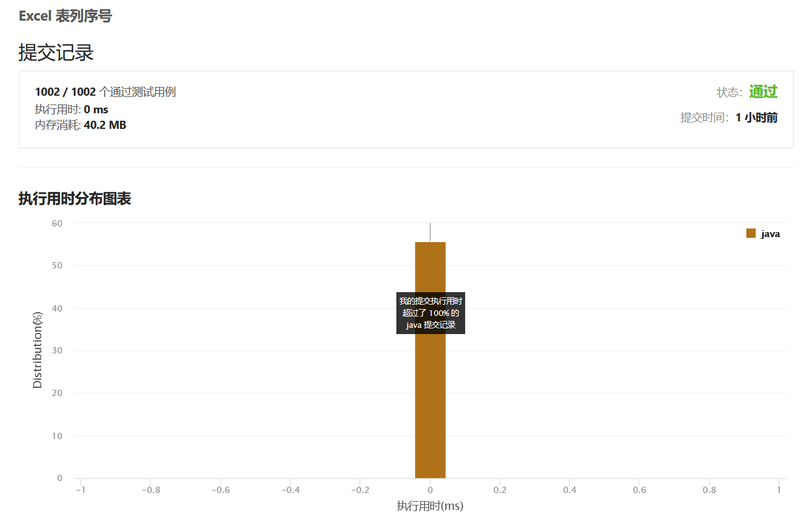

# 绪论
### <p align="right">一一顾元杰</br>学号:20200135223</br>班级:计算机Z2012</p>

# 目录:
##### <p align="right">提示:点击题目名称可直接跳转LeetCode</p>
##### <p align="right">[点击跳转到在线版](https://gitee.com/cnsukidayo/su-ke-da-data-structure/blob/master/markdown/%E6%95%B0%E6%8D%AE%E7%BB%93%E6%9E%84%E4%B8%8E%E7%AE%97%E6%B3%95.md)</p>
* ### [剑指 Offer 03. 数组中重复的数字](#Offer03)
* ### [剑指 Offer II 004. 只出现一次的数字 ](#Offer04)
* ### [707. 设计链表](#Leetcode707)
* ### [155. 最小栈](#Leetcode155)
* ### [35. 搜索插入位置](#Leetcode35)
* ### [88. 合并两个有序数组](#Leetcode88)
* ### [100. 相同的树](#Leetcode100)
* ### [111. 二叉树的最小深度](#Leetcode111)
* ### [125. 验证回文串](#Leetcode125)
* ### [168. Excel表列名称](#Leetcode168)
* ### [171. Excel 表列序号](#Leetcode171)
* ### [226. 翻转二叉树](#Leetcode226)
* ### [228. 汇总区间](#Leetcode228)
* ### [231. 2 的幂](#Leetcode231)
* ### [LCP 66. 最小展台数量](#LCP66)
* ### [LCP 67. 装饰树](#LCP67)
* ### [257. 二叉树的所有路径](#Leetcode257)
* ### [258. 各位相加](#Leetcode258)
* ### [263. 丑数](#Leetcode263)
* ### [268. 丢失的数字](#Leetcode268)
* ### [326. 3 的幂](#Leetcode326)
</br>

## <a id="dataStructure">常用数据结构:</a>  
* ### [链表](#LinkList)
* ### [栈](#Stack)
</br>

## <a id="skill">常见技巧总结:</a>  
* ### [代码的健壮性](#Robust)
* ### [开辟额外空间的注意事项](#extraCache)
* ### [得到十进制数的第i位二进制表示](#HexToBitArray)
* ### [永远不要使用JDK的Stack类](#DoNotUseStack)
* ### [快速估计算法是否会超时](#QuickTimeOut)

</br>
  
## <a id="Offer03">[剑指 Offer 03. 数组中重复的数字](https://leetcode.cn/problems/shu-zu-zhong-zhong-fu-de-shu-zi-lcof/)</a>  

### **<font color="#dddd00">题目描述:</font>**
> 找出数组中重复的数字。
在一个长度为 n 的数组 nums 里的所有数字都在 0～n-1 的范围内。数组中某些数字是重复的，但不知道有几个数字重复了，也不知道每个数字重复了几次。请找出数组中任意一个重复的数字。
>>示例 1：  
输入：
[2, 3, 1, 0, 2, 5, 3]  
输出：2 或 3  
>  
> >  限制：  
2 <= n <= 100000

### **<font color="#00FF00">解题思路:</font>**
1. ### 根据题目所述,nums数组中所有元素的范围都在[0,n-1]的范围内.于是乎自然相当,可以用一个长度为n的布尔数组contains来存储当前已经出现的元素的真假.用contains数组的索引来对应元素字面值.
2. ### 首先初始化contains数组,长度为n.此时contains数组中的每个元素都为false.
3. ### 接着遍历nums数组,直接以nums数组中元素的字面值作为contains数组的元素索引,将该索引处的元素值设置为true,以此来代表某个数已经出现过.
4. ### 如果在遍历的过程中,发现在设置contains数组的某个元素值为true之前,该元素值已经是true了,那么就表明当前数已经出现过一次,返回即可.
### **<font color="#00FFFF">代码实现:</font>**
```java
1.public int findRepeatNumber(int[] nums) {
2.    if (nums == null || nums.length == 0) {
3.        throw new IllegalArgumentException("parameter should not be null or empty!");
4.    }
5.    boolean[] contains = new boolean[nums.length];
6.    for (int i = 0; i < nums.length; i++) {
7.        if (temp[nums[i]]) {
8.            return nums[i];
9.        }
10.        contains[nums[i]] = true;
11.    }
12.    return 0;
13.}

```
1. ### 首先是代码健壮性的判断.2-4行,关于代码健壮性判断详情见:[代码的健壮性](#Robust)
2. ### 第五行是用于存储已经出现过的元素的状态标识数组.数组的索引映射出现过的元素的字面值.
3. ### 6-11行遍历nums数组,并做相应的操作.

### **<font color="#FF00FF">表格演示:</font>**
1. ### 初始化contains数组,长度为n.
|    ↓     |   0   |   1   |   2   |   3   |   4   |   5   |   6   |
| :------: | :---: | :---: | :---: | :---: | :---: | :---: | :---: |
|  array   |   2   |   3   |   1   |   0   |   2   |   5   |   3   |
| contains |   F   |   F   |   F   |   F   |   F   |   F   |   F   |
2. ### 开始遍历数组
### 将array当前元素的字面值作为contains数组的下标,并将该contains元素设置为true.
|  index   | <strong><font color="#ff00ff">↓</font></strong> |   1   |                        2                        |   3   |   4   |   5   |   6   |
| :------: | :---------------------------------------------: | :---: | :---------------------------------------------: | :---: | :---: | :---: | :---: |
|  array   | <strong><font color="#00ff00">2</font></strong> |   3   |                        1                        |   0   |   2   |   5   |   6   |
| contains |                        F                        |   F   | <strong><font color="#00ff00">F</font></strong> |   F   |   F   |   F   |   F   |
3. ### 继续遍历执行
|  index   |                        0                        | <strong><font color="#ff00ff">↓</font></strong> |                        2                        |                        3                        |   4   |   5   |   6   |
| :------: | :---------------------------------------------: | :---------------------------------------------: | :---------------------------------------------: | :---------------------------------------------: | :---: | :---: | :---: |
|  array   | <strong><font color="#ffc800">2</font></strong> | <strong><font color="#00ff00">3</font></strong> |                        1                        |                        0                        |   2   |   5   |   6   |
| contains |                        F                        |                        F                        | <strong><font color="#ffc800">T</font></strong> | <strong><font color="#00ff00">F</font></strong> |   F   |   F   |   F   |

4. ### 继续遍历执行
|  index   |                        0                        |                        1                        | <strong><font color="#ff00ff">↓</font></strong> |                        3                        |   4   |   5   |   6   |
| :------: | :---------------------------------------------: | :---------------------------------------------: | :---------------------------------------------: | :---------------------------------------------: | :---: | :---: | :---: |
|  array   | <strong><font color="#ffc800">2</font></strong> | <strong><font color="#ffc800">3</font></strong> | <strong><font color="#00ff00">1</font></strong> |                        0                        |   2   |   5   |   6   |
| contains |                        F                        | <strong><font color="#00ff00">F</font></strong> | <strong><font color="#ffc800">T</font></strong> | <strong><font color="#ffc800">T</font></strong> |   T   |   F   |   F   |
5. ### 继续遍历执行
|  index   |                        0                        |                        1                        |                        2                        | <strong><font color="#ff00ff">↓</font></strong> |   4   |   5   |   6   |
| :------: | :---------------------------------------------: | :---------------------------------------------: | :---------------------------------------------: | :---------------------------------------------: | :---: | :---: | :---: |
|  array   | <strong><font color="#ffc800">2</font></strong> | <strong><font color="#ffc800">3</font></strong> | <strong><font color="#ffc800">1</font></strong> | <strong><font color="#00ff00">0</font></strong> |   2   |   5   |   6   |
| contains | <strong><font color="#00ff00">F</font></strong> | <strong><font color="#ffc800">T</font></strong> | <strong><font color="#ffc800">T</font></strong> | <strong><font color="#ffc800">T</font></strong> |   T   |   F   |   F   |
6. ### 继续遍历执行,直到访问到contains数组某个元素为true时,此时array数组的当前元素就是重复出现过的元素.所以此时2即为重复出现的元素.
|  index   |                        0                        |                        1                        |                        2                        |                        3                        | <strong><font color="#ff00ff">↓</font></strong> |   5   |   6   |
| :------: | :---------------------------------------------: | :---------------------------------------------: | :---------------------------------------------: | :---------------------------------------------: | :---------------------------------------------: | :---: | :---: |
|  array   | <strong><font color="#ffc800">2</font></strong> | <strong><font color="#ffc800">3</font></strong> | <strong><font color="#ffc800">1</font></strong> | <strong><font color="#ffc800">0</font></strong> | <strong><font color="#00ff00">2</font></strong> |   5   |   6   |
| contains | <strong><font color="#ffc800">T</font></strong> | <strong><font color="#ffc800">T</font></strong> | <strong><font color="#ff0000">T</font></strong> | <strong><font color="#ffc800">T</font></strong> |                        T                        |   F   |   F   |

**<font color="#FFC800">复杂度分析:</font>**
> ### 时间复杂度:O(n)  
> > ### 假设一种最坏的情况,数组中元素只重复出现一次,例如:[0,1,2,3,...n-1,0],因为需要遍历玩整个数组才知道重复的元素是哪一个,所以时间复杂是O(n).

> ### 空间复杂度:O(n)
> > ### 因为需要一个布尔数组contains数组来存放已经出现过的元素的状态值,并且认定出现过的数作为contains数组的下标,那么要想contains下标合法,所以contains数组的长度就是元素数值的取值范围.即n-1+1=n
> > ### 最后检验,发现给出的条件中有<font color="#FF0000">2<=n<=100000</font>,contains数组大小不超过2^31-1.
### **<p align="center"><font color="#FF0000">通过截图:</font></p>**


## <a id="Offer04">[剑指 Offer II 004. 只出现一次的数字 ](https://leetcode.cn/problems/WGki4K/)</a>  
### **<font color="#dddd00">题目描述:</font>**
> ### 给你一个整数数组 nums ，除某个元素仅出现 一次 外，其余每个元素都恰出现 三次 。请你找出并返回那个只出现了一次的元素。
> ### 示例 1：
> > ### 输入：nums = [2,2,3,2]
> > ### 输出：3
> ### 示例 2：
> > ### 输入：nums = [0,1,0,1,0,1,100]
> > ### 输出：100
> ### 提示：
> > * ### 1 <= nums.length <= 3 * 10<sup>4</sup>
> > * ### -2<sup>31</sup> <= nums[i] <= 2<sup>31</sup> - 1
> > * ### nums 中，除某个元素仅出现 一次 外，其余每个元素都恰出现 三次
## <p align="center"><font color="#0000FF">解法一之双HashSet</font></p>
### **<font color="#00FF00">解题思路:</font>**
1. ### 在本题给出的条件中,nums数组的每个元素的取值范围为-2<sup>31</sup> <= nums[i] <= 2<sup>31</sup> - 1,显然我们不可能按照Offer3那题的方法去创建一个布尔数组标识已经出现过的数的状态,因为nums数组中元素的取值范围太广泛.
2. ### 既然如此,题目中又说除了某个元素外其余的元素都恰好出现三次.显然我们可以通过另一种方式来标识已经出现过的元素.
3. ### 我们解题的核心技术扣住某个元素只出现一次这句话.创建两个HastSet一个称作contains,contains的作用是记录所有出现过元素,即只要某个元素不存在于contains中,那么就将该元素添加到contains集合中.第二个HastSet称作saveSet,saveSet的作用是记录已经出现过的元素,并将重复的元素从saveSet中移除.
4. ### 首先遍历nums数组,将每个元素去contains集合中进行比对看contains集合是否有该元素,如果没有就将该元素添加到contains和saveSet集合中.如果contains元素中有该元素,则能传递两个信息,一是该元素曾经必然出现过,二是saveSet中曾经也必然添加过该元素,于是乎这是一个重复元素将该元素从saveSet中移除.如此操作所有重复出现过的元素到最后必然都不存在于saveSet中,只有那个只出现过一次的元素会存在于saveSet中,最终将该元素返回即刻.
### **<font color="#00FFFF">代码实现:</font>**
```java
1.public class Offer4 {
2.    private Set<Integer> saveSet;
3.    private Set<Integer> contains;
4.
5.    public int singleNumber(int[] nums) {
6.        if (nums == null || nums.length % 3 != 1) {
7.            throw new IllegalArgumentException("nums数组不能为空,并且nums数组的长度取余3必须为1!");
8.        }
9.        saveSet = new HashSet<>(nums.length / 3 + 1);
10.       contains = new HashSet<>(nums.length / 3 + 1);
11.        for (int i = 0; i < nums.length; i++) {
12.            if (!contains.contains(nums[i])) {
13.                contains.add(nums[i]);
14.                saveSet.add(nums[i]);
15.            } else {
16.                saveSet.remove(nums[i]);
17.            }
18.        }
19.        return saveSet.iterator().next();
20.    }
21.}
```
1. ### 首先6-8行是代码健壮性的判断,详情见:[代码的健壮性.](#Robust)另外值得注意的一点是,这里数组的长度取模3的值一定是1,因为除某个元素只出现一次外,其余的每个元素都恰好出现三次.
2. ### 9-10行对HashSet进行初始化,并且指定集合大小,saveSet指定为nums.length / 3 + 1,具体为什么是这个值的原因不在过多阐述.提前指定集合大小的好处是避免HastSet的自动扩容造成的时间和空间上的浪费.
3. ### 接着就是遍历nums数组,并按照解题思路中的思路编码即可.
4. ### 最后一步返回结果的时候,因为此时saveSet中必然只剩下一个元素(即只出现一次的元素),所以直接用迭代器返回第一个元素即刻.
### **<font color="#FF00FF">表格演示:</font>**
1. ### 以nums = [1,2,1,3,2,1,2]举例

2. ### 初始化HastSet
|  index   |   0   |   1   |   2   |   3   |   4   |   5   |   6   |
| :------: | :---: | :---: | :---: | :---: | :---: | :---: | :---: |
|   nums   |   1   |   2   |   1   |   3   |   2   |   1   |   2   |
| contains |       |       |       |       |       |       |       |
| saveSet  |       |       |       |       |       |       |       |

3. ### 开始遍历数组,并且在contains集合中进行判断看是否存在当前元素,如果不存在就将当前元素添加到contains和saveSet集合中去.
|  index   | <strong><font color="#ff00ff">↓</font></strong> |   1   |   2   |   3   |   4   |   5   |   6   |
| :------: | :---------------------------------------------: | :---: | :---: | :---: | :---: | :---: | :---: |
|   nums   | <strong><font color="#00ff00">1</font></strong> |   2   |   1   |   3   |   2   |   1   |   2   |
| contains | <strong><font color="#00ff00">1</font></strong> |       |       |       |       |       |       |
| saveSet  | <strong><font color="#00ff00">1</font></strong> |       |       |       |       |       |       |

4. ### 继续遍历
|  index   |                        0                        | <strong><font color="#ff00ff">↓</font></strong> |   2   |   3   |   4   |   5   |   6   |
| :------: | :---------------------------------------------: | :---------------------------------------------: | :---: | :---: | :---: | :---: | :---: |
|   nums   |                        1                        | <strong><font color="#00ff00">2</font></strong> |   1   |   3   |   2   |   1   |   2   |
| contains | <strong><font color="#ffc800">1</font></strong> | <strong><font color="#00ff00">2</font></strong> |       |       |       |       |       |
| saveSet  | <strong><font color="#ffc800">1</font></strong> | <strong><font color="#00ff00">2</font></strong> |       |       |       |       |       |
5. ### 继续遍历,一旦发现contains数组中存在当前元素,那么就将当前元素从saveSet集合中移除.
|  index   |                        0                        |                        1                        | <strong><font color="#ff00ff">↓</font></strong> |   3   |   4   |   5   |   6   |
| :------: | :---------------------------------------------: | :---------------------------------------------: | :---------------------------------------------: | :---: | :---: | :---: | :---: |
|   nums   |                        1                        |                        2                        | <strong><font color="#00ff00">1</font></strong> |   3   |   2   |   1   |   2   |
| contains | <strong><font color="#00ff00">1</font></strong> | <strong><font color="#ffc800">2</font></strong> |                                                 |       |       |       |       |
| saveSet  | <strong><font color="#00ff00">1</font></strong> | <strong><font color="#ffc800">2</font></strong> |                                                 |       |       |       |       |

|  index   |                        0                        |                        1                        | <strong><font color="#ff00ff">↓</font></strong> |   3   |   4   |   5   |   6   |
| :------: | :---------------------------------------------: | :---------------------------------------------: | :---------------------------------------------: | :---: | :---: | :---: | :---: |
|   nums   |                        1                        |                        2                        | <strong><font color="#00ff00">1</font></strong> |   3   |   2   |   1   |   2   |
| contains | <strong><font color="#ffc800">1</font></strong> | <strong><font color="#ffc800">2</font></strong> |                                                 |       |       |       |       |
| saveSet  | <strong><font color="#ffc800">2</font></strong> |                                                 |                                                 |       |       |       |       |
6. ### 继续遍历
|  index   |                        0                        |                        1                        |                        2                        | <strong><font color="#ff00ff">↓</font></strong> |   4   |   5   |   6   |
| :------: | :---------------------------------------------: | :---------------------------------------------: | :---------------------------------------------: | :---------------------------------------------: | :---: | :---: | :---: |
|   nums   |                        1                        |                        2                        |                        1                        | <strong><font color="#00ff00">3</font></strong> |   2   |   1   |   2   |
| contains | <strong><font color="#ffc800">1</font></strong> | <strong><font color="#ffc800">2</font></strong> | <strong><font color="#00ff00">3</font></strong> |                                                 |       |       |       |
| saveSet  | <strong><font color="#ffc800">2</font></strong> | <strong><font color="#00ff00">3</font></strong> |                                                 |                                                 |       |       |       |
7. ### 继续遍历
|  index   |                        0                        |                        1                        |                        2                        |   3   | <strong><font color="#ff00ff">↓</font></strong> |   5   |   6   |
| :------: | :---------------------------------------------: | :---------------------------------------------: | :---------------------------------------------: | :---: | :---------------------------------------------: | :---: | :---: |
|   nums   |                        1                        |                        2                        |                        1                        |   3   | <strong><font color="#00ff00">2</font></strong> |   1   |   2   |
| contains | <strong><font color="#ffc800">1</font></strong> | <strong><font color="#00ff00">2</font></strong> | <strong><font color="#ffc800">3</font></strong> |       |                                                 |       |       |
| saveSet  | <strong><font color="#00ff00">2</font></strong> | <strong><font color="#ffc800">3</font></strong> |                                                 |       |                                                 |       |       |

|  index   |                        0                        |                        1                        |                        2                        |   3   | <strong><font color="#ff00ff">↓</font></strong> |   5   |   6   |
| :------: | :---------------------------------------------: | :---------------------------------------------: | :---------------------------------------------: | :---: | :---------------------------------------------: | :---: | :---: |
|   nums   |                        1                        |                        2                        |                        1                        |   3   | <strong><font color="#00ff00">2</font></strong> |   1   |   2   |
| contains | <strong><font color="#ffc800">1</font></strong> | <strong><font color="#ffc800">2</font></strong> | <strong><font color="#ffc800">3</font></strong> |       |                                                 |       |       |
| saveSet  | <strong><font color="#ffc800">3</font></strong> | <strong><font color="#ffc800"></font></strong>  |                                                 |       |                                                 |       |       |

8. ### 继续遍历
|  index   |                        0                        |                        1                        |                        2                        |   3   |   4   | <strong><font color="#ff00ff">↓</font></strong> |   6   |
| :------: | :---------------------------------------------: | :---------------------------------------------: | :---------------------------------------------: | :---: | :---: | :---------------------------------------------: | :---: |
|   nums   |                        1                        |                        2                        |                        1                        |   3   |   2   | <strong><font color="#00ff00">1</font></strong> |   2   |
| contains | <strong><font color="#00ff00">1</font></strong> | <strong><font color="#ffc800">2</font></strong> | <strong><font color="#ffc800">3</font></strong> |       |       |                                                 |       |
| saveSet  | <strong><font color="#ffc800">3</font></strong> | <strong><font color="#ffc800"></font></strong>  |                                                 |       |       |                                                 |       |

9. ### 继续遍历
|  index   |                        0                        |                        1                        |                        2                        |   3   |   4   |   5   | <strong><font color="#ff00ff">↓</font></strong> |
| :------: | :---------------------------------------------: | :---------------------------------------------: | :---------------------------------------------: | :---: | :---: | :---: | :---------------------------------------------: |
|   nums   |                        1                        |                        2                        |                        1                        |   3   |   2   |   1   | <strong><font color="#00ff00">2</font></strong> |
| contains | <strong><font color="#ffc800">1</font></strong> | <strong><font color="#00ff00">2</font></strong> | <strong><font color="#ffc800">3</font></strong> |       |       |       |                                                 |
| saveSet  | <strong><font color="#ffc800">3</font></strong> | <strong><font color="#ffc800"></font></strong>  |                                                 |       |       |       |                                                 |
 
10. ### 遍历结束后将saveSet中的第一个元素(也就是唯一的一个元素)返回即可.
|  index   |                        0                        |                        1                        |                        2                        |   3   |   4   |   5   |   6   |
| :------: | :---------------------------------------------: | :---------------------------------------------: | :---------------------------------------------: | :---: | :---: | :---: | :---: |
|   nums   |                        1                        |                        2                        |                        1                        |   3   |   2   |   1   |   2   |
| contains | <strong><font color="#ffc800">1</font></strong> | <strong><font color="#ffc800">2</font></strong> | <strong><font color="#ffc800">3</font></strong> |       |       |       |       |
| saveSet  | <strong><font color="#ff0000">3</font></strong> | <strong><font color="#ffc800"></font></strong>  |                                                 |       |       |       |       |


**<font color="#FFC800">复杂度分析:</font>**
> ### 时间复杂度:O(n)  
> > 1. ### 首先需要遍历整个nums数组,所以时间复杂度为O(n)
> > 2. ### 其次每次都要对元素进行contains判断,根据主流说法,HashSet的时间复杂度为O(1).
> > 3. ### contains被判为false一共只会出现nums.length/3+1次,当contains判为false时会进行两次add操作,分别将当前元素添加到contains和saveSet这两个集合中去,根据主流说法HashSet的add方法时间复杂度为O(1),所以contains被判为false时会执行O(1)+O(1)的时间复杂度的代码.
> > 4. ### contains被判为true一共会出现num.length / 3 * 2次,当contains判为true时会对saveSet进行remove操作,根据主流说法HashSet的remove方法时间复杂度为O(1).
> > 5. ### 所以综上所述时间复杂度为:O(n*(O(1) + n / 3 + 1 * (O(1)+O(1)) + n / 3 * 2 * O(1))) = O(n)

> ### 空间复杂度:O(n)
> > 1. ### 需要两个HashSet,其中contains这个集合的大小为O(n / 3 + 1),因为不管给定的nums内的元素如何排列,contains集合代表的意义是已经出现过的元素的集合.而所有元素出现的次数必定是nums数组的总长度除3再加1.
> > 2. ### 同理saveSet集合也不会存储重复出现过的元素,所以它的长度最大也是nums数组的长度除3再加1.即O(n / 3 + 1)
> > 3. ### 综上所述空间复杂度为: O(n / 3 + 1) + O(n / 3 + 1) = O(n)

### **<p align="center"><font color="#FF0000">通过截图:</font></p>**


## <p align="center"><font color="#0000FF">解法二之排序</font></p>
### **<font color="#00FF00">解题思路:</font>**
1. ### 如题所述,解题核心是紧扣每个元素都恰好出现三次.
2. ### 我们先假设nums数组中的每个元素都恰好出现三次,此时对该数组进行排序后,应当形成每三个元素为一组的局面.每组元素都相同.若此时往该有序数组中插入一个未出现过的元素,那么这个元素出现的位置只也两种可能.第一种可能是出现在某组之前,另外一种可能是出现在nums数组的最后一个位置.
3. ### 看第一种情况,假设 nums = [1,3,1,3,1,3,2] 将其排序后 nums = [1,1,1,2,3,3,3].
4. ### 再看一种情况,假设 nums = [1,2,1,2,1,2,3] 将其排序后 nums = [1,1,1,2,2,2,3].
5. ### 所以我们只要每三个元素为一组进行遍历,遍历时判断每组的第一个和第二个元素是否相等,如果这两个元素不相等,那么该组中的第一个元素就是只出现一次的元素.对于第二种情况,如果遍历到最后只剩下一个元素时还没有找到只出现一次的元素,那么最后一个元素必为只出现一次的元素.
### **<font color="#00FFFF">代码实现:</font>**
```java
1.class Solution {
2.    public int singleNumber(int[] nums) {
3.        if (nums == null || nums.length % 3 != 1) {
4.            throw new IllegalArgumentException("nums数组不能为空,并且nums数组的长度取余3必须为1!");
5.        }
6.        Arrays.sort(nums);
7.        for (int i = 0; i < nums.length - 1; i += 3) {
8.            if (nums[i] != nums[i + 1]) {
9.                return nums[i];
10.            }
11.        }
12.        return nums[nums.length - 1];
13.    }
14.}
```
1. ### 首先6-8行是代码健壮性的判断,详情见:[代码的健壮性.](#Robust)另外值得注意的一点是,这里数组的长度取模3的值一定是1,因为除某个元素只出现一次外,其余的每个元素都恰好出现三次.
2. ### 接着调用Arrays.sort()对nums数组进行排序.
3. ### 按照一开始的思路,对排序后的nums数组以三个元素为一组,对每组的第一个和第二个元素进行值相等的比较.
4. ### 如果for循环结束还没有找到只出现一次的数值,那么就将数组最后一个元素进行返回.
### **<font color="#FF00FF">表格演示:</font>**
1. ### 初始化表格
| index |   0   |   1   |   2   |   3   |   4   |   5   |   6   |
| :---: | :---: | :---: | :---: | :---: | :---: | :---: | :---: |
| nums  |   1   |   3   |   1   |   3   |   1   |   3   |   2   |
2. ### 对nums数组进行排序
| index |   0   |   1   |   2   |   3   |   4   |   5   |   6   |
| :---: | :---: | :---: | :---: | :---: | :---: | :---: | :---: |
| nums  |   1   |   1   |   1   |   2   |   3   |   3   |   3   |
3. ### 以三个元素为一组开始遍历,并比较第一个元素和第二个元素是否相等.
| index | <strong><font color="#ff00ff">↓</font></strong> | <strong><font color="#ff00ff">↓</font></strong> |   2   |   3   |   4   |   5   |   6   |
| :---: | :---------------------------------------------: | :---------------------------------------------: | :---: | :---: | :---: | :---: | :---: |
| nums  | <strong><font color="#00ff00">1</font></strong> | <strong><font color="#00ff00">1</font></strong> |   1   |   2   |   3   |   3   |   3   |
4. ### 如果发现不相等,则返回改组中的第一个元素,注意因为是以三个元素为一组所以不会对索引2除的元素进行任何操作.这里发现2!=3所以返回2即刻.
| index |                        0                        |                        1                        |   2   | <strong><font color="#ff00ff">↓</font></strong> | <strong><font color="#ff00ff">↓</font></strong> |   5   |   6   |
| :---: | :---------------------------------------------: | :---------------------------------------------: | :---: | :---------------------------------------------: | :---------------------------------------------: | :---: | :---: |
| nums  | <strong><font color="#ffc800">1</font></strong> | <strong><font color="#ffc800">1</font></strong> |   1   | <strong><font color="#ff0000">2</font></strong> | <strong><font color="#00ff00">3</font></strong> |   3   |   3   |
**<font color="#FFC800">复杂度分析:</font>**
> ### 时间复杂度:O(n log(n))
> > 1. ### 首先第一步就是对nums数组进行排序,根据JDK官方的API说法是该算法在大多数情况下的时间复杂度都是O(n log(n)),所以对nums数组进行排序的时间复杂度为O(n log(n)).
> > 2. ### 其次是以三个元素为一组进行比较,一共会执行 n / 3次,所以比较数值这一步的时间复杂度为O(n / 3)
> > 3. ### 综上所述,算法的时间复杂度为O(n log(n))
> ### 空间复杂度:O(1)
> > 1. ### 本算法不需要开辟额外的内存空间,所以空间复杂度为O(1),即本算法所消耗的空间大小不随问题规模的扩大而扩大.
### **<p align="center"><font color="#FF0000">通过截图:</font></p>**


## <p align="center"><font color="#0000FF">解法三之位运算</font></p>

### **<font color="#00FF00">解题思路:</font>**
1. ### 上述两种算法都各有优劣,一个时间复杂度相对较低,一个空间复杂度相对较低.
2. ### 看了一眼这题的标签是位运算,那么就想想能否用位运算来优化这道题的算法.
3. ### 假设nums = [5,5,5] 这是一个每个元素重复出现三次的数组,它们的二进制分别是:
   ### 1 0 1</br> 
   ### 1 0 1</br>
   ### 1 0 1</br>
   ### 将这三个二进制的每一位想加,得到的二进制是3 0 3 我们对每一位取模3,得到的结果就是 0 0 0.
4. ### 假设nums = [5,5,5,3] 它们的二进制分别为:
   ### 1 0 1</br>
   ### 1 0 1</br>
   ### 1 0 1</br>
   ### &emsp;1 1</br>
   ### 将这四个二进制的每一位想加,得到的二进制是 3 1 4 同样对每一位进行取模3,得到的结果就是 0 1 1 此时不难发现该结果就是只出现一次元素的二进制值.
5. ### 会产生这种情况得益于数组中很多元素都是成3重复出现的,所以它们的二进制也会存在某种相似性(或者叫对称性),导致将它们的二进制表示想加后再取模3结果一定是0.而唯有那个只出现一次的元素的二进制值是显得突兀的.
6. ### 根据题目的提示,数组元素的取值范围为-2<sup>31</sup> <= nums[i] <= 2<sup>31</sup> - 1 也就是说会出现负数的情况.而在Java中基本数据类型都是有符号的,并且最高位为符号位.0代表正数1代表负数,所以在相加每个数的二进制时通常要考虑符号位的问题.而这里由于负数和正数的符号位也存在一种对称的关系(即负数和正数出现的次数一定能被3整除,不包含只出现一次的数).简单来说就是这里只要把所有数的二进制想加即可.
7. ### 首先,我们要创建一个长度为32的short数组(称为plus),数组元素从0到32(0->32)依次表示十进制数的二进制从最高位到最低位.假设我们要讲十进制数3存入到plus数组中,它应该是这样的:
    | index |   0   |   1   | 2...29 |  30   |  31   |
    | :---: | :---: | :---: | :----: | :---: | :---: |
    | plus  |   0   |   0   | 0...0  |   1   |   1   |
    ### 值得注意的是将十进制数的二进制表示存储到plus数组中时要注意索引位置不是从0开始存储,而是从数组最后一个元素往前存储.
    ### 另外short类型也有讲究,因为这题给定nums数组的长度范围是<font color="#FF0000">1 <= nums.length <= 3 * 10^4</font>,所以就算nums数组中所有数的某一位二进制都是1,那么在这一位上一共也就是想加30000次,是在short类型的范围之内的.
8. ### 现在开始遍历nums数组,并拿到一个十进制元素.那么该如何将这个十进制元素的二进制表示,存放到plus数组中呢?换句话说就是如何得到十进制数的二进制表示的每一位的值?详情见:[得到十进制数的第i位二进制表示](#HexToBitArray)
9. ### 遍历完数组之后,就是将plus数组中的每个元素对3进行取模,取模后得到的数组就表示只出现一次的那个元素的二进制表示.最后一步就是将二进制数组转为十进制数,我们只要定义一个变量result,然后遍历plus数组将result每次都加等于plus元素的数组再讲其左移1位往复循环便可得到该二进制数组的十进制表示.
### **<font color="#00FFFF">代码实现:</font>**
```java
1.class Solution {
2.    int[] plus = new int[32];
3.
4.    public int singleNumber(int[] nums) {
5.        if (nums == null || nums.length % 3 != 1) {
6.            throw new IllegalArgumentException("nums数组不能为空,并且nums数组的长度取余3必须为1!");
7.        }
8.        for (int i = 0; i < nums.length; i++) {
9.            int currentNumber = nums[i];
10.            for (int j = plus.length - 1; j > -1; j--) {
11.                if (currentNumber != 0) {
12.                    plus[j] += 1 & currentNumber;
13.                    currentNumber >>= 1;
14.                } else {
15.                    break;
16.                }
17.            }
18.        }
19.        for (int i = 0; i < plus.length; i++) {
20.            plus[i] %= 3;
21.        }
22.        int result = 0;
23.        for (int i = 0; i < plus.length; i++) {
24.            result <<= 1;
25.            result += plus[i];
26.        }
27.        return result;
28.    }
29.}
```
1. ### 第2行定义plus数组,长度为32因为int类型是4字节32位的,这里既然要用数组来表示每一位二进制,自然长度为32.
2. ### 5-7行依旧时代码健壮性的判断,详情见:[代码的健壮性.](#Robust)
3. ### 8-18行遍历nums数组并将每一位添加到plus数组中.
4. ### 19-21行,将plus数组的每一位取模3
5. ### 将二进制数组plus转为十进制数值.
### **<font color="#FF00FF">表格演示:</font>**
1. ### 初始化表格,假设nums = [1,-2,3,1,-2,-2,1]
|   index    |   0   |   1   |   2    |   3   |   4   |   5   |   6   |
| :--------: | :---: | :---: | :----: | :---: | :---: | :---: | :---: |
|    nums    |   1   |  -2   |   3    |   1   |  -2   |  -2   |   1   |
| plus index |   0   |   1   | 2...27 |  28   |  29   |  30   |  31   |
|    plus    |   0   |   0   |   0    |   0   |   0   |   0   |   0   |
2. ### 开始遍历数组,得到第一个元素1的二进制值为1
|   index    | <strong><font color="#ff00ff">↓</font></strong> |   1   |   2    |   3   |   4   |   5   |                        6                         |
| :--------: | :---------------------------------------------: | :---: | :----: | :---: | :---: | :---: | :----------------------------------------------: |
|    nums    | <strong><font color="#00ff00">1</font></strong> |  -2   |   3    |   1   |  -2   |  -2   |                        1                         |
| plus index |                        0                        |   1   | 2...27 |  28   |  29   |  30   | <strong><font color="#00ff00">31</font></strong> |
|    plus    |                        0                        |   0   |   0    |   0   |   0   |   0   | <strong><font color="#00ff00">1</font></strong>  |
3. ### 继续遍历数组,第二个元素-2的二进制值为1000......10注意这里是负数.
|   index    |                        0                        | <strong><font color="#ff00ff">↓</font></strong>  |   2    |   3   |   4   |                        5                         |                        6                         |
| :--------: | :---------------------------------------------: | :----------------------------------------------: | :----: | :---: | :---: | :----------------------------------------------: | :----------------------------------------------: |
|    nums    |                        1                        | <strong><font color="#00ff00">-2</font></strong> |   3    |   1   |  -2   |                        -2                        |                        1                         |
| plus index | <strong><font color="#00ff00">0</font></strong> |                        1                         | 2...27 |  28   |  29   | <strong><font color="#00ff00">30</font></strong> | <strong><font color="#ffc800">31</font></strong> |
|    plus    | <strong><font color="#00ff00">1</font></strong> |                        0                         |   0    |   0   |   0   |                        1                         | <strong><font color="#ffc800">1</font></strong>  |
4. ### 继续遍历数组,第三个元素3的二进制值为11
|   index    |                        0                        |   1   | <strong><font color="#ff00ff">↓</font></strong> |   3   |   4   |                        5                         |                        6                         |
| :--------: | :---------------------------------------------: | :---: | :---------------------------------------------: | :---: | :---: | :----------------------------------------------: | :----------------------------------------------: |
|    nums    |                        1                        |  -2   | <strong><font color="#00ff00">3</font></strong> |   1   |  -2   |                        -2                        |                        1                         |
| plus index | <strong><font color="#ffc800">0</font></strong> |   1   |                     2...27                      |  28   |  29   | <strong><font color="#00ff00">30</font></strong> | <strong><font color="#00ff00">31</font></strong> |
|    plus    | <strong><font color="#ffc800">1</font></strong> |   0   |                        0                        |   0   |   0   | <strong><font color="#00ff00">2</font></strong>  | <strong><font color="#00ff00">2</font></strong>  |
5. ### 继续遍历,第四个元素1的二进制值为1
|   index    |                        0                        |   1   |   2    | <strong><font color="#ff00ff">↓</font></strong> |   4   |                        5                         |                        6                         |
| :--------: | :---------------------------------------------: | :---: | :----: | :---------------------------------------------: | :---: | :----------------------------------------------: | :----------------------------------------------: |
|    nums    |                        1                        |  -2   |   3    | <strong><font color="#00ff00">1</font></strong> |  -2   |                        -2                        |                        1                         |
| plus index | <strong><font color="#ffc800">0</font></strong> |   1   | 2...27 |                       28                        |  29   | <strong><font color="#ffc800">30</font></strong> | <strong><font color="#00ff00">31</font></strong> |
|    plus    | <strong><font color="#ffc800">1</font></strong> |   0   |   0    |                        0                        |   0   | <strong><font color="#ffc800">2</font></strong>  | <strong><font color="#00ff00">3</font></strong>  |
6. ### 继续遍历直到最后一个元素
|   index    |                        0                        |   1   |   2    |   3   |   4   |                        5                         | <strong><font color="#ff00ff">↓</font></strong>  |
| :--------: | :---------------------------------------------: | :---: | :----: | :---: | :---: | :----------------------------------------------: | :----------------------------------------------: |
|    nums    |                        1                        |  -2   |   3    |   1   |  -2   |                        -2                        | <strong><font color="#00ff00">1</font></strong>  |
| plus index | <strong><font color="#ffc800">0</font></strong> |   1   | 2...27 |  28   |  29   | <strong><font color="#ffc800">30</font></strong> | <strong><font color="#00ff00">31</font></strong> |
|    plus    | <strong><font color="#ffc800">3</font></strong> |   0   |   0    |   0   |   0   | <strong><font color="#ffc800">4</font></strong>  | <strong><font color="#00ff00">4</font></strong>  |
7. ### 对plus数组的每个元素对3进行取模.
|   index    |                        0                        |                        1                        |                        2                        |                        3                        |                        4                        |                        5                         | <strong><font color="#ff00ff">↓</font></strong>  |
| :--------: | :---------------------------------------------: | :---------------------------------------------: | :---------------------------------------------: | :---------------------------------------------: | :---------------------------------------------: | :----------------------------------------------: | :----------------------------------------------: |
|    nums    |                        1                        |                       -2                        |                        3                        |                        1                        |                       -2                        |                        -2                        | <strong><font color="#00ff00">1</font></strong>  |
| plus index | <strong><font color="#00ff00">0</font></strong> |                        1                        |                     2...27                      |                       28                        |                       29                        | <strong><font color="#00ff00">30</font></strong> | <strong><font color="#00ff00">31</font></strong> |
|    plus    | <strong><font color="#ff0000">0</font></strong> | <strong><font color="#ff0000">0</font></strong> | <strong><font color="#ff0000">0</font></strong> | <strong><font color="#ff0000">0</font></strong> | <strong><font color="#ff0000">0</font></strong> | <strong><font color="#ff0000">1</font></strong>  | <strong><font color="#ff0000">1</font></strong>  |
8. ### 将plus二进制数组转为十进制,最终的结果即为3是只出现一次的元素.

**<font color="#FFC800">复杂度分析:</font>**
> ### 时间复杂度:O(n)  
> > 1. ### 首选需要遍历整个数组,并且对于数组的每个元素还要做32次的位运算(为了获取当前十进制数的二进制表示而做的运算),即时间复杂度为O(n*32)
> > 2. ### 遍历完nums数组后,还需要将当前plus数组的每一位元素对3进行取模,而plus数组的长度固定为32.所以时间复杂度为O(32)
> > 3. ### 最后还需要将plus数组再遍历一次,为的是将二进制数组转为十进制表示.所以时间复杂度也是O(32)
> > 4. ### 综上所述,时间复杂度为O(n * 32) + O(32) + O(32) = O(n) 
> ### 空间复杂度:O(1)
> > 1. ### 只开辟了一个长度固定为32的short数组,作为二进制数的存储.即空间复杂度为O(32) = O(1) 即算法的空间复杂度不随问规模的扩大而扩大.
### **<p align="center"><font color="#FF0000">通过截图:</font></p>**


## <a id="Leetcode707">[707. 设计链表](https://leetcode.cn/problems/design-linked-list/)</a>  
## 本题题解放到常用数据结构之链表中完成,[点击跳转](#LinkList).

## <a id="Leetcode155">[155. 最小栈](https://leetcode.cn/problems/min-stack/)</a>  
### **<font color="#FFFF00">题目描述:</font>**
> ### 设计一个支持 push ，pop ，top 操作，并能在常数时间内检索到最小元素的栈。
> ### 实现 MinStack 类:
> * ### MinStack() 初始化堆栈对象。
> * ### void push(int val) 将元素val推入堆栈。
> * ### void pop() 删除堆栈顶部的元素。
> * ### int top() 获取堆栈顶部的元素。
> * ### int getMin() 获取堆栈中的最小元素。
> ### 示例1:
> > ### 输入：
> > ### ["MinStack","push","push","push","getMin","pop","top","getMin"]
> > ### [[],[-2],[0],[-3],[],[],[],[]]
> > ### 输出：
> > ### [null,null,null,null,-3,null,0,-2]
> > ### 解释：
> > ### MinStack minStack = new MinStack();
> > ### minStack.push(-2);
> > ### minStack.push(0);
> > ### minStack.push(-3);
> > ### minStack.getMin();   --> 返回 -3.
> > ### minStack.pop();
> > ### minStack.top();      --> 返回 0.
> > ### minStack.getMin();   --> 返回 -2.
> ### 提示:
> * ### -231 <= val <= 231 - 1
> * ### pop、top 和 getMin 操作总是在 非空栈 上调用
> * ### push, pop, top, and getMin最多被调用 3 * 104 次

### **<font color="#00FF00">解题思路:</font>**
1. ### 本题采用双栈来实现,push、pop、top方法的时间都较为简单.毕竟栈的实现本身并不困难,只要满足先进后出即可.栈的实现有两种方式一种是线性栈一种是链栈,本题具体采用哪种稍后介绍.
2. ### 对于getMin()方法,一种可行的实现是遍历栈然后找出最小的元素即可.那么时间复杂度就为O(n).
3. ### 这里采用双栈的实现方法,即一个栈正常使用(称为iStack).当我们往栈中放入元素时,如果栈是空的第一次放入元素,那么将这个元素同时保存到minStack中.紧接着第二个元素放入iStack之后需要和minStack栈中的栈顶元素进行比较,如果该元素小于等于栈顶元素,则将该元素放入minStack中,否则不做任何操作仅仅将该元素放入iStack中.以此类推第三个第四个元素...这样做的好处是minStack的栈顶永远存放的是iStack栈中目前最小的元素.
4. ### 注意实际上minStack是有序的,从栈顶到栈底是升序.所以当我们从iStack中移除元素的时候才有可能将当前栈中最小的元素移除.所以,再移除元素之后,需要判断如果当前移除的元素和minStack中栈顶的元素相等,就表明当前移除的是iStack中最小的元素,所以同样需要将该元素从minStack中移除,如果不等说明当前要移除的元素定必minStack栈顶的元素大,也就代表此时iStack中的最小元素依旧时minStack的栈顶元素.
5. ### 题目中明确说了pop、top和getMin操作总是在非空栈上调用,所以就本题而言不用考虑边界值问题.
6. ### 本题采用链栈,虽然题目中明确给出了push, pop, top, and getMin最多被调用3 * 10^4次的条件,使用顺序栈也只要指定大小固定为30000次即可,不需要考虑扩容问题,但如果栈的空间只使用很少一部分势必会造成内存空间的浪费,所以就本题而言采用链栈更为合适.
### **<font color="#00FFFF">代码实现:</font>**
```java
1.class MinStack {
2.
3.    IStack iStack = new IStack();
4.    IStack minStack = new IStack();
5.    int min = Integer.MAX_VALUE;
6.
7.    public MinStack() {
8.
9.    }
10.
11.    public void push(int val) {
12.        iStack.push(val);
13.        if (val <= min) {
14.            min = val;
15.            minStack.push(val);
16.        }
17.    }
18.
19.    public void pop() {
20.        int top = iStack.top();
21.        iStack.pop();
22.        if (top == minStack.top()) {
23.            minStack.pop();
24.        }
25.        if (minStack.top != null) {
26.            min = minStack.top();
27.        } else {
28.            min = Integer.MAX_VALUE;
29.        }
30.    }
31.
32.    public int top() {
33.        return iStack.top();
34.    }
35.
36.    public int getMin() {
37.        return minStack.top();
38.    }
39.
40.    private static class IStack {
41.
42.        private Node top = null;
43.
44.        public int top() {
45.            return top.value;
46.        }
47.
48.        public void pop() {
49.            top = top.pre;
50.        }
51.
52.        public void push(int value) {
53.            Node node = new Node(value, top);
54.            top = node;
55.        }
56.    }
57.
58.    private static class Node {
59.        private int value;
60.        private Node pre;
61.
62.        public Node(int value, Node pre) {
63.            this.value = value;
64.            this.pre = pre;
65.        }
66.    }
67.
68.}
```
### **<font color="#FF00FF">表格演示:</font>**
1. ### 以["MinStack","push","push","push","getMin","pop","top","getMin"]  
    ### [[],[-2],[0],[-3],[],[],[],[]]
    ### 为示例,开始执行.
    |  index   |   0   |   1   |   2   |
    | :------: | :---: | :---: | :---: |
    |  iStack  |       |       |       |
    | minStack |       |       |       |
2. ### 执行push操作,由于是第一个元素,必定会放进minStack中
    |  index   | <strong><font color="#ff00ff">↓</font></strong>  |                       1                        |                       2                        |
    | :------: | :----------------------------------------------: | :--------------------------------------------: | :--------------------------------------------: |
    |  iStack  | <strong><font color="#00ff00">-2</font></strong> |                                                | <strong><font color="#00ff00"></font></strong> |
    | minStack | <strong><font color="#00ff00">-2</font></strong> | <strong><font color="#00ff00"></font></strong> |                                                |
3. ### 继续push,但是0不比-2小,所以0不会放入minStack中.
   |  index   |                        0                         | <strong><font color="#ff00ff">↓</font></strong> |   2   |
   | :------: | :----------------------------------------------: | :---------------------------------------------: | :---: |
   |  iStack  | <strong><font color="#ffc800">-2</font></strong> | <strong><font color="#00ff00">0</font></strong> |       |
   | minStack | <strong><font color="#ffc800">-2</font></strong> |                                                 |       |
4. ### 接着进行push操作,因为-3比minStack栈顶的元素小,所以会放入minStack中.
   |  index   |                        0                         |                        1                         | <strong><font color="#ff00ff">↓</font></strong>  |
   | :------: | :----------------------------------------------: | :----------------------------------------------: | :----------------------------------------------: |
   |  iStack  | <strong><font color="#ffc800">-2</font></strong> | <strong><font color="#ffc800">0</font></strong>  | <strong><font color="#00ff00">-3</font></strong> |
   | minStack | <strong><font color="#ffc800">-2</font></strong> | <strong><font color="#00ff00">-3</font></strong> |                                                  |
5. ### getMin()方法直接返回minStack的栈顶元素就是当前iStack栈中的最小元素.为-3
   |  index   |                        0                         |                        1                         | <strong><font color="#ff00ff">↓</font></strong>  |
   | :------: | :----------------------------------------------: | :----------------------------------------------: | :----------------------------------------------: |
   |  iStack  | <strong><font color="#ffc800">-2</font></strong> | <strong><font color="#ffc800">0</font></strong>  | <strong><font color="#ffc800">-3</font></strong> |
   | minStack | <strong><font color="#ffc800">-2</font></strong> | <strong><font color="#ff0000">-3</font></strong> |                                                  |
6. ### pop方法,看iStack弹出的元素和minStack栈顶元素是否相等如果相等,则将minStack的栈顶元素一并弹出.这里相等所以会一并弹出.
   |  index   |                        0                         |                        1                         | <strong><font color="#ff00ff">↓</font></strong>  |
   | :------: | :----------------------------------------------: | :----------------------------------------------: | :----------------------------------------------: |
   |  iStack  | <strong><font color="#ffc800">-2</font></strong> | <strong><font color="#ffc800">0</font></strong>  | <strong><font color="#00ff00">-3</font></strong> |
   | minStack | <strong><font color="#ffc800">-2</font></strong> | <strong><font color="#00ff00">-3</font></strong> |                                                  |

    |  index   |                        0                         | <strong><font color="#ff00ff">↓</font></strong> |                       2                        |
    | :------: | :----------------------------------------------: | :---------------------------------------------: | :--------------------------------------------: |
    |  iStack  | <strong><font color="#ffc800">-2</font></strong> | <strong><font color="#ffc800">0</font></strong> | <strong><font color="#00ff00"></font></strong> |
    | minStack | <strong><font color="#ffc800">-2</font></strong> | <strong><font color="#00ff00"></font></strong>  |                                                |
7. ### top()方法直接返回iStack的栈顶元素即可.为0
   |  index   |                        0                         | <strong><font color="#ff00ff">↓</font></strong> |                       2                        |
   | :------: | :----------------------------------------------: | :---------------------------------------------: | :--------------------------------------------: |
   |  iStack  | <strong><font color="#ffc800">-2</font></strong> | <strong><font color="#ff0000">0</font></strong> | <strong><font color="#00ff00"></font></strong> |
   | minStack | <strong><font color="#ffc800">-2</font></strong> | <strong><font color="#00ff00"></font></strong>  |                                                |
   
   |  index   | <strong><font color="#ff00ff">↓</font></strong>  |                       1                        |                       2                        |
   | :------: | :----------------------------------------------: | :--------------------------------------------: | :--------------------------------------------: |
   |  iStack  | <strong><font color="#ffc800">-2</font></strong> |                                                | <strong><font color="#00ff00"></font></strong> |
   | minStack | <strong><font color="#ffc800">-2</font></strong> | <strong><font color="#00ff00"></font></strong> |                                                |

8. ### 最后再次调用getMin()方法返回minStack栈中的栈顶元素即可,为-2.
   |  index   | <strong><font color="#ff00ff">↓</font></strong>  |                       1                        |                       2                        |
   | :------: | :----------------------------------------------: | :--------------------------------------------: | :--------------------------------------------: |
   |  iStack  | <strong><font color="#ffc800">-2</font></strong> |                                                | <strong><font color="#00ff00"></font></strong> |
   | minStack | <strong><font color="#ff0000">-2</font></strong> | <strong><font color="#00ff00"></font></strong> |                                                |


**<font color="#FFC800">复杂度分析:</font>**
> ### 时间复杂度:O(1)  
> > 1. ### push()方法没有涉及复杂操作,时间复杂度为O(1).
> > 2. ### pop()方法没有涉及复杂操作,时间复杂度为O(1).
> > 3. ### top()方法没有涉及复杂操作,时间复杂度为O(1).
> > 4. ### getMin()方法,由于在添加和删除操作时做了额外操作,所以时间复杂度为O(1)

> ### 空间复杂度:O(n)
> > 1. ### 因为需要一个额外的栈来存储当前iStack栈中的最小元素,所以空间复杂度为O(n).
> > 2. ### 假设示例为 iStack = [5,4,3,2,1] 则minStack也相应的为[5->4->3->2->1]所以空间复杂度为O(n).
### **<p align="center"><font color="#FF0000">通过截图:</font></p>**


## <a id="Leetcode35">[35. 搜索插入位置](https://leetcode.cn/problems/search-insert-position/)</a>
### **<font color="#DDDD00">题目描述:</font>**
> ### 给定一个排序数组和一个目标值，在数组中找到目标值，并返回其索引。如果目标值不存在于数组中，返回它将会被按顺序插入的位置。
> ### 请必须使用时间复杂度为 O(log n) 的算法。
> ### 示例 1:
> > ### 输入: nums = [1,3,5,6], target = 5
> > ### 输出: 2
> ### 示例 2:
> > ### 输入: nums = [1,3,5,6], target = 2
> > ### 输出: 1
> ### 示例 3:
> > ### 输入: nums = [1,3,5,6], target = 7
> > ### 输出: 4
> ### 提示:
> > * ### 1 <= nums.length <= 10^4
> > * ### -10^4 <= nums[i] <= 10^4
> > * ### nums 为 无重复元素 的 升序 排列数组
> > * ### -10^4 <= target <= 10^4

### **<font color="#00FF00">解题思路:</font>**
1. ### 因为是有序数组,所以本题想到采用二分法的实现思路.
2. ### 将target元素和数组中间的元素进行比较,如果比中间的元素大那就说明当前元素所插入的位置一定在中间元素的右侧.如果比中间元素小,说明当前元素所插入的位置一定在中间元素的左侧.
3. ### 如果当前元素比中间的元素大,那就把现在的中间元素看成数组的开头,把现在数组的最右端看做末尾.然后再去找这个数组的中间元素与当前元素进行比较.
4. ### 不难看出这其实是一个递归问题.
### **<font color="#00FFFF">代码实现:</font>**
```java
1.public int searchInsert(int[] nums, int target) {
2.    return searchInsert(nums, target, 0, nums.length - 1);
3.}
4.
5.public int searchInsert(int[] nums, int target, int left, int right) {
6.    int mid = (right - left) / 2 + left;
7.    if (nums[mid] == target) {
8.        return mid;
9.    }
10.    if (mid == left) {
11.        if (target < nums[left]) {
12.            return left;
13.        } else if (target > nums[right]) {
14.            return right + 1;
15.        } else {
16.            return left + 1;
17.        }
18.    }
19.    if (nums[mid] > target) {
20.        return searchInsert(nums, target, left, mid);
21.    } else if (nums[mid] < target) {
22.        return searchInsert(nums, target, mid, right);
23.    }
24.    return right;
25.}
```
**<font color="#FFC800">复杂度分析:</font>**
> ### 时间复杂度:O(logn)  
> > 1. ### 因为不需要遍历数组,每次操作都可以将原有区间的一般筛选出去.即1/2 * 1/2 * 1/2 ...
> > 2. ### 所以时间复杂度为O(logn),即算法时间复杂度随问题规模的上升而成对数级的地上升.

> ### 空间复杂度:O(1)
> > 1. ### 因为没有用到额外的内存空间,只需要常数空间存放变量和栈帧的开销即可.
### **<p align="center"><font color="#FF0000">通过截图:</font></p>**


## <a id="Leetcode88">[88. 合并两个有序数组](https://leetcode.cn/problems/merge-sorted-array/)</a>
### **<font color="#DDDD00">题目描述:</font>**
> ### 给你两个按 非递减顺序 排列的整数数组 nums1 和 nums2，另有两个整数 m 和 n ，分别表示 nums1 和 nums2 中的元素数目。
> ### 请你合并nums2到nums1中使合并后的数组同样按非递减顺序 > ### 排列。
> ### 注意：最终，合并后数组不应由函数返回，而是存储在数组 nums1 中。> ### 为了应对这种情况，nums1 的初始长度为 m + n，其中前 m 个元素表> ### 示应合并的元素，后 n 个元素为 0 ，应忽略。nums2 的长度为 n 。
> ### 示例1:
> > ### 输入：nums1 = [1,2,3,0,0,0], m = 3, nums2 = [2,5,6], n = 3
> > ### 输出：[1,2,2,3,5,6]
> > ### 解释：需要合并 [1,2,3] 和 [2,5,6] 。
> > ### 合并结果是 [1,2,2,3,5,6] ，其中斜体加粗标注的为 nums1 中的元素。
> ### 示例2:
> > ### 输入：nums1 = [1], m = 1, nums2 = [], n = 0
> > ### 输出：[1]
> > ### 解释：需要合并 [1] 和 [] 。
> > ### 合并结果是 [1] 。
> ### 示例1:
> > ### 输入：nums1 = [0], m = 0, nums2 = [1], n = 1
> > ### 输出：[1]
> > ### 解释：需要合并的数组是 [] 和 [1] 。
> > ### 合并结果是 [1] 。
> > ### 注意，因为 m = 0 ，所以 nums1 中没有元素。nums1 中仅存的 0 仅仅是为了确保合并结果可以顺利存放到 nums1 中。
> ### 提示:
> > * ### nums1.length == m + n
> > * ### nums2.length == n
> > * ### 0 <= m, n <= 200
> > * ### 1 <= m + n <= 200
> > * ### -10^9 <= nums1[i], nums2[j] <= 10^9
> ### 进阶：你可以设计实现一个时间复杂度为 O(m + n) 的算法解决此问题吗？
### **<font color="#00FF00">解题思路:</font>**
1. ### 本题题意是让合并数组,并让设计一个时间复杂度为O(m+n)的算法.
2. ### 由于nums1数组的特性,它的长度是m+n,导致它的[m,n]的区间内的元素都是空值.如果我们直接从nums1数组开始遍历比较,那每次往nums1数组中添加nums2数组的元素时,就需要让nums1数组中的每个元素向后挪动一位,否则nums1的数组元素很有可能会被nums2的数组元素覆盖.
3. ### 所以我们从后往前遍历,从nums1[m-1]处和nums2[n-1]开始比较,即从最大值开始比较,将每次比较得到的较大的那个元素添加到nums1数组的末尾,然后将较大元素的数组的指针往前移动一位.重复比较,如果出现nums1数组的指针已经到头了,那说明此时nums2剩下的所有元素都比nums1[index]处的元素要小,所以此时直接将nums2数组的所有元素添加到nums1即可,无需再比较.
### **<font color="#00FFFF">代码实现:</font>**
```java
1.public void merge(int[] nums1, int m, int[] nums2, int n) {
2.    int index = nums1.length - 1;
3.    while (n != 0) {
4.        if (m == 0) {
5.            nums1[index--] = nums2[n-- - 1];
6.            continue;
7.        }
8.        if (nums1[m - 1] > nums2[n - 1]) {
9.            nums1[index--] = nums1[m-- - 1];
10.        } else {
11.            nums1[index--] = nums2[n-- - 1];
12.        }
13.    }
14.}
```
**<font color="#FFC800">复杂度分析:</font>**
> ### 时间复杂度:O(m+n)  
> > 1. ### 因为需要完整地遍历nums2数组以及nums1数组存在的元素.即nums1+nums2数组元素个数.所以时间复杂度为O(m+n)

> ### 空间复杂度:O(1)
> > 1. ### 没有用到额外空间,即算法空间复杂度不随问题规模的扩大而扩大.
### **<p align="center"><font color="#FF0000">通过截图:</font></p>**


## <a id="Leetcode100">[100. 相同的树](https://leetcode.cn/problems/same-tree/)</a>
### **<font color="#DDDD00">题目描述:</font>**
> ### 给你两棵二叉树的根节点 p 和 q ，编写一个函数来检验这两棵树是否相同。
> ### 如果两个树在结构上相同，并且节点具有相同的值，则认为它们是相同的。
> ### 示例1:
>> 
>> ### 输入：p = [1,2,3], q = [1,2,3]
>> ### 输出：true
> ### 示例2:
>> 
>> ### 输入：p = [1,2,3], q = [1,2,3]
>> ### 输出：true
> ### 示例3:
>> 
> > ### 输入：p = [1,2,1], q = [1,1,2]
> > ### 输出：false
### **<font color="#00FF00">解题思路:</font>**
1. ### 首先是边界值的判断,判断当前的两个树是否都是null,如果都是null表明没有可比性,直接返回true即可.详情见:[代码的健壮性](#Robust)
2. ### 同理如果其中一个根节点为null,另一个不为null.那也无需判断直接返回false.
3. ### 我们需要一个布尔类型的标记值result,最终方法的结果就是返回该值.
4. ### 判断当前的两个节点的value值是否相等,如果不相等则将result设置为false.
5. ### 如果其中一个节点的左子树不为null,而另外一个节点的左子树为null,则将result设置为false.否则将当前两个节点的左节点视作根节点递归调用方法再进行判断.
6. ### 如果其中一个节点的右子树不为null,而另外一个节点的右子树为null,则将result设置为false.否则将当前两个节点的右节点视作根节点递归调用方法再进行判断.
7. ### 最后返回result值即可.
### **<font color="#00FFFF">代码实现:</font>**
```java
1.boolean result = true;
2.
3.public boolean isSameTree(TreeNode p, TreeNode q) {
4.    if (p == null && q == null) {
5.        return true;
6.    } else if (p == null || q == null) {
7.        return false;
8.    }
9.    if (p.val != q.val) {
10.        result = false;
11.    }
12.    if (p.left != null && q.left != null) {
13.        isSameTree(p.left, q.left);
14.    } else if (p.left != null || q.left != null) {
15.        result = false;
16.    }
17.    if (p.right != null && q.right != null) {
18.        isSameTree(p.right, q.right);
19.    } else if (p.right != null || q.right != null) {
20.        result = false;
21.    }
22.    return result;
23.}
```
**<font color="#FFC800">复杂度分析:</font>**
> ### 时间复杂度:O(n)  
> > 1. ### 因为需要遍历整棵树才能确定最终答案,所以时间复杂度为O(n)

> ### 空间复杂度:O(n)
> > 1. ### 虽然算法本身没有额外空间消耗,但是再Java中递归调用需要开辟栈帧,从而会导致额外存储空间.而这里开辟的空间为O(n),这取决于递归调用的次数.
### **<p align="center"><font color="#FF0000">通过截图:</font></p>**


## <a id="Leetcode111">[111. 二叉树的最小深度](https://leetcode.cn/problems/minimum-depth-of-binary-tree/)</a>
### **<font color="#DDDD00">题目描述:</font>**
> ### 给定一个二叉树，找出其最小深度。
> ### 最小深度是从根节点到最近叶子节点的最短路径上的节点数量。
> ### 说明：叶子节点是指没有子节点的节点。
> ### 示例1:
> > 
> ### 输入：root = [3,9,20,null,null,15,7]
> ### 输出：2
> ### 示例2:
> > ### 输入：root = [2,null,3,null,4,null,5,null,6]
> > ### 输出：5
> ### 提示:
> > * ### 树中节点数的范围在 [0, 105] 内
> > * ### -1000 <= Node.val <= 1000

### **<font color="#00FF00">解题思路:</font>**
1. ### 本题采用深度优先算法(DFS)
2. ### 计算某个根节点下面的最小深度,如果是一个叶子结点的父节点,则该父节点只需要判断当前节点的左叶子结点和右叶子结点是否不为null,如果有一个不为null,表明当前父节点的深度为2.
3. ### 而叶子结点的深度则为1.如果父节点的左右节点都为null,表明当前父节点的深度为0.同时该父节点会作为爷爷节点的左节点或右节点,那么爷爷节点的深度只要选取它左节点和右节点深度较小的那个节点的深度再+1即可.

### **<font color="#00FFFF">代码实现:</font>**
```java
1.public int minDepth(TreeNode root) {
2.    if (root == null) {
3.        return 0;
4.    }
5.
6.    if (root.left == null && root.right == null) {
7.        return 1;
8.    }
9.
10.    int result = Integer.MAX_VALUE;
11.    if (root.left != null) {
12.        result = Math.min(minDepth(root.left), result);
13.    }
14.    if (root.right != null) {
15.        result = Math.min(minDepth(root.right), result);
16.    }
17.
18.    return result + 1;
19.}
```
**<font color="#FFC800">复杂度分析:</font>**
> ### 时间复杂度:O(n)  
> > 1. ### 本题采用深度优先算法(DFS),需要遍历每个子节点才可得到最终结果.所以本算法的时间复杂度为O(n).

> ### 空间复杂度:O(n)
> > 1. ### 算法本身不消耗额外空间,但是递归调用方法再Java中会开辟栈帧.所以栈帧开辟的多少取决于递归的次数,所以本题的空间复杂度为O(n).
### **<p align="center"><font color="#FF0000">通过截图:</font></p>**


## <a id="Leetcode125">[125. 验证回文串](https://leetcode.cn/problems/valid-palindrome/)</a>
### **<font color="#DDDD00">题目描述:</font>**
> ### 如果在将所有大写字符转换为小写字符、并移除所有非字母数字字符之后，短语正着读和反着读都一样。则可以认为该短语是一个 回文串 。
> ### 字母和数字都属于字母数字字符。
> ### 给你一个字符串 s，如果它是 回文串 ，返回 true ；否则，返回 false 。
> ### 示例1:
> > ### 输入: s = "A man, a plan, a canal: Panama"
> > ### 输出：true
> > ### 解释："amanaplanacanalpanama" 是回文串。
> ### 示例 2：
> > ### 输入：s = "race a car"
> > ### 输出：false
> > ### 解释："raceacar" 不是回文串。
> ### 示例3:
> > ### 输入：s = " "
> > ### 输出：true
> > ### 解释：在移除非字母数字字符之后，s 是一个空字符串 "" 。
> > ### 由于空字符串正着反着读都一样，所以是回文串。
> ### 提示：
> > * ### 1 <= s.length <= 2 * 105
> > * ### s 仅由可打印的 ASCII 字符组成

### **<font color="#00FF00">解题思路:</font>**
1. ### 本题有两个指针,分别为左指针left和右指针right.索引分别为0和字符串长度-1.
2. ### 具体思路就是遍历字符串,如果左指针和右指针当前指向的字符串不为数字字母字符串就跳过当前字符串.即左指针++ 右指针--
3. ### 如果当前左指针和右指针指向的都是数字字母字符串,由于字母字符串需要考虑大小写问题,所以先判断如果当前两个指针指向的有一个字符串是数字字符,则直接判断两个字符是否相等,不等直接返回false.
4. ### 如果两个字符都是字母字符,则进行三重判断只要三个判断全不通过表明当前两个字符串在忽略大小写的情况下也不相等,就返回false.这三个判断分别是 1.直接判断字符是否相等 2.left指向的字符+32和right指向的字符判断 3.left指向的字符-32和right指向的字符判断.
5. ### 加32或减32是因为,在ASCII码中大小写的十进制差值为32.
### **<font color="#00FFFF">代码实现:</font>**
```java
1.public boolean isPalindrome(String s) {
2.    char[] chars = s.toCharArray();
3.    int left = 0;
4.    int right = chars.length - 1;
5.    while (left < right) {
6.        // 如果不是26*2个字母+10个数字就跳过当前字符
7.        if (!((97 <= chars[left] && chars[left] <= 122) || (65 <= chars[left] && chars[left] <= 90) || (48 <= chars[left] && chars[left] <= 57))) {
8.            left++;
9.            continue;
10.        }
11.        if (!((97 <= chars[right] && chars[right] <= 122) || (65 <= chars[right] && chars[right] <= 90) || (48 <= chars[right] && chars[right] <= 57))) {
12.            right--;
13.            continue;
14.        }
15.        // 如果是数字就直接判相不相等
16.        if (((48 <= chars[left] && chars[left] <= 57) || (48 <= chars[right] && chars[right] <= 57)) && chars[left] != chars[right]) {
17.            return false;
18.        }
19.        if (!(chars[left] == chars[right] || chars[left] + 32 == chars[right] || chars[left] - 32 == chars[right])) {
20.            return false;
21.        }
22.        left++;
23.        right--;
24.    }
25.    return true;
26.}
```
**<font color="#FFC800">复杂度分析:</font>**
> ### 时间复杂度:O(n)  
> > 1. ### 必须遍历整个字符串,所以时间复杂度为O(n)

> ### 空间复杂度:O(1)
> > 1. ### 没有用到额外的存储空间,空间复杂度为保存的变量常数项.所以空间复杂度为O(1)
### **<p align="center"><font color="#FF0000">通过截图:</font></p>**


## <a id="Leetcode168">[168. Excel表列名称](https://leetcode.cn/problems/excel-sheet-column-title/)</a>
### **<font color="#DDDD00">题目描述:</font>**
> ### 给你一个整数 columnNumber ，返回它在 Excel 表中相对应的列名称。
> ### 例如:
> > ### A -> 1
> > ### B -> 2
> > ### C -> 3
> > ### ...
> > ### Z -> 26
> > ### AA -> 27
> > ### AB -> 28 
> ### 示例1:
> > ### 输入：columnNumber = 1
> > ### 输出："A"
> ### 示例2:
> > ### 输入：columnNumber = 28
> > ### 输出："AB"

### **<font color="#00FF00">解题思路:</font>**
1. ### 假设输入1-25内的数字,我们直接将columnNumber值取余26,便可得到一个1-25以内的数.因为ASCII码的A是65,所以将取余得到的结果+64便可得到其对应的大写英文字母.  
2. ### 现在假设输入28,现将28取余26得到2所以末尾字符就是B,由于每26个数才会进一位,所以当输入的数大于26,我们将columnNumber除以26,除完之后的数为1,那么再讲1取余26得到的数就是1则其对于的大写字母就是A.所以最后的结果就是AB.
3. ### 依次类推,就是先取余得到当前位置的数将其转为对应的大写英文字母.我们还需要一个StringBuilder来存储当前得到的数.然后将当前数除以26如果不为0则再取余依次类推,将每次取余后得到的数转为对应的英文字母.另外如果columnNumber取余后正好为0,代表当前字母就是Z而且不需要进位,需要把columnNumber--.
### **<font color="#00FFFF">代码实现:</font>**
```java
1.public String convertToTitle(int columnNumber) {
2.    StringBuilder stringBuilder = new StringBuilder();
3.    while (columnNumber != 0) {
4.        int i = columnNumber % 26;
5.        columnNumber /= 26;
6.        if (i == 0) {
7.            stringBuilder.append('Z');
8.            columnNumber--;
9.        } else {
10.            stringBuilder.append((char) (64 + i));
11.        }
12.    }
13.    return stringBuilder.reverse().toString();
14.}

```
**<font color="#FFC800">复杂度分析:</font>**
> ### 时间复杂度:O(log26n)  
> > 1. ### 时间复杂度：时间复杂度即为将columnNumber转换成26进制的位数。时间复杂度为O(log26n)
> > 2. ### 最后还需要调用stringbuilder的reverse方法,时间复杂度为O(log26n/2)
> > 3. ### 综上所述,时间复杂度为O(log26n)

> ### 空间复杂度:O(log26n)
> > 1. ### 因为需要存储columnNumber每次转换后的英文字母,所以空间复杂度为O(log26n).
### **<p align="center"><font color="#FF0000">通过截图:</font></p>**


## <a id="Leetcode171">[171. Excel 表列序号:](https://leetcode.cn/problems/excel-sheet-column-number/)</a>
### **<font color="#DDDD00">题目描述:</font>**
> ### 给你一个字符串 columnTitle ，表示 Excel 表格中的列名称。返回 该列名称对应的列序号 。
> ### 例如:
> > ### A -> 1
> > ### B -> 2
> > ### C -> 3
> > ### ...
> > ### Z -> 26
> > ### AA -> 27
> > ### AB -> 28 
> > ### ...
> ### 示例1:
> > ### 输入: columnTitle = "A"
> > ### 输出: 1
> ### 示例 2:
> > ### 输入: columnTitle = "AB"
> > ### 输出: 28
### **<font color="#00FF00">解题思路:</font>**
1. ### 和第168题非常相似
2. ### 假设输入的是B则直接将B的ASCII码减去64便可得到B对应的数值.因为A的ASCII码为65.
3. ### 现在假设输入的是AB,从字符串的末尾开始向前遍历,首先得到末尾字符为B,转换成数值为2.在获取前一个字符为A,但这里要涉及到进位,所以转换得到的实际上是26.即数值28对应的是AB.
4. ### 假设现在输入的是BB,我们需要重点考虑进位问题,实际上BB是在AB的基础上再加上26即可.所以实际上是2+26+26.
5. ### 假设是BAB实际上就是2+26\*2+26\*26\*2便可得出规律.实际上就是看,当前是第几位元素,如果是第i位就是,26^i.然后再看当前字母转成的对于的数字是多少,假设B就是2.那第i位数字B的值就是,26^i*(B-64)
### **<font color="#00FFFF">代码实现:</font>**
```java
1.public int titleToNumber(String columnTitle) {
2.    int result = 0;
3.    int temp = 1;
4.    for (int i = columnTitle.length() - 1; i > -1; i--) {
5.        int value = columnTitle.charAt(i) - 64;
6.        value *= temp;
7.        result += value;
8.        temp *= 26;
9.    }
10.    return result;
11.}
```
**<font color="#FFC800">复杂度分析:</font>**
> ### 时间复杂度:O(n)  
> > 1. ### 需要遍历整个字符串数组,所以时间复杂度为O(n).

> ### 空间复杂度:O(1)
> > 1. ### 没有用到额外的内存空间,所以空间复杂度为O(1)
### **<p align="center"><font color="#FF0000">通过截图:</font></p>**


## <a id="Leetcode226">[226. 翻转二叉树:](https://leetcode.cn/problems/invert-binary-tree/)</a>
### **<font color="#DDDD00">题目描述:</font>**
> ### 给你一棵二叉树的根节点 root ，翻转这棵二叉树，并返回其根节点。
> ### 示例1:
> > 
>> ### 输入：root = [4,2,7,1,3,6,9]
> > ### 输出：[4,7,2,9,6,3,1]
> ### 示例2:
> > 
> > ### 输入：root = [2,1,3]
> > ### 输出：[2,3,1]
> ### 示例3:
> > ### 输入：root = []
> > ### 输出：[]
### **<font color="#00FF00">解题思路:</font>**
1. ### 像这种递归的题目,要从叶子结点向上思考.首先判断根节点是否为null,如果为null则直接返回null即可.这点在示例3中也有体现.
2. ### 假设我们遍历到叶子结点了,那么作为叶子结点的父节点会交换它的两个子节点,也就是将叶子结点的父节点的左子树的引用设置右子树的引用.
3. ### 但如果直接将根节点的左节点设为右节点,再讲右节点设为左节点时会发现此时的右节点已经被设置为左节点了,也就是所谓的信息丢失.所以我们还需要先保存右节点的引用作为一个临时变量.
4. ### 大体的思路就是递归遍历整棵树,然后将叶子结点的父节点的两棵树的引用交换,再讲这个父节点视作叶子结点的爷爷节点的其中一个子节点,再将爷爷节点的两个子节点的引用交换即可.
### **<font color="#00FFFF">代码实现:</font>**
```java
1.public TreeNode invertTree(TreeNode root) {
2.    if (root == null) {
3.        return null;
4.    }
5.    if (root.left == null && root.right == null) {
6.        return root;
7.    }
8.    TreeNode leftNode = invertTree(root.left);
9.    root.left = invertTree(root.right);
10.    root.right = leftNode;
11.    return root;
12.}
```
**<font color="#FFC800">复杂度分析:</font>**
> ### 时间复杂度:O(n)  
> > 1. ### 需要遍历整棵树的每一个节点,所以算法的时间复杂度为O(n).

> ### 空间复杂度:O(n)
> > 1. ### 算法本身并没有什么额外的内存空间,但是再遍历的过程中会频繁开辟栈帧,这和递归调用的次数有关,所以算法的空间复杂度为O(n).
### **<p align="center"><font color="#FF0000">通过截图:</font></p>**


## <a id="Leetcode228">[228. 汇总区间:](https://leetcode.cn/problems/summary-ranges/)</a>
### **<font color="#DDDD00">题目描述:</font>**
> ### 给定一个  无重复元素 的 有序 整数数组 nums 。
> ### 返回 恰好覆盖数组中所有数字 的 最小有序 区间范围列表 。也就是说，nums 的每个元素都恰好被某个区间范围所覆盖，并且不存在属于某个范围但不属于 nums 的数字 x 。
> ### 列表中的每个区间范围 [a,b] 应该按如下格式输出：
> * ### "a->b" ，如果 a != b
> * ### "a" ，如果 a == b
> ### 示例1:
> > ### 输入：nums = [0,1,2,4,5,7]
> > ### 输出：["0->2","4->5","7"]
> > ### 解释：区间范围是：
> > ### [0,2] --> "0->2"
> > ### [4,5] --> "4->5"
> > ### [7,7] --> "7"
> ### 示例2:
> > ### 输入：nums = [0,2,3,4,6,8,9]
> > ### 输出：["0","2->4","6","8->9"]
> > ### 解释：区间范围是：
> > ### [0,0] --> "0"
> > ### [2,4] --> "2->4"
> > ### [6,6] --> "6"
> > ### [8,9] --> "8->9"
> ### 提示:
> > * ### 0 <= nums.length <= 20
> > * ### -2^31 <= nums[i] <= 2^31 - 1
> > * ### nums 中的所有值都 互不相同
> > * ### nums 按升序排列

### **<font color="#00FF00">解题思路:</font>**
1. ### 用两个指针,左指针left和右指针right.,最开始这两个指针都指向数组的第一个元素.随后开始遍历数组,我们每次比较右指针当前元素+1和右指针指向的下一个元素的值是否相等.
2. ### 如果相等则表明,右指针当前指向的元素和右指针指向的下一个元素是连续的,是可以构成一个区间的.此时将右指针向右移动一位.再次进行判断,如果还是相等就继续移动右指针的位置.
3. ### 直到当前右指针指向的元素值+1不等于右指针指向的下一个元素值时,此时代表左指针和右指针间的所有元素都可以构成一个区间.那么将左指针和右指针所指向的元素转为题目要求添加到List中的字符串即可,注意不要直接使用字符串拼接的方式,因为Java中字符串的拼接效率是很低的,而应该使用StringBuilder进行拼接.
4. ### 拼接完之后将左指针的位置改为右指针,将右指针的位置移动到下一位,表明当前的区间已经处理完毕,即将要处理下一个区间.
5. ### 另外要注意的一种情况就是当一个区间处理完毕后,将要处理下一个区间时,第一次比较右指针和右指针的下一个元素就不相等.此时按照上面的说法拼接的字符串就会变为 0->0 也就是此时左指针和右指针指向的是同一个元素.所以为了避免这种情况的发生,在拼接之前还需要判断左指针和右指针是否指向同一个元素,如果是则需要进行额外的处理.
### **<font color="#00FFFF">代码实现:</font>**
```java
1.public List<String> summaryRanges(int[] nums) {
2.    List<String> result = new ArrayList<>();
3.    int left = 0;
4.    int right = 0;
5.    if (nums.length == 0) {
6.        return result;
7.    }
8.    while (right < nums.length - 1) {
9.        if (nums[right] + 1 == nums[right + 1]) {
10.            right++;
11.        } else {
12.            StringBuilder add = new StringBuilder();
13.            add.append(nums[left]);
14.            if (left != right) {
15.                add.append("->").append(nums[right]);
16.            }
17.            result.add(add.toString());
18.            right++;
19.            left = right;
20.        }
21.    }
22.    StringBuilder add = new StringBuilder();
23.    add.append(nums[left]);
24.    if (left != right) {
25.        add.append("->").append(nums[right]);
26.    }
27.    result.add(add.toString());
28.    return result;
29.}
```
**<font color="#FFC800">复杂度分析:</font>**
> ### 时间复杂度:O(n) 
> > 1. ### 因为需要遍历整个数组,所以时间复杂度为O(n).
> > 2. ### 与此同时每次一个区间处理完毕还必须拼接字符串,由于使用StringBuilder,所以拼接这一步的时间复杂度也为O(n).
> > 3. ### 综上所述,时间复杂度为O(n).

> ### 空间复杂度:O(n)
> > 1. ### 因为开辟了一个List,假设nums=[1,3,5,7,9]这种每个都是不连续的,那么List存储的长度最坏就是nums的长度.
> > 2. ### 同理StringBuilder也需要append字符串,所以空间复杂度为O(n).
> > 3. ### 综上所述,空间复杂度为O(n) 
### **<p align="center"><font color="#FF0000">通过截图:</font></p>**


## <a id="Leetcode231">[231. 2 的幂](https://leetcode.cn/problems/power-of-two/)</a>
### **<font color="#DDDD00">题目描述:</font>**
> ### 给你一个整数 n，请你判断该整数是否是 2 的幂次方。如果是，返回 true ；否则，返回 false 。
> ### 如果存在一个整数 x 使得 n == 2x ，则认为 n 是 2 的幂次方。
> ### 示例1:
> > ### 输入：n = 1
> > ### 输出：true
> > ### 解释：20 = 1
> ### 示例2:
> > ### 输入：n = 16
> > ### 输出：true
> > ### 解释：24 = 16
> ### 示例3:
> > ### 输入：n = 3
> > ### 输出：false
> ### 示例4:
> > ### 输入：n = 4
> > ### 输出：true
### **<font color="#00FF00">解题思路:</font>**
1. ### 实际上复合本题题意的数值有 1 2 4 8 16 ...
2. ### 所以很容易发现它们都有一个特征,有点类似于8421码.将它们全部转为二进制你会发现,除了最高位剩下的每一位都是0.
3. ### 所以我们只要判断除了最高位外剩下的所有位是不是都是0即可.我们只要从数字的最后一位开始判断,判断是不是0即可,如果是就接着判断,直到第一位为1时返回true即可.如果在判断的过程中有一位不是0(即为1)则直接返回false,说明当前数不是2的幂.
4. ### 如果判断十进制数转二进制数的第i位是不是0?详情见:[得到十进制数的第i位二进制表示](#HexToBitArray)
5. ### 另外如果传入的数小于1,则直接返回false即可.这是边界值的判定.
### **<font color="#00FFFF">代码实现:</font>**
```java
1.public boolean isPowerOfTwo(int n) {
2.    if (n < 1) {
3.        return false;
4.    }
5.    while (true) {
6.        if (n == 1) {
7.            return true;
8.        }
9.        if ((n & 1) != 0) {
10.            return false;
11.        }
12.        n >>= 1;
13.    }
14.}
```
**<font color="#FFC800">复杂度分析:</font>**
> ### 时间复杂度:O(bitLength(n))  
> > 1. ### 该算法的时间复杂度取决于传入的数的二进制长度为多少

> ### 空间复杂度:O(1)
> > 1. ### 本算法没有额外的存储空间的开销,所以空间复杂度为O(1)
### **<p align="center"><font color="#FF0000">通过截图:</font></p>**


## <a id="LCP66">[LCP 66. 最小展台数量](https://leetcode.cn/problems/600YaG/)</a>
### **<font color="#DDDD00">题目描述:</font>**
> ### 力扣嘉年华将举办一系列展览活动，后勤部将负责为每场展览提供所需要的展台。
> ### 已知后勤部得到了一份需求清单，记录了近期展览所需要的展台类型，demand[i][j] 表示第 i 天展览时第 j 个展台的类型。
> ### 在满足每一天展台需求的基础上，请返回后勤部需要准备的 最小 展台数量。
> ### 注意:
> > * ### 同一展台在不同天中可以重复使用。
> ### 示例1:
> > ### 输入：demand = ["acd","bed","accd"]
> > ### 输出：6
> > ### 解释：
> > ### 第 0 天需要展台 a、c、d；
> > ### 第 1 天需要展台 b、e、d；
> > ### 第 2 天需要展台 a、c、c、d；
> > ### 因此，后勤部准备 abccde 的展台，可以满足每天的展览需求;
> ### 示例2:
> > ### 输入：demand = ["abc","ab","ac","b"]
> > ### 输出：3
> ### 提示：
> > * ### 1 <= demand.length,demand[i].length <= 100
> > * ### demand[i][j] 仅为小写字母

### **<font color="#00FF00">解题思路:</font>**
1. ### 首先创建一个长度为26的int数组result,数组下标分别代表从a-z的英文字母,数组内的元素表示当前英文字母至少需要的数量.
2. ### 首先创建一个临时的长度为26的int数组count,代表某天需要用到的所有英文字母的数组,接着遍历数组,然后得到每天需要展出的舞台字符串.然后遍历字符串的每个字符,将当前字符减去97作为count数组的索引,并让当前位置的元素值+1.代表今天增加某个展台的数量.
3. ### 当遍历完今天的字符串之后,将得到的count数组的每个元素和对应的result数组的每个元素进行比较,将较大的元素值存放进result数组中.
4. ### 这样代表的意思是,对于某一天而言可能需要5个a,那么先将其存放在count数组中.等当前天已经处理结束时,看result的a有几个,如果之前result的a有6个代表之前的某天会用到6个a,说明已经有6个a了不需要做额外处理,而如果result此时只有2个a,代表之前的某天最多只用到了两个a,那么今天的是5个a,所以要将这个a存放在result中.同时此时对于接下来的天而言,因为今天已经有了5个a了,如果后续某天只用3个a那么是完全够用的.
### **<font color="#00FFFF">代码实现:</font>**
```java
1.public int minNumBooths(String[] demand) {
2.    int[] result = new int[26];
3.    for (int i = 0; i < demand.length; i++) {
4.        char[] chars = demand[i].toCharArray();
5.        int[] count = new int[26];
6.        for (int j = 0; j < chars.length; j++) {
7.            count[chars[j] - 97]++;
8.        }
9.        for (int j = 0; j < result.length; j++) {
10.            result[j] = Math.max(result[j], count[j]);
11.        }
12.    }
13.    int temp = 0;
14.    for (int i = 0; i < result.length - 1; i++) {
15.        temp += result[i];
16.    }
17.    return temp;
18.}
```
**<font color="#FFC800">复杂度分析:</font>**
> ### 时间复杂度:O(n^2)  
> > 1. ### 首先需要遍历整个字符串数组,所以时间复杂度是O(n)
> > 2. ### 对于某个具体的字符串,还需要遍历这个字符串的每个字符,所以时间复杂度是O(n^2)
> ### 综上所述本算法的时间复杂度为O(n^2)

> ### 空间复杂度:O(n)
> > 1. ### 因为对于每个字符串,都必须创建一个长为26的int数组来存储该字符串数组中字母出现的次数,所以空间复杂度为O(n).即该算法的空间复杂度随问题规模的变大而变大.
### **<p align="center"><font color="#FF0000">通过截图:</font></p>**


## <a id="LCP67">[LCP 67. 装饰树](https://leetcode.cn/problems/KnLfVT/)</a>
### **<font color="#DDDD00">题目描述:</font>**
> ### 力扣嘉年华上的 DIY 手工展位准备了一棵缩小版的 二叉 装饰树 root 和灯饰，你需要将灯饰逐一插入装饰树中，要求如下：
> > * ### 完成装饰的二叉树根结点与 root 的根结点值相同
> > * ### 若一个节点拥有父节点，则在该节点和他的父节点之间插入一个灯饰（即插入一个值为 -1 的节点）。具体地：
> >     * ### 在一个 父节点 x 与其左子节点 y 之间添加 -1 节点， 节点 -1、节点 y 为各自父节点的左子节点，
> >     * ### 在一个 父节点 x 与其右子节点 y 之间添加 -1 节点， 节点 -1、节点 y 为各自父节点的右子节点，
> ### 示例1:
> > ### 输入：
> > ### root = [7,5,6]
> > ### 输出：[7,-1,-1,5,null,null,6]
> > ### 解释：如下图所示，
> > 
> ### 示例2:
> > ### 输入：
> > ### root = [3,1,7,3,8,null,4]
> > ### 输出：[3,-1,-1,1,null,null,7,-1,-1,null,-1,3,null,null,8,null,4]
> > ### 解释：如下图所示
> > 
> ### 提示：
> > ### 0 <= root.Val <= 1000
> > ### root 节点数量范围为 [1, 10^5]

### **<font color="#00FF00">解题思路:</font>**
1. ### 遍历整棵树,如果当前节点没有右节点或左节点,表明当前是叶子节点,那么当前节点的父节点就应该是-1.
2. ### 如果某个节点的左节点不为null,那么就创建一个新的节点-1,并让当前节点的左节点的父节点设置-1节点,并让当前父节点的左节点设置-1.
3. ### 如果某个节点的右节点不为null,那么就创建一个新的节点-1,并让当前节点的右节点的父节点设置-1节点,并让当前父节点的右节点设置-1.
### **<font color="#00FFFF">代码实现:</font>**
```java
1.public TreeNode expandBinaryTree(TreeNode root) {
2.    if (root.left == null && root.right == null) {
3.        return root;
4.    }
5.    if (root.left != null) {
6.        TreeNode treeNode = expandBinaryTree(root.left);
7.        TreeNode add = new TreeNode(-1);
8.        add.left = treeNode;
9.        root.left = add;
10.    }
11.    if (root.right != null) {
12.        TreeNode treeNode = expandBinaryTree(root.right);
13.        TreeNode add = new TreeNode(-1);
14.        add.right = treeNode;
15.        root.right = add;
16.    }
17.    return root;
18.}
```
### **<font color="#FF00FF">表格演示:</font>**
**<font color="#FFC800">复杂度分析:</font>**
> ### 时间复杂度:O(n)  
> > 1. ### 需要遍历整棵树的每个节点,所以时间复杂度为O(n).

> ### 空间复杂度:O(n)
> > 1. ### 算法本身不产生额外空间消耗,但是用到了递归调动,在Java中递归调用会开辟栈帧从而产生内存消耗,所以该方法的空间复杂度取决于递归调用的次数即O(n).
### **<p align="center"><font color="#FF0000">通过截图:</font></p>**


## <a id="Leetcode257">[257. 二叉树的所有路径](https://leetcode.cn/problems/binary-tree-paths/)</a>
### **<font color="#DDDD00">题目描述:</font>**
> ### 给你一个二叉树的根节点 root ，按 任意顺序 ，返回所有从根节点到叶子节点的路径。
> ### 叶子节点 是指没有子节点的节点。
> ### 示例1:
> > 
> > ### 输入：root = [1,2,3,null,5]
> > ### 输出：["1->2->5","1->3"]
> ### 示例2:
> > ### 输入：root = [1]
> > ### 输出：["1"]
> ### 提示:
> > ### 树中节点的数目在范围 [1, 100] 内
> > ### -100 <= Node.val <= 100

### **<font color="#00FF00">解题思路:</font>**
1. ### 递归遍历数,将当前节点的value值转为字符串,层层向下.
2. ### 对于父节点的子节点而言,接收到父节点的value值后,将父节点拼接上当前节点值value值,并再讲当前节点作为它子节点的父节点,将当前节点的value值传给下一层.
3. ### 最终传到叶子节点的时候,判断它的左节点和右节点是否为null,如果全部为null,说明当前节点为叶子结点.将当前节点的父节点传过来的value值拼接上当前节点的值后,将其保存到要返回的List<String>中即可.
### **<font color="#00FFFF">代码实现:</font>**
```java
1.List<String> result = new ArrayList<>();
2.
3.public List<String> binaryTreePaths(TreeNode root) {
4.    StringBuilder value = new StringBuilder();
5.    getString(root, value.append(root.val));
6.    return result;
7.}
8.
9.private void getString(TreeNode root, StringBuilder value) {
10.    if (root.left == null && root.right == null) {
11.        result.add(value.toString());
12.    }
13.    if (root.left != null) {
14.        getString(root.left, value.append("->").append(root.left.val));
15.    }
16.    if (root.right != null) {
17.        getString(root.right, value.append("->").append(root.right.val));
18.    }
19.}
```
**<font color="#FFC800">复杂度分析:</font>**
> ### 时间复杂度:O(n)  
> > 1. ### 因为需要遍历整棵树的每个节点,所以该算法的时间复杂度为O(n).

> ### 空间复杂度:O(n)
> > 1. ### 算法本身并没有额外的空间开销,但是该算法用到递归,而Java的递归会开辟栈帧从而带来额外的内存开销,所以该方法的空间复杂度取决于递归调用的次数,所以该方法的空间复杂度为O(n).
### **<p align="center"><font color="#FF0000">通过截图:</font></p>**


## <a id="Leetcode258">[258. 各位相加](https://leetcode.cn/problems/add-digits/)</a>
### **<font color="#DDDD00">题目描述:</font>**
> ### 给定一个非负整数 num，反复将各个位上的数字相加，直到结果为一位数。返回这个结果。
> ### 示例1:
> > ### 输入: num = 38
> > ### 输出: 2 
> > ### 解释: 各位相加的过程为：
> > ### 38 --> 3 + 8 --> 11
> > ### 11 --> 1 + 1 --> 2
> > ### 由于 2 是一位数，所以返回 2。
> ### 示例2:
> > ### 输入: num = 0
> > ### 输出: 0
> ### 提示：
> * ### 0 <= num <= 2^31 - 1
### **<font color="#00FF00">解题思路:</font>**
1. ### 本题直接模拟即可,现将当前数取余10获取当前数的末尾值,然后将该值加到一个变量sum上,然后再将当前数除以10.接着就是循环即可,直到当前数变为一位数即可.
### **<font color="#00FFFF">代码实现:</font>**
```java
1.public int addDigits(int num) {
2.    while (num >= 10) {
3.        int sum = 0;
4.        while (num > 0) {
5.            sum += num % 10;
6.            num /= 10;
7.        }
8.        num = sum;
9.    }
10.    return num;
11.}
```
**<font color="#FFC800">复杂度分析:</font>**
> ### 时间复杂度:O(nlogn)  
> > 1. ### 首先需要获取当前数的每一位,然后还要将它们加起来后再获取加起来的数的每一位,以此类推,直到当前数为一位数即可.所以该算法的时间复杂度为O(nlogn)

> ### 空间复杂度:O(1)
> > 1. ### 该算法没有用到额外的内存空间,所以空间复杂度为O(1)
### **<p align="center"><font color="#FF0000">通过截图:</font></p>**


## <a id="Leetcode263">[263. 丑数](https://leetcode.cn/problems/ugly-number/)</a>
### **<font color="#DDDD00">题目描述:</font>**
> ### 丑数 就是只包含质因数 2、3 和 5 的正整数。
> ### 给你一个整数 n ，请你判断 n 是否为 丑数 。如果是，返回 true ；否则，返回 false 。
> ### 示例1:
> > ### 输入：n = 6
> > ### 输出：true
> > ### 解释：6 = 2 × 3
> ### 示例2:
> > ### 输入：n = 1
> > ### 输出：true
> > ### 解释：1 没有质因数，因此它的全部质因数是 {2, 3, 5} 的空集。习惯上将其视作第一个丑数。
> ### 示例3:
> > ### 输入：n = 14
> > ### 输出：false
> > ### 解释：14 不是丑数，因为它包含了另外一个质因数 7 。
### **<font color="#00FF00">解题思路:</font>**
1. ### 直接循环判断,看当前数分别和5 3 2 进行取余如果取余的结果为0代表当前数可以被这三个数中的一个数整除,那么就拿n除以对应的数.直到当前数无法和这三个数中的任何一个数进行整除,那么就跳出循环.
2. ### 跳出循环后要两种情况,一种是当前数的确是丑数,那么它最后一次和5/3/2中的某个数进行整除后得到的结果是1.另外一种情况是这个数假设是7,那么它最后必然没有和5/3/2中的任意一个数除过,也就是说如果最终的数不为1那当前数就不是丑数否则当前数就是丑数.
### **<font color="#00FFFF">代码实现:</font>**
```java
1.public boolean isUgly(int n) {
2.    if (n < 1) {
3.        return false;
4.    }
5.    while (true) {
6.        if (n % 5 == 0) {
7.            n /= 5;
8.        } else if (n % 3 == 0) {
9.            n /= 3;
10.        } else if (n % 2 == 0) {
11.            n /= 2;
12.        } else {
13.            break;
14.        }
15.    }
16.    return n == 1;
17.}
```
**<font color="#FFC800">复杂度分析:</font>**
> ### 时间复杂度:O(logn)  
> > 1. ### 如果当前数能被某个数整除,那么该数整除后一定是原来数的二分之一或三分之一或五分之一.所以该算法的时间复杂度为O(logn).

> ### 空间复杂度:O(1)
> > 1. ### 本算法没有用到额外的内存开销,所以空间复杂度为O(1).
### **<p align="center"><font color="#FF0000">通过截图:</font></p>**


## <a id="Leetcode268">[268. 丢失的数字](https://leetcode.cn/problems/missing-number/)</a>
### **<font color="#DDDD00">题目描述:</font>**
> ### 给定一个包含 [0, n] 中 n 个数的数组 nums ，找出 [0, n] 这个范围内没有出现在数组中的那个数。
> ### 示例1:
> > ### 输入：nums = [3,0,1]
> > ### 输出：2
> > ### 解释：n = 3，因为有 3 个数字，所以所有的数字都在范围 [0,3] 内。2 是丢失的数字，因为它没有出现在 nums 中。
> ### 示例2:
> > ### 输入：nums = [0,1]
> > ### 输出：2
> > ### 解释：n = 2，因为有 2 个数字，所以所有的数字都在范围 [0,2] 内。2 是丢失的数字，因为它没有出现在 nums 中。
> ### 示例3:
> > ### 输入：nums = [9,6,4,2,3,5,7,0,1]
> > ### 输出：8
> > ### 解释：n = 9，因为有 9 个数字，所以所有的数字都在范围 [0,9] 内。8 是丢失的数字，因为它没有出现在 nums 中。
> ### 示例4:
> > ### 输入：nums = [0]
> > ### 输出：1
> > ### 解释：n = 1，因为有 1 个数字，所以所有的数字都在范围 [0,1] 内。1 是丢失的数字，因为它没有出现在 nums 中。
> ### 提示:
> * ###  n == nums.length
> * ### 1 <= n <= 104
> * ### 0 <= nums[i] <= n
> * ### nums 中的所有数字都 独一无二

### **<font color="#00FF00">解题思路:</font>**
1. ### 既然题目给出的条件是,以0开始,数组长度为结尾的数字区间.其中有一个数是没有的,相当于被挖掉了.
2. ### 那么我们现将数组内的元素进行排序,然后将第一个元素和它后面的一个元素进行比较,如果当前元素+1后等于后一个元素说明中间没有空缺的元素,即当前元素和它的后一个元素是连续的.
3. ### 如果在判断的过程中,发现某个元素和它的后一个元素不是连续的,那么就返回当前元素的值+1,表明该数值是缺少的那个数.
4. ### 另外还有两种特殊情况需要考虑,即如果排序后的数组的第一位不是0则最后返回0.如果循环介绍还没有找到那个数,说明那个数就是数组元素的最后一个元素+1.
### **<font color="#00FFFF">代码实现:</font>**
```java
1.public int missingNumber(int[] nums) {
2.    Arrays.sort(nums);
3.    for (int i = 0; i < nums.length - 1; i++) {
4.        if (nums[i] + 1 != nums[i + 1]) {
5.            return nums[i] + 1;
6.        }
7.    }
8.    return nums[0] != 0 ? 0 : nums[nums.length - 1] + 1;
9.}
```
**<font color="#FFC800">复杂度分析:</font>**
> ### 时间复杂度:O(nlogn)  
> > 1. ### 首选需要对数组进行排序,根据JDK官方对Arrays.sort()方法的描述,该方法的时间复杂度为O(nlogn).
> > 2. ### 其次还需要将排序后的数组进行遍历操作,所以这一步的时间复杂度为O(n).
> > 3. ### 综上所述,该算法的时间复杂度为O(nlogn).

> ### 空间复杂度:O(1)
> > 1. ### 本算法没有用到额外的内存空间,所以空间复杂度为O(1)
### **<p align="center"><font color="#FF0000">通过截图:</font></p>**


## <a id="Leetcode326">[326. 3 的幂](https://leetcode.cn/problems/power-of-three/)</a>
### **<font color="#DDDD00">题目描述:</font>**
> ### 给定一个整数，写一个函数来判断它是否是 3 的幂次方。如果是，返回 true ；否则，返回 false 。
> ### 整数 n 是 3 的幂次方需满足：存在整数 x 使得 n == 3x
> ### 示例1:
> > ### 输入：n = 27
> > ### 输出：true
> ### 示例2:
> > ### 输入：n = 0
> > ### 输出：false
> ### 示例3:
> > ### 输入：n = 9
> > ### 输出：true
> ### 提示：
> * ### -2^31 <= n <= 2^31 - 1
### **<font color="#00FF00">解题思路:</font>**
1. ### 如果当前数可以被3整除,那就整除3.往复循环,直到不能被3整除,如果最后的结果是1代表当前数是3的幂,否则就不是.
2. ### 除此之外,如果输入的n小于3,代表当前数一定不是3的幂.
### **<font color="#00FFFF">代码实现:</font>**
```java
1.public boolean isPowerOfThree(int n) {
2.    if (n < 1) {
3.        return false;
4.    }
5.    while (true) {
6.        if (n % 3 == 0) {
7.            n /= 3;
8.        } else {
9.            break;
10.        }
11.    }
12.    return n == 1;
13.}
```
**<font color="#FFC800">复杂度分析:</font>**
> ### 时间复杂度:O(log3n)  
> > 1. ### 因为本题每次将n除以3,所以每次执行的可能的次数都在原来的基础上除以3,所以本算法的时间复杂度为O(log3n)

> ### 空间复杂度:O(1)
> > 1. ### 本题没有使用额外的空间,所以空间复杂度为O(1).
### **<p align="center"><font color="#FF0000">通过截图:</font></p>**


## <p align="center"><font color="#0000FF">[常用数据结构](#dataStructure)</font></p>
## <a id="LinkList">链表:</a>
## <p align="right">[本题借用 LeetCode707.设计链表 作为链表数据结构实现的引入(点击跳转)](https://leetcode.cn/problems/design-linked-list/)</p>
### **<font color="#dddd00">题目描述:</font>**
> ### 设计链表的实现。您可以选择使用单链表或双链表。单链表中的节点应该具有两个属性：<font color="#FF0000">val</font> 和 <font color="#FF0000">next</font>。<font color="#FF0000">val</font> 是当前节点的值，<font color="#FF0000">next</font> 是指向下一个节点的指针/引用。如果要使用双向链表，则还需要一个属性 prev 以指示链表中的上一个节点。假设链表中的所有节点都是 0-index 的。  
> ### 在链表类中实现这些功能：  
> * ### get(index)：获取链表中第 <font color="#FF0000">index</font> 个节点的值。如果索引无效，则返回<font color="#FF0000">-1</font>。
> * ### addAtHead(val)：在链表的第一个元素之前添加一个值为<font color="#FF0000"> val</font> 的节点。插入后，新节点将成为链表的第一个节点。
> * ### addAtTail(val)：将值为 <font color="#FF0000">val</font> 的节点追加到链表的最后一个元素。
> * ### addAtIndex(index,val)：在链表中的第 <font color="#FF0000">index</font> 个节点之前添加值为 <font color="#FF0000">val</font>  的节点。如果 <font color="#FF0000">index</font> 等于链表的长度，则该节点将附加到链表的末尾。如果 <font color="#FF0000">index</font> 大于链表长度，则不会插入节点。如果<font color="#FF0000">index</font>小于0，则在头部插入节点。
> * ### deleteAtIndex(index)：如果索引 <font color="#FF0000">index</font> 有效，则删除链表中的第 <font color="#FF0000">index</font> 个节点。
> ### 示例:
> > ### MyLinkedList linkedList = new MyLinkedList();
> > ### linkedList.addAtHead(1);
> > ### linkedList.addAtTail(3);
> > ### linkedList.addAtIndex(1,2);   //链表变为1-> 2-> 3
> > ### linkedList.get(1);            //返回2
> > ### linkedList.deleteAtIndex(1);  //现在链表是1-> 3
> > ### linkedList.get(1);            //返回3
> ### 提示:
> > * ### <font color="#FF0000">0 <= index, val <= 1000</font>
> > * ### 请不要使用内置的 LinkedList 库。
> > * ### <font color="#FF0000">get, addAtHead, addAtTail, addAtIndex 和 deleteAtIndex</font> 的操作次数不超过 2000。
### **<p align="center"><font color="#FF0000">什么是链表?</font></p>**
1. ### 链表和顺序表都隶属于线性表,都是用来存放数据的,但是链表和顺序表有很多的区别(这里先特指单链表).
2. ### 不像顺序表需要在内存中开辟一块连续的物理空间,链表由两个部分组成,分别为指针域和值域,链表可以利用零散的内存空间存储数据.然后通过指针将这些零散的内存空间连接起来.
3. ### 所以链表拥有灵活的内存分配,以及不用考虑扩容带来的性能消耗,缺点是链表除了存放数据本身的内存开销外,还需要存放指针域的内存开销,所以相较于顺序表链表会额外消耗一部分内存.
4. ### 顺序表的大小在声明时就确定下来了,所以长度已经内存分配的灵活性不高,但是顺序表直接存放数据比较节省内存.并且顺序表支持直接按索引访问元素.即顺序表访问某个元素的时间复杂度为O(1).而链表需要从头结点开始遍历链表,所以它访问元素的时间复杂度为O(n).
5. ### 链表的add方法直接在尾结点处更改指针域的引用即可,任何情况下都不必考虑集合扩容问题.而当顺序表所有的元素空间都被分配完毕时,再想往里面添加元素就必须要考虑扩容的问题.虽然Java数组的拷贝System.arraycopy();方法调用的是本地方法,但其性能开销仍然不容小觑.并且在JDK的默认实现中,扩容的增长因子是1.5,所以扩容往往会造成某些空间不被使用从而造成浪费,而链表就不必担心这种问题.
6. ### 链表和顺序表两者insert方法的时间复杂度都是O(n),链表需要先从头结点遍历到指定元素后进行指针域的修改,顺序表虽然可以直接找到元素位置,但插入完数据后需要把当前插入位置后的所有元素的位置(索引)往后挪一格,所以这一步的时间复杂度也是O(n).
7. ### 链表和顺序表的remove方法.对于链表而言,如果已经获得了要删除索引处的节点,则它的时间复杂度为O(1).而对于顺序表而言无论何时它的remove方法的时间复杂度都是O(n),因为需要将被删除元素后面的所有元素往前挪一位.如果是根据value来进行删除,则两者的时间复杂度都是O(n),相对而言顺序表所需要的时间还会比链表多一些.
8. ### 除了单链表外,还有双链表、循环链表等以单链表为基础的数据结构.
### **<font color="#00FF00">解题思路:</font>**
1. ### 根据本题的题目,可以选择使用单链表或双链表来实现,那这里肯定是选用双链表来实现,因为相较于单链表,双链表在数据查找包括增加和删除都比单链表有天然的优势.唯一的缺点就是增加了实现的复杂度.
2. ### 首先链表是由一个个节点构成的,所以根据面向对象的设计思路,我们需要先定义一个LinkedListNode节点类.
    ```java
    1.private static class LinkedListNode {
    2.    private int value;
    3.    private LinkedListNode next;
    4.    private LinkedListNode pre;
    5.
    6.    public LinkedListNode(int value) {
    7.        this.value = value;
    8.    }
    9.
    10.    public int getValue() {
    11.        return value;
    12.    }
    13.
    14.    public void setValue(int value) {
    15.        this.value = value;
    16.    }
    17.
    18.    public LinkedListNode getNext() {
    19.        return next;
    20.    }
    21.
    22.    public void setNext(LinkedListNode next) {
    23.        this.next = next;
    24.    }
    25.
    26.
    27.    public LinkedListNode getPre() {
    28.        return pre;
    29.    }
    30.
    31.    public void setPre(LinkedListNode pre) {
    32.        this.pre = pre;
    33.    }
    34.}
    ```
3. ### 注意这里定义的实际上是一个静态内部类(也就是LinkedListNode作为一个静态内部类定义在MyLinkedList类中,虽然这里的代码没有体现),由于这个节点类只有当宿主类存在才有意义并且不需要访问宿主类的方法和成员变量,所以这里定义为static类, 关于这里为什么要定义成静态内部类而不是非静态的,在Effect Java这本书中有详细的介绍.详情见:
    ### [Effective Java Third Edition #24. 支持使用静态成员类而不是非静态类.](https://blog.csdn.net/XAVI_2010/article/details/105806091)

4. ### 可以看到这个类的定义非常简单,三个成员变量分别是:value当前节点存储的值,pre上一个节点的引用,next下一个节点的引用.剩下的就是一些构造方法和getter/setter方法.
5. ### 本题看似需要实现5个方法,实际上addAtHead(val)和addAtTail(val)方法就是addAtIndex(0,val)、addAtIndex(size,val)方法的变式.所以我们需要定义一个size变量,这个size就表示当前整个链表有多少个元素个数.于是乎我们便能很容易得到addAtHead()和addAtTail()方法的实现:
    ```java
    // 链表的总长度
    1.private int size = 0;
    1.  public void addAtHead(int val) {
    2.    addAtIndex(0, val);
    3.  }
    5.
    1.  public void addAtTail(int val) {
    2.      addAtIndex(size, val);
    3.  }
    4.    
    5.   public void addAtIndex(int index, int val) {
    6.     //do something...
    7.   }
    ```
6. ### 此外我们还需要定义两个成员变量,一个指向当前链表的头结点,一个指向当前链表的尾结点.并且我们采用的是双链表,双链表的好处是除了可以找后继节点之外,还可以找前驱节点.所以当我们查找某个节点时,可以从头结点往后查找找也可以从尾结点往前查找,具体采用哪种算法取决于要查找的元素的索引位置.假设现在有这样一个链表:
    | index |   0    |   1    |   2    |
    | :---: | :----: | :----: | :----: |
    | list  | value0 | value1 | value2 |
    ### 链表的长度是3,假设现在要访问第0个元素,则肯定从头结点开始遍历查找,假设要访问第2个元素,肯定从尾结点开始遍历查找.但如果此时要访问第1个元素,此时无论是从头结点还是尾结点进行遍历它俩的操作次数都是一样的.于是乎我们先假定当当前访问的索引小于链表长度除以2时就从头结点开始遍历查找,否则从尾结点遍历查找.在这个例子中如果要访问索引1处的元素,则它会从尾结点进行遍历.size/2 = 1.
    ### 那如果条件改成当访问元素的索引小于等于链表长度除以2时就从头结点开始,否则从尾结点开始.因为上面说过这种情况下无论从头结点还是尾结点开始所经过的步骤都一样,那为什么这里不能从头结点开始呢?
    ### 假设现在有个链表为:
    | index |   0    |   1    |
    | :---: | :----: | :----: |
    | list  | value0 | value1 |
    ### 此时如果想要访问元素1,那么因为 size / 2 = 1 按照上面所述,这里会从头结点开始遍历.实际上我们知道此时元素1的位置就是尾结点的位置,应该直接返回尾结点即可.
    ### 综上所述,查找某个元素的逻辑是:当前访问的索引小于链表长度除以2时就从头结点开始遍历查找,否则从尾结点遍历查找.
    ### 这样做的好处上是为了缩短元素的查找时间,因为如果只从链表的一端查找,假设要访问索引为n处的元素,就要从头遍历到末尾要遍历n次.如果从两端遍历,要访问索引为n处的元素,直接返回即可.所以从两端遍历查找元素只需要遍历最多n/2次便可得到目标元素.
    ```java
    1.private LinkedListNode getNodeFromIndex(int index) {
    1.    LinkedListNode current = null;
    2.    if (index < size / 2) {
    3.        current = firstNode;
    4.        for (int i = 0; i < index; i++) {
    5.            current = current.getNext();
    6.        }
    7.    } else {
    8.        current = lastNode;
    9.         for (int i = 0; i < size - index - 1; i++) {
    10.            current = current.getPre();
    11.        }
    12.    }
    13.    return current;
    15.}
    ```
7. ### 于是乎get方法的实现也便浮出水面,注意代码健壮性的判断,详情见:[代码的健壮性](#Robust)
    ```java
    1.public int get(int index) {
    1.    // 无效的索引
    2.    if (index < 0 || index > size - 1) {
    3.        return -1;
    4.    }
    5.    return getNodeFromIndex(index).getValue();
    7.}
    ```
8. ### 关于addAtIndex(int index,int value)方法的实现,根据题意是在某个元素之前插入一个元素.首先插入的索引必须合法,这里不再过多的赘述,详情见:[代码的健壮性](#Robust).
    ### 接着我们必须先找到要在哪个元素之前进行插入操作(称作currentNode).然后我们还必须创建这个新的节点(称作newNode).我们直接将newNode的前一个节点的引用设置为currentNode的前一个节点,再将newNode的后一个节点的引用设置为currentNode.然后将currentNode的前一个节点的引用设置为newNode.判断如果此时newNode的前一个节点(即之前currentNode的前一个节点)不为空,则让newNode的前一个节点的后一个节点引用设置为newNode.否则表明当前newNode就是头结点(因为头结点前没有任何结点,引用自然也为null),所以需要将当前链表的头节点的指针指向newNode.
    ### 另外因为我的实现没有用到虚空节点,所以我还需要对index = size的这种特殊情况做处理(即将元素添加到链表末尾的处理):
    ### 创建新的节点,直接拿到尾结点的指针,将尾结点的下一个节点的引用设为新节点,并将新节点的上一个节点的引用设置尾结点,最后让链表的尾指针指向新节点即可.
    ### 另外如果链表的长度为0代表此时的链表一个元素都没有,如果此时往链表中添加元素,则需要将链表的头指针和尾指针同时指向该元素.
    ### **<p align="center"><font color="#FF0000">图解插入过程:</font></p>**
    <p style="text-align: center;"></p>
    <p style="text-align: center;"></p>
    <p style="text-align: center;"></p>
    <p style="text-align: center;"></p>
    <p style="text-align: center;"></p>
9. ### 关于deleteAtIndex(int index)方法的实现.首先删除的索引必须合法,这里不再过多的赘述,详情见:[代码的健壮性](#Robust).
     ### 接着我们必须先找到要删除的这个元素,调用getNodeFromIndex()方法得到该元素.
    ### 如果当前要删除的节点的前一个节点为null表明当前节点就是头结点,那就将链表的头结点指向当前节点的下一个节点,否则将当前节点的上一个节点的下一个节点的引用设置为当前节点的下一个节点.
    ### 如果当前要删除的节点的后一个节点为null表明当前节点就是尾结点,那就将链表的头结点指向当前节点的前一个节点,否则将当前节点的下一个节点的上一个节点的引用设置为当前节点的上一个节点.
    ### 另外如果在删除之前链表的长度就为1,我们直接将当前链表的size-1即可.此时相当于重置了整个链表,之后再往链表中添加元素时会重新设置链表的头结点和尾结点的指针.而这种情况下是无法再从链表中移除元素的,因为想从长度为0的链表中移除元素时无法通过代码健壮性(或者叫参数合法性)检查的.
    ### **<p align="center"><font color="#FF0000">图解删除过程:</font></p>**
    <p style="text-align: center;"></p>
    <p style="text-align: center;"></p>
    <p style="text-align: center;"></p>
### **<font color="#00FFFF">代码实现:</font>**
```java
1.class MyLinkedList {
2.    // 链表的总长度
3.    private int size = 0;
4.    // 链表的头结点
5.    private LinkedListNode firstNode;
6.    // 链表的尾结点
7.    private LinkedListNode lastNode;
8.
9.
10.    public MyLinkedList() {
11.
12.    }
13.
14.    public int get(int index) {
15.        // 无效的索引
16.        if (index < 0 || index > size - 1) {
17.            return -1;
18.        }
19.        return getNodeFromIndex(index).getValue();
20.    }
21.
22.    public void addAtHead(int val) {
23.        addAtIndex(0, val);
24.    }
25.
26.    public void addAtTail(int val) {
27.        addAtIndex(size, val);
28.    }
29.
30.    public void addAtIndex(int index, int val) {
31.        // 如果索引大于链表大小,直接返回即可
32.        if (index > size) {
33.            return;
34.        }
35.        // 添加头结点
36.        if (size == 0) {
37.            firstNode = new LinkedListNode(val);
38.            lastNode = firstNode;
39.            size++;
40.            return;
41.        }
42.        LinkedListNode newValue = new LinkedListNode(val);
43.        // 需要单独处理添加尾节点的操作
44.        if (index == size) {
45.            lastNode.setNext(newValue);
46.            newValue.setPre(lastNode);
47.            lastNode = newValue;
48.            size++;
49.            return;
50.        }
51.        // 进行到这一步链表的长度必定>0
52.        LinkedListNode addNode = getNodeFromIndex(index);
53.        newValue.setNext(addNode);
54.        newValue.setPre(addNode.getPre());
55.        addNode.setPre(newValue);
56.        if (newValue.getPre() != null) {
57.            newValue.getPre().setNext(newValue);
58.        } else {
59.            // 如果newValueNext==null则表明,当前的current就是尾节点,那还需要把尾节点赋值给lastNode
60.            firstNode = newValue;
61.        }
62.        size++;
63.    }
64.
65.    public void deleteAtIndex(int index) {
66.        // 无效索引
67.        if (index < 0 || index >= size) {
68.            return;
69.        }
70.        // 链表长度为1时的另外判断
71.        if (size == 1) {
72.            size--;
73.            return;
74.        }
75.        // 进行到这一步,链表的长度必定>1
76.        LinkedListNode deleteNode = getNodeFromIndex(index);
77.
78.        if (deleteNode.getPre() != null) {
79.            deleteNode.getPre().setNext(deleteNode.getNext());
80.        } else {
81.            // 此时要删除的节点为头结点
82.            firstNode = deleteNode.getNext();
83.        }
84.        if (deleteNode.getNext() != null) {
85.            deleteNode.getNext().setPre(deleteNode.getPre());
86.        } else {
87.            // 此时要删除的节点为尾结点
88.            lastNode = deleteNode.getPre();
89.        }
90.        size--;
91.    }
92.
93.    private LinkedListNode getNodeFromIndex(int index) {
94.        LinkedListNode current = null;
95.        if (index < size / 2) {
96.            current = firstNode;
97.            for (int i = 0; i < index; i++) {
98.                current = current.getNext();
99.            }
100.        } else {
101.            current = lastNode;
102.            for (int i = 0; i < size - index - 1; i++) {
103.                current = current.getPre();
104.            }
105.        }
106.        return current;
107.    }
108.
109.    private static class LinkedListNode {
110.        private int value;
111.        private LinkedListNode next;
112.        private LinkedListNode pre;
113.
114.        public LinkedListNode(int value) {
115.            this.value = value;
116.        }
117.
118.        public int getValue() {
119.            return value;
120.        }
121.
122.        public void setValue(int value) {
123.            this.value = value;
124.        }
125.
126.        public LinkedListNode getNext() {
127.            return next;
128.        }
129.
130.        public void setNext(LinkedListNode next) {
131.            this.next = next;
132.        }
133.
134.
135.        public LinkedListNode getPre() {
136.            return pre;
137.        }
138.
139.        public void setPre(LinkedListNode pre) {
140.            this.pre = pre;
141.        }
142.    }
143.}

```
**<font color="#FFC800">复杂度分析:</font>**
> ### 时间复杂度:
> > 1. ### get方法的时间复杂度为O(n)
> > 2. ### addAtHead()和addAtTail()方法的时间复杂度都是O(1)
> > 3. ### addAtIndex()方法的时间复杂度为O(n/2) = O(n)
> > 4. ### deleteAtIndex()方法的时间复杂度为O(n/2) = O(n)

> ### 空间复杂度:O(n)
> > 1. ### 链表长度就是元素的个数,空间复杂度为O(n).
### **<p align="center"><font color="#FF0000">通过截图:</font></p>**


## <a id="LinkList">链表:</a>
### **<p align="center"><font color="#FF0000">什么是链表?</font></p>**
1. ### 栈说白了就是一种先进后出的数据结构.
2. ### 栈的实现分为两种,一种是顺序栈(通过数组来实现),一种是链栈.顺序栈的实现较为简单,但是数组空间分配不灵活,且需要考虑扩容问题,而且用不到的空间始终占用内存无法释放,导致内存空间被浪费,所以推荐使用链栈的实现方式.链栈内存存储一个指针,指向当前栈顶元素.链栈里的每个元素(节点)又由两部分组成,分别是值域和指针域.值域存储当前节点存储的number值.而指针当前节点的上一个节点的引用.
### **<font color="#00FFFF">代码实现:</font>** 注意这种实现方式是比较高效的一种实现方式,并且空间复杂度也不高.后续遇到需要使用栈来解决的题目,但凡是想要通过JDK的stack类来完成的统统都改为用下面的Istack来实现.
```java
1.private static class IStack {
2.
3.    private Node top = null;
4.
5.    public int top() {
6.        return top.value;
7.    }
8.
9.    public void pop() {
10.        top = top.pre;
11.    }
12.
13.    public void push(int value) {
14.        Node node = new Node(value, top);
15.        top = node;
16.    }
17.}
18.
19.private static class Node {
20.    private int value;
21.    private Node pre;
22.
23.    public Node(int value, Node pre) {
24.        this.value = value;
25.        this.pre = pre;
26.    }
27.}

```
## <p align="center"><font color="#0000FF">[常用技巧总结](#skill)</font></p>
* ### <a id="Robust">[代码的健壮性:](#skill)</a>
  ### 首先要搞清楚一个问题,什么事鲁棒性?为什么需要代码的健壮性? 
  ### 实际上在编写程序时注重健壮性就是为了代码在遇到特殊输入参数时也能不出错,并适当抛出异常告知函数的调用者,下面通过几个具体的例子来了解.
    1. ### 非空值的判断:
        ```java
        1.    /**
        2.     * 打印int数组中的每个元素
        3.     *
        4.     * @param array int数组
        5.     */
        6.    public void printArray(int[] array) {
        7.        if (array == null || array.length == 0) {
        8.            throw new IllegalArgumentException("parameter [array] should not be null or empty!");
        9.        }
        10.        // do something
        11.    }
        ```
        ### 在这个例子中printArray(int[] array)函数的功能是输出一个int数组中的每个元素.所以该函数的期望参数array不应为null,如果为null则抛出异常.除此之外,如果array数组的长度为0,有时也是一种不被期望的参数(因为该方法不会产生任何执行结果),因此除了对对象本身进行非空判断之外,还需要注意参数的逻辑空值,即参数不为null但参数本身没有任何值.
        ### 这个例子最典型的应用就是判断字符串是否为非空字符串,除了判断字符串是否有地址外,还需要调用字符串的isEmpty方法看是否为非空字符串.
    2. ### 边界值判断:
        ### 这里暂且[707. 设计链表](#Leetcode707)这题作为例子,即链表访问/插入某个节点.
        ### 其实对于边界值最常见的场景是,访问数组下标元素.由于数组下标从0开始,所以如果访问的下标小于0必然是不行的,并且如果访问的大小超出数组的总长度,被称为数组越界也是不可行的.可以看看JDK ArrayList的get方法的实现,如果数组越界访问则会调用Preconditions的outOfBoundsCheckIndex方法并抛出一个数组越界异常,所以我们在写程序时也必须考虑代码的健壮性,对边界值进行判断并做处理.
        ```java
        1.    @HotSpotIntrinsicCandidate
        2.    public static <X extends RuntimeException>
        3.    int checkIndex(int index, int length,
        4.                   BiFunction<String, List<Integer>, X>         oobef) {
        5.        if (index < 0 || index >= length)
        6.            throw outOfBoundsCheckIndex(oobef, index,         length);
        7.        return index;
        8.    }
        ```
        ### 以LeetCode707题为例,对于链表元素的访问肯定也不能数组越界,并且根据题意,如果访问的索引无效则需要返回-1.这其实也就是一种特殊的处理逻辑.而这里所谓的无效索引,实际上就是当访问的元素的索引小于0或者大于当前数组的长度-1.
        ### 本题中详细说明了,插入元素时是在这个元素之前插入一个元素.比如调用addAtIndex(0,value)就是在元素0之前插入一个元素.那假设我想在链表的末尾添加一个元素,如果直接调用addAtIndex(size-1,value)它代表的意思是在末尾节点前添加一个节点.而不是在末尾节点的后面添加一个节点.而你是不可能找到末尾节点的后一个节点然后再在这个节点前添加一个节点从而到达在末尾节点后添加一个节点的目的(这句话虽然很绕口但就是事实,因为你不可能找到一个虚空的节点).所以题目也给出规定了,如果调用addAtIndex(size,value)方法指定的索引是链表的长度,则就在当前链表的尾结点后添加一个新的节点.实际上这也是一种边界值的处理,只不过题目中有明确要求,计算没有明确要求,平常我们在实现算法时也是要特别注意这些点的.
        ### 说白了就是要避免假溢出情况!
* ### <a id="extraCache">[开辟额外空间的注意事项:](#skill)</a>
  ### 由于Java数组按索引访问的类型是int,所以超出int范围的元素是访问不到的,即Java数组最大长度为Integer.MAX_VALUE - 1 即2^31-1.所以我们在开辟新空间时数组的长度不能超过2^31-1否则就要考虑新的算法.

* ### <a id="HexToBitArray">[得到十进制数的第i位二进制表示:](#skill)</a>
   1. ### 如何获取十进制数的二进制表示的末尾是0还是1?
      ```java
      // 常规套路直接抄模板即可
      int number = 5;
      short bit = number & 1; 
      ```
      ### 原理:
      ### (5)<sub>10</sub>的二进制表示为101,将其与1进行与运算,得到的结果为:
      ### 1&ensp;0&ensp;1
      ### &ensp;&ensp;&ensp;&ensp;1
      ### 一一一
      ### 0&ensp;0&ensp;1
      ### 因为1会高位补0,相当于把十进制数5的二进制表示的高位全部与0进行与运算,得到的结果自然为0.效果类似于高位截取.所以这里只会保留十进制数最后一位的值.
  1. ### 获取十进制数的第i位二进制表示的前要知识就是第一点的内容.获取第i位也非常简单,只要将该书右移i位后再对1进行与运算即可.
      ```java
      // 常规套路直接抄模板即可
      int number = 5;
      short bit = number >> i & 1; 
      ```
      ### 假设获取十进制数5的第1位二进制表示.
      ### 同理5的二进制表示还是101,但此时先将5右移1位,得到的二进制数为10,再将其与1进行与运算便可得到第i位的二进制值.